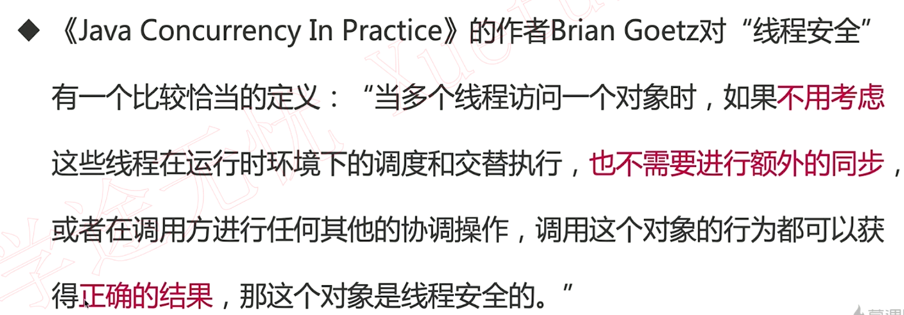
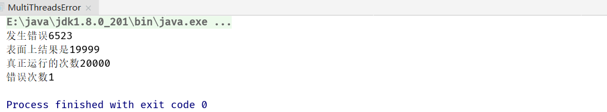
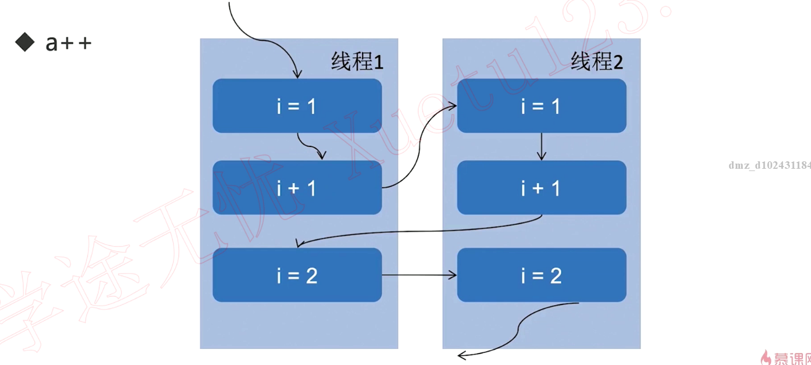
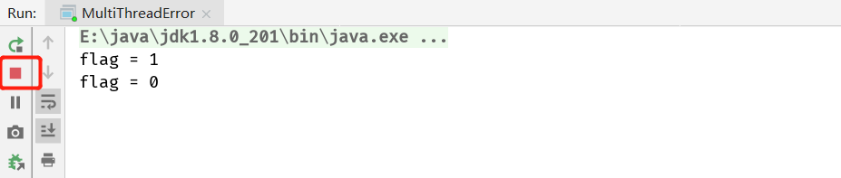
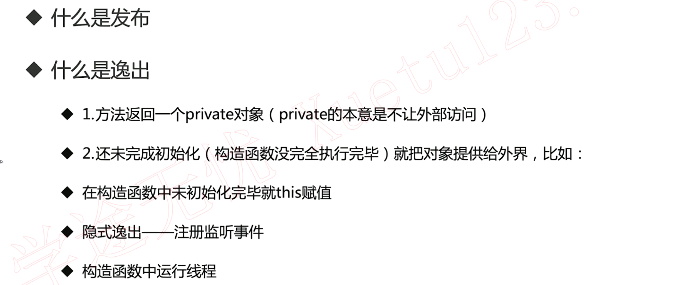
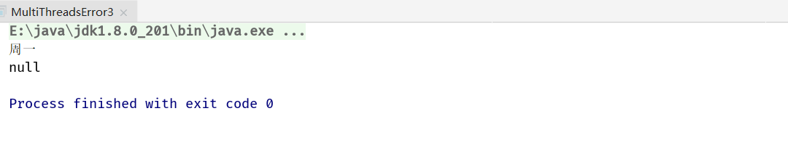
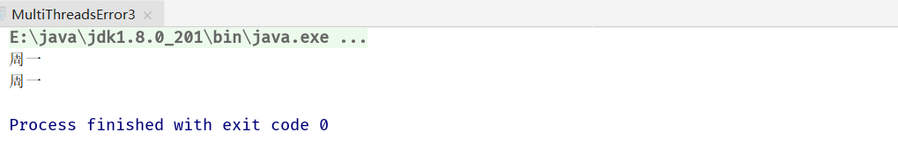
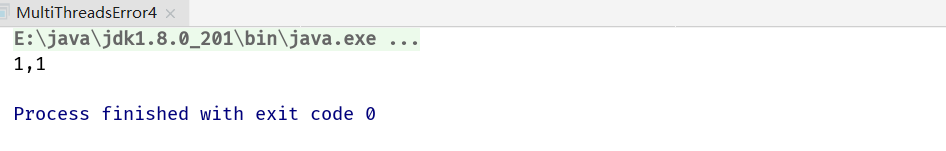
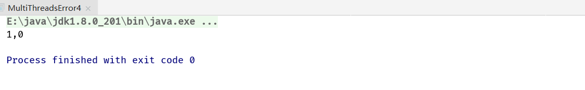

## 1. 线程安全




### 1.1 避免线程安全问题(读后写，死锁，饥饿...)


```java
/**
 * 描述：     第一种：运行结果出错。 演示计数不准确（减少），找出具体出错的位置。
 */
public class MultiThreadsError implements Runnable {

  static MultiThreadsError instance = new MultiThreadsError();
  int index = 0;
  static AtomicInteger realIndex = new AtomicInteger();
  static AtomicInteger wrongCount = new AtomicInteger();
  // CyclicBarrier让线程可以根据需要在某一个地方等待直到等待的人员都就绪了再一起出发
  // CyclicBarrier(2)表示监听两个线程
  static volatile CyclicBarrier cyclicBarrier1 = new CyclicBarrier(2);
  static volatile CyclicBarrier cyclicBarrier2 = new CyclicBarrier(2);

  final boolean[] marked = new boolean[10000000];

  public static void main(String[] args) throws InterruptedException {

    Thread thread1 = new Thread(instance);
    Thread thread2 = new Thread(instance);
    thread1.start();
    thread2.start();
    thread1.join();
    thread2.join();
    System.out.println("表面上结果是" + instance.index);
    System.out.println("真正运行的次数" + realIndex.get());
    System.out.println("错误次数" + wrongCount.get());
  }

  @Override
  public void run() {
    // marked[i]表示已经处理了
    marked[0] = true;
    for (int i = 0; i < 10000; i++) {
      // cyclicBarrier1，cyclicBarrier2两个栅栏
      try {
        cyclicBarrier2.reset();
        // 两个线程都就位了之后再去执行index++
        cyclicBarrier1.await();
      } catch (InterruptedException e) {
        e.printStackTrace();
      } catch (BrokenBarrierException e) {
        e.printStackTrace();
      }
      index++;
      try {
        cyclicBarrier1.reset();
        // 两个线程都执行完index++后再去执行marked[index] = true;
        cyclicBarrier2.await();
      } catch (InterruptedException e) {
        e.printStackTrace();
      } catch (BrokenBarrierException e) {
        e.printStackTrace();
      }
      // 原子整型++，不会出现线程错误
      realIndex.incrementAndGet();
      // 对互斥变量加以同步设置
      synchronized (instance) {
        // marked[index - 1]是为了防止上面的index++两次导致产生间隔数据的情况
        // 正确逻辑产生的效果是marked[0]=true,marked[1]=false,marked[2]=true,marked[3]=false,
        // 错误逻辑产生的效果是marked[0]=true,marked[1]=true,marked[2]=true,marked[3]=true,
        if (marked[index] && marked[index - 1]) {
          System.out.println("发生错误" + index);
          wrongCount.incrementAndGet();
        }
        marked[index] = true;
      }
    }
  }
}
```





### 1.2 死锁

```java
public class MultiThreadError implements Runnable {

  int flag = 1;
  static Object o1 = new Object();
  static Object o2 = new Object();

  public static void main(String[] args) {
    MultiThreadError r1 = new MultiThreadError();
    MultiThreadError r2 = new MultiThreadError();
    r1.flag = 1;
    r2.flag = 0;
    new Thread(r1).start();
    new Thread(r2).start();
  }

  @Override
  public void run() {
    System.out.println("flag = " + flag);
    if (flag == 1) {
      synchronized (o1) {
        try {
          Thread.sleep(500);
        } catch (InterruptedException e) {
          e.printStackTrace();
        }
        synchronized (o2) {
          System.out.println("1");
        }
      }
    }
    if (flag == 0) {
      synchronized (o2) {
        try {
          Thread.sleep(500);
        } catch (InterruptedException e) {
          e.printStackTrace();
        }
        synchronized (o1) {
          System.out.println("0");
        }
      }
    }
  }
}
```



### 1.3 发布和初始化时候的安全问题



```java
/**
 * 描述：     发布逸出
 */
public class MultiThreadsError3 {

  private Map<String, String> states;

  public MultiThreadsError3() {
    states = new HashMap<>();
    states.put("1", "周一");
    states.put("2", "周二");
    states.put("3", "周三");
    states.put("4", "周四");
  }

  public Map<String, String> getStates() {
    return states;
  }

  public static void main(String[] args) {
    MultiThreadsError3 multiThreadsError3 = new MultiThreadsError3();
    Map<String, String> states = multiThreadsError3.getStates();
        System.out.println(states.get("1"));
        states.remove("1");
        System.out.println(states.get("1"));
  }
}
```

这个states是要服务于无数线程，若一个线程删除了states其中一个元素其他线程就拿不到了



```java
public class MultiThreadsError3 {

  private Map<String, String> states;

  public MultiThreadsError3() {
    states = new HashMap<>();
    states.put("1", "周一");
    states.put("2", "周二");
    states.put("3", "周三");
    states.put("4", "周四");
  }

  public Map<String, String> getStates() {
    return states;
  }

  // 解决线程安全问题：返回副本
  public Map<String, String> getStatesImproved() {
    return new HashMap<>(states);
  }

  public static void main(String[] args) {
    MultiThreadsError3 multiThreadsError3 = new MultiThreadsError3();
    Map<String, String> states = multiThreadsError3.getStates();

    System.out.println(multiThreadsError3.getStatesImproved().get("1"));
    multiThreadsError3.getStatesImproved().remove("1");
    System.out.println(multiThreadsError3.getStatesImproved().get("1"));
  }
}
```



```java
/**
 * 描述：     初始化未完毕，就this赋值
 */
public class MultiThreadsError4 {

  static Point point;

  public static void main(String[] args) throws InterruptedException {
    new PointMaker().start();
    Thread.sleep(100);
    if (point != null) {
      System.out.println(point);
    }
  }
}

class Point {

  private final int x, y;

  public Point(int x, int y) throws InterruptedException {
    this.x = x;
    MultiThreadsError4.point = this;
    Thread.sleep(100);
    this.y = y;
  }

  @Override
  public String toString() {
    return x + "," + y;
  }
}

class PointMaker extends Thread {

  @Override
  public void run() {
    try {
      new Point(1, 1);
    } catch (InterruptedException e) {
      e.printStackTrace();
    }
  }
}
```



```java
// 若把睡眠时间挑短
new PointMaker().start();
Thread.sleep(10);
if (point != null) {
  System.out.println(point);
}
```



