## 1. 死锁


```java
/**
 * 描述：     必定发生死锁的情况
 */
public class MustDeadLock implements Runnable {

  int flag = 1;

  static Object o1 = new Object();
  static Object o2 = new Object();

  public static void main(String[] args) {
    MustDeadLock r1 = new MustDeadLock();
    MustDeadLock r2 = new MustDeadLock();
    r1.flag = 1;
    r2.flag = 0;
    Thread t1 = new Thread(r1);
    Thread t2 = new Thread(r2);
    t1.start();
    t2.start();
  }

  @Override
  public void run() {
    System.out.println("flag = " + flag);
    if (flag == 1) {
      synchronized (o1) {
        try {
          Thread.sleep(500);
        } catch (InterruptedException e) {
          e.printStackTrace();
        }
        synchronized (o2) {
          System.out.println("线程1成功拿到两把锁");
        }
      }
    }
    if (flag == 0) {
      synchronized (o2) {
        try {
          Thread.sleep(500);
        } catch (InterruptedException e) {
          e.printStackTrace();
        }
        synchronized (o1) {
          System.out.println("线程2成功拿到两把锁");
        }
      }
    }
  }
}
```

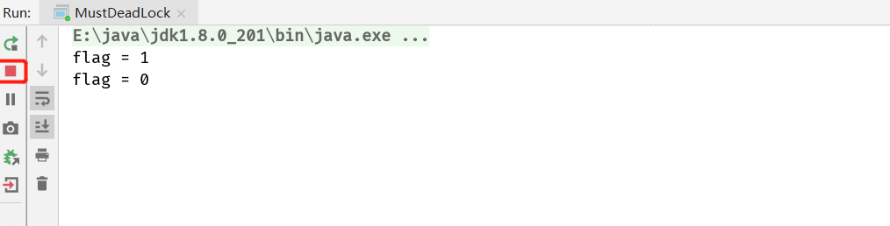

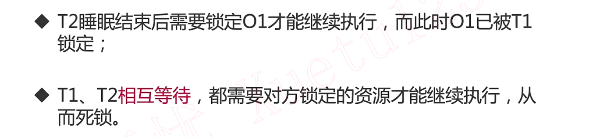

## 2. 转账

1. 转账方A不希望多个线程来扣钱，被转账方B也不希望多个线程同时给B转钱；转账动作：1.检查余额，2.扣钱，3.增加对方的钱
2. 二者相互转账可能会导致死锁出现：A转账B，先获取自身锁再获取对方锁；B转账A，先获取自身锁再获取对方锁

`正常情况`

```java
/**
 * 描述：     转账时候遇到死锁，一旦打开注释，便会发生死锁
 */
public class TransferMoney implements Runnable {

  int flag = 1;
  static Account a = new Account(500);
  static Account b = new Account(500);

  public static void main(String[] args) throws InterruptedException {
    TransferMoney r1 = new TransferMoney();
    TransferMoney r2 = new TransferMoney();
    r1.flag = 1;
    r2.flag = 0;
    Thread t1 = new Thread(r1);
    Thread t2 = new Thread(r2);
    t1.start();
    t2.start();
    t1.join();
    t2.join();
    System.out.println("a的余额" + a.balance);
    System.out.println("b的余额" + b.balance);
  }

  @Override
  public void run() {
    if (flag == 1) {
      transferMoney(a, b, 200);
    }
    if (flag == 0) {
      transferMoney(b, a, 200);
    }
  }

  public static void transferMoney(Account from, Account to, int amount) {
    synchronized (from) {
      synchronized (to) {
        if (from.balance - amount < 0) {
          System.out.println("余额不足，转账失败。");
          return;
        }
        from.balance -= amount;
        to.balance = to.balance + amount;
        System.out.println("成功转账" + amount + "元");
      }
    }
  }

  static class Account {

    public Account(int balance) {
      this.balance = balance;
    }

    int balance;

  }
}
```

互相转账200元，双方余额不变

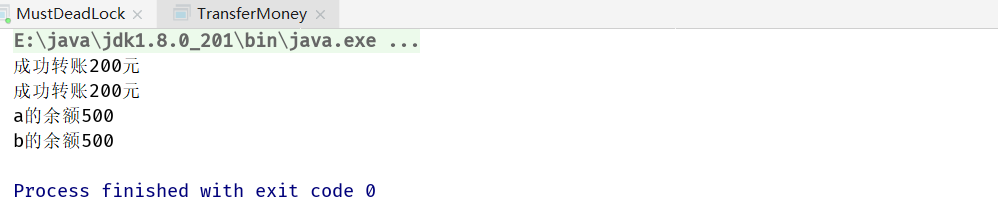

但是程序运行通信需要一段时间，我们这里使用`Thread.sleep(500)`来替代

```java
synchronized (from) {
  try {
    Thread.sleep(500);
  } catch (InterruptedException e) {
    e.printStackTrace();
  }
  synchronized (to) {
    if (from.balance - amount < 0) {
      System.out.println("余额不足，转账失败。");
      return;
    }
    from.balance -= amount;
    to.balance = to.balance + amount;
    System.out.println("成功转账" + amount + "元");
  }
}
```

控制台什么都不打印了，原因是因为`Thread.sleep(500);`的关系，二者都卡在了`synchronized (to)`，对于线程A来说拿到了A锁，正要获取B锁之前被阻塞了；因为阻塞的关系在A拿取锁对象B时，线程B提前拿到了A锁，正要获取A锁之前被也被阻塞了；当线程A被唤醒想要拿取锁B对象时发现已被拿走，同理B也如此，由此发生死锁

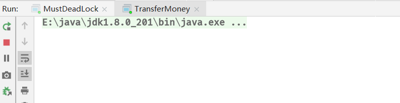

## 3. 模拟多人随机转账(若出现两人相互转账就会出现死锁)

```java
/**
 * 描述：     多人同时转账，依然很危险
 */
public class MultiTransferMoney {
  private static final int NUM_ACCOUNTS = 500;
  private static final int NUM_MONEY = 1000;
  private static final int NUM_ITERATIONS = 1000000;
  private static final int NUM_THREADS = 20;

  public static void main(String[] args) {

    Random rnd = new Random();
    Account[] accounts = new Account[NUM_ACCOUNTS];
    for (int i = 0; i < accounts.length; i++) {
      accounts[i] = new Account(NUM_MONEY);
    }
    class TransferThread extends Thread {

      @Override
      public void run() {
        for (int i = 0; i < NUM_ITERATIONS; i++) {
          int fromAcct = rnd.nextInt(NUM_ACCOUNTS);
          int toAcct = rnd.nextInt(NUM_ACCOUNTS);
          int amount = rnd.nextInt(NUM_MONEY);
          TransferMoney.transferMoney(accounts[fromAcct], accounts[toAcct], amount);
        }
        System.out.println("运行结束");
      }
    }
    // 起多个线程同时模拟转账
    for (int i = 0; i < NUM_THREADS; i++) {
      new TransferThread().start();
    }
  }
}
```


## 4. 如何定位死锁

1. jstack：首先找到java进程id

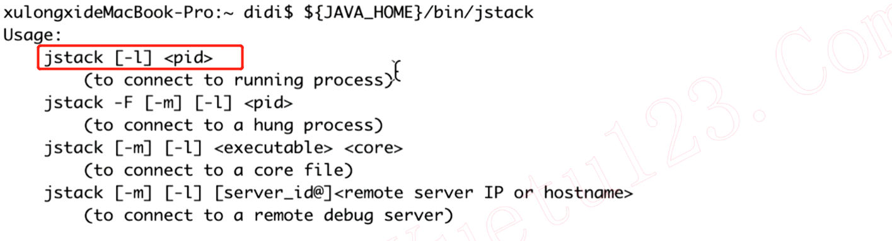

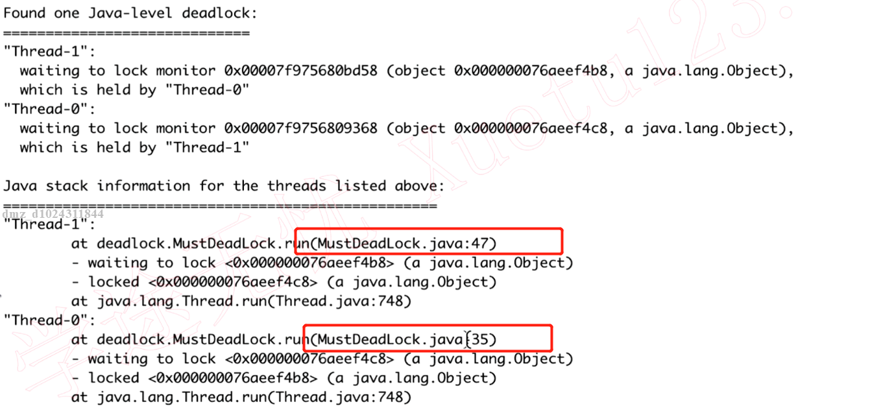

2. ThreadMXBean

```java
/**
 * 描述：     用ThreadMXBean检测死锁
 */
public class ThreadMXBeanDetection implements Runnable {

  int flag = 1;

  static Object o1 = new Object();
  static Object o2 = new Object();

  public static void main(String[] args) throws InterruptedException {
    ThreadMXBeanDetection r1 = new ThreadMXBeanDetection();
    ThreadMXBeanDetection r2 = new ThreadMXBeanDetection();
    r1.flag = 1;
    r2.flag = 0;
    Thread t1 = new Thread(r1);
    Thread t2 = new Thread(r2);
    t1.start();
    t2.start();
    Thread.sleep(1000);
    ThreadMXBean threadMXBean = ManagementFactory.getThreadMXBean();
    long[] deadlockedThreads = threadMXBean.findDeadlockedThreads();
    if (deadlockedThreads != null && deadlockedThreads.length > 0) {
      for (int i = 0; i < deadlockedThreads.length; i++) {
        ThreadInfo threadInfo = threadMXBean.getThreadInfo(deadlockedThreads[i]);
        System.out.println("发现死锁" + threadInfo.getThreadName());
      }
    }
  }

  @Override
  public void run() {
    System.out.println("flag = " + flag);
    if (flag == 1) {
      synchronized (o1) {
        try {
          Thread.sleep(500);
        } catch (InterruptedException e) {
          e.printStackTrace();
        }
        synchronized (o2) {
          System.out.println("线程1成功拿到两把锁");
        }
      }
    }
    if (flag == 0) {
      synchronized (o2) {
        try {
          Thread.sleep(500);
        } catch (InterruptedException e) {
          e.printStackTrace();
        }
        synchronized (o1) {
          System.out.println("线程2成功拿到两把锁");
        }
      }
    }
  }
}
```

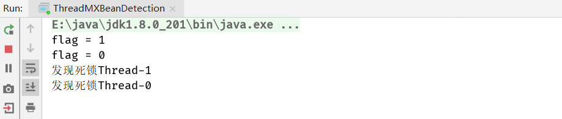

## 5. 死锁避免策略

避免相反的获取锁的顺序，实际上不在乎获取锁谁先谁后，只需要有先后顺序即可

```java
public class TransferMoney implements Runnable {

  int flag = 1;
  static Account a = new Account(500);
  static Account b = new Account(500);
  static Object lock = new Object();

  public static void main(String[] args) throws InterruptedException {
    TransferMoney r1 = new TransferMoney();
    TransferMoney r2 = new TransferMoney();
    r1.flag = 1;
    r2.flag = 0;
    Thread t1 = new Thread(r1);
    Thread t2 = new Thread(r2);
    t1.start();
    t2.start();
    t1.join();
    t2.join();
    System.out.println("a的余额" + a.balance);
    System.out.println("b的余额" + b.balance);
  }

  @Override
  public void run() {
    if (flag == 1) {
      transferMoney(a, b, 200);
    }
    if (flag == 0) {
      transferMoney(b, a, 200);
    }
  }

  public static void transferMoney(Account from, Account to, int amount) {
    class Helper {
      public void transfer() {
        if (from.balance - amount < 0) {
          System.out.println("余额不足，转账失败。");
          return;
        }
        from.balance -= amount;
        to.balance = to.balance + amount;
        System.out.println("成功转账" + amount + "元");
      }
    }
    // 通过Hash值确定线程序执行先后顺序
    int fromHash = System.identityHashCode(from);
    int toHash = System.identityHashCode(to);
    if (fromHash < toHash) {
      synchronized (from) {
        synchronized (to) {
          new Helper().transfer();
        }
      }
    } else if (fromHash > toHash) {
      synchronized (to) {
        synchronized (from) {
          new Helper().transfer();
        }
      }
    } else {
      // 如果两者的Hash值相同，冲突时需要做额外的处理，有主键更方便就不需要处理冲突了
      synchronized (lock) {
        synchronized (to) {
          synchronized (from) {
            new Helper().transfer();
          }
        }
      }
    }
  }

  static class Account {

    public Account(int balance) {
      this.balance = balance;
    }

    int balance;

  }
}
```

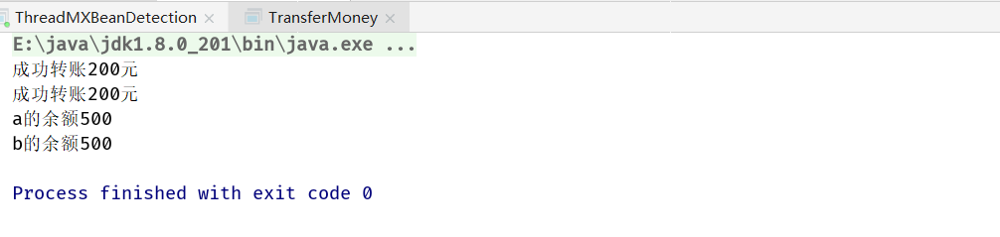

## 6. 哲学家就餐

```java
/**
 * 描述：     演示哲学家就餐问题导致的死锁
 */
public class DiningPhilosophers {

  public static class Philosopher implements Runnable {

    private Object leftChopstick;
    private Object rightChopstick;

    public Philosopher(Object leftChopstick, Object rightChopstick) {
      this.leftChopstick = leftChopstick;
      this.rightChopstick = rightChopstick;
    }

    @Override
    public void run() {
      try {
        while (true) {
          doAction("Thinking");
          synchronized (leftChopstick) {
            doAction("Picked up left chopstick");
            synchronized (rightChopstick) {
              doAction("Picked up right chopstick - eating");
              doAction("Put down right chopstick");
            }
            doAction("Put down left chopstick");
          }
        }
      } catch (InterruptedException e) {
        e.printStackTrace();
      }
    }

    private void doAction(String action) throws InterruptedException {
      System.out.println(Thread.currentThread().getName() + " " + action);
      Thread.sleep((long) (Math.random() * 10));
    }
  }

  public static void main(String[] args) {
    Philosopher[] philosophers = new Philosopher[5];
    Object[] chopsticks = new Object[philosophers.length];
    for (int i = 0; i < chopsticks.length; i++) {
      chopsticks[i] = new Object();
    }
    for (int i = 0; i < philosophers.length; i++) {
      Object leftChopstick = chopsticks[i];
      Object rightChopstick = chopsticks[(i + 1) % chopsticks.length];
      philosophers[i] = new Philosopher(leftChopstick, rightChopstick);
      new Thread(philosophers[i], "哲学家" + (i + 1) + "号").start();
    }
  }
}
```


### 6.1 多种解决策略


```java
if (i == philosophers.length - 1) {
  philosophers[i] = new Philosopher(rightChopstick, leftChopstick);
} else {
  philosophers[i] = new Philosopher(leftChopstick, rightChopstick);
}
```

## 7. 实际工程避免死锁

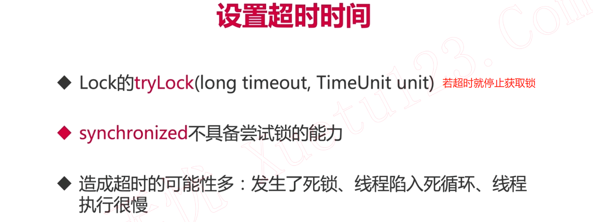

```java
/**
 * 描述：     用tryLock来避免死锁
 */
public class TryLockDeadlock implements Runnable {

  int flag = 1;
  // ReentrantLock可重入锁
  static Lock lock1 = new ReentrantLock();
  static Lock lock2 = new ReentrantLock();

  public static void main(String[] args) {
    TryLockDeadlock r1 = new TryLockDeadlock();
    TryLockDeadlock r2 = new TryLockDeadlock();
    r1.flag = 1;
    r2.flag = 0;
    new Thread(r1).start();
    new Thread(r2).start();
  }

  @Override
  public void run() {
    for (int i = 0; i < 100; i++) {
      if (flag == 1) {
        try {
          if (lock1.tryLock(800, TimeUnit.MILLISECONDS)) {
            System.out.println("线程1获取到了锁1");
            Thread.sleep(new Random().nextInt(1000));
            if (lock2.tryLock(800, TimeUnit.MILLISECONDS)) {
              System.out.println("线程1获取到了锁2");
              System.out.println("线程1成功获取到了两把锁");
              lock2.unlock();
              lock1.unlock();
              break;
            } else {
              System.out.println("线程1尝试获取锁2失败，已重试");
              lock1.unlock();
              Thread.sleep(new Random().nextInt(1000));
            }
          } else {
            System.out.println("线程1获取锁1失败，已重试");
          }
        } catch (InterruptedException e) {
          e.printStackTrace();
        }
      }
      if (flag == 0) {
        try {
          if (lock2.tryLock(3000, TimeUnit.MILLISECONDS)) {
            System.out.println("线程2获取到了锁2");

            Thread.sleep(new Random().nextInt(1000));
            if (lock1.tryLock(3000, TimeUnit.MILLISECONDS)) {
              System.out.println("线程2获取到了锁1");
              System.out.println("线程2成功获取到了两把锁");
              lock1.unlock();
              lock2.unlock();
              break;
            } else {
              System.out.println("线程2尝试获取锁1失败，已重试");
              lock2.unlock();
              Thread.sleep(new Random().nextInt(1000));
            }
          } else {
            System.out.println("线程2获取锁2失败，已重试");
          }
        } catch (InterruptedException e) {
          e.printStackTrace();
        }
      }
    }
  }
}
```

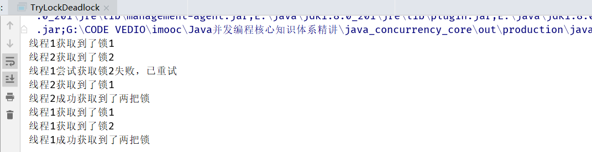


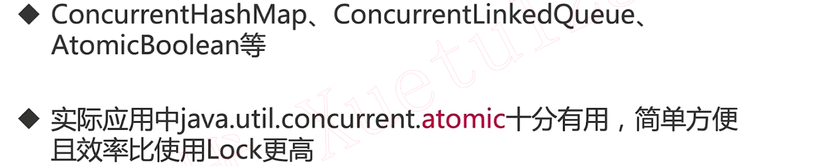

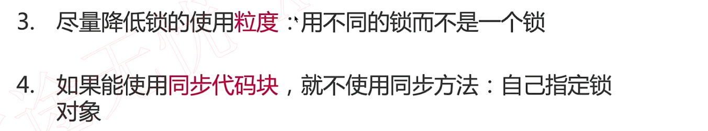

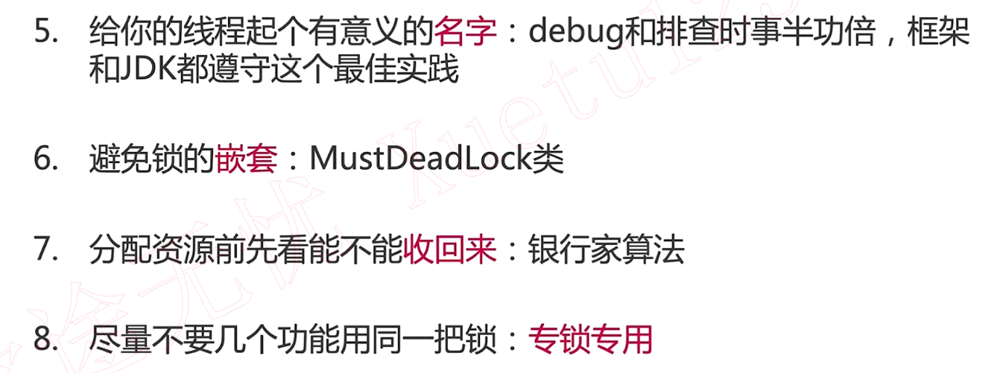

## 8. 其他活性故障


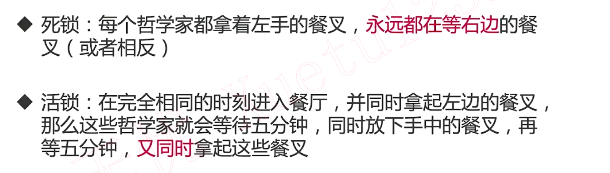


```java
/**
 * 描述：     演示活锁问题
 */
public class LiveLock {

  static class Spoon {

    private Diner owner;

    public Spoon(Diner owner) {
      this.owner = owner;
    }

    public Diner getOwner() {
      return owner;
    }

    public void setOwner(Diner owner) {
      this.owner = owner;
    }

    public synchronized void use() {
      System.out.printf("%s吃完了!", owner.name);
    }
  }

  static class Diner {

    private String name;
    private boolean isHungry;

    public Diner(String name) {
      this.name = name;
      isHungry = true;
    }

    public void eatWith(Spoon spoon, Diner spouse) {
      while (isHungry) {
        // 是不是拿到了勺子
        if (spoon.owner != this) {
          try {
            // 若没拿到勺子等待配偶吃完
            Thread.sleep(1);
          } catch (InterruptedException e) {
            e.printStackTrace();
          }
          continue;
        }
        if (spouse.isHungry) {
          System.out.println(name + ": 亲爱的" + spouse.name + "你先吃吧");
          spoon.setOwner(spouse);
          continue;
        }

        spoon.use();
        isHungry = false;
        System.out.println(name + ": 我吃完了");
        spoon.setOwner(spouse);
      }
    }
  }

  public static void main(String[] args) {
    Diner husband = new Diner("牛郎");
    Diner wife = new Diner("织女");

    Spoon spoon = new Spoon(husband);

    new Thread(new Runnable() {
      @Override
      public void run() {
        husband.eatWith(spoon, wife);
      }
    }).start();

    new Thread(new Runnable() {
      @Override
      public void run() {
        wife.eatWith(spoon, husband);
      }
    }).start();
  }
}

```

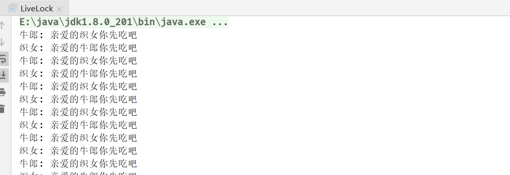


```java
Random random = new Random();
// 有百分之10的概率不谦让
if (spouse.isHungry && random.nextInt(10) < 9) {
  System.out.println(name + ": 亲爱的" + spouse.name + "你先吃吧");
  spoon.setOwner(spouse);
  continue;
}
```

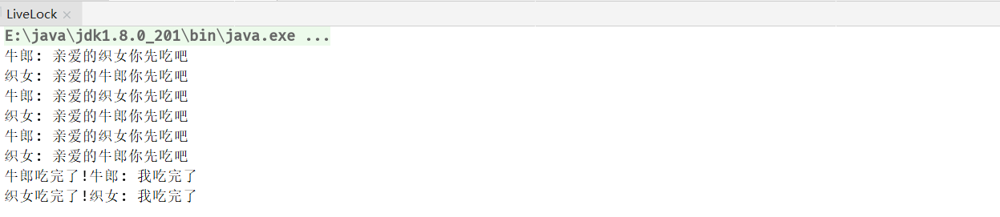

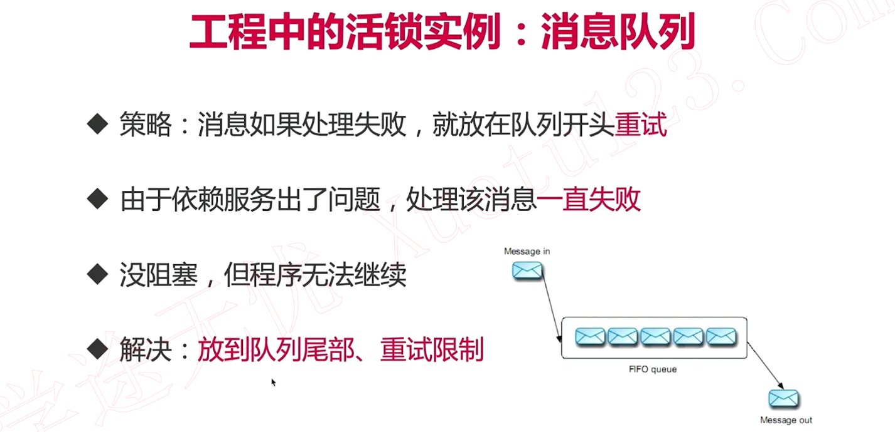

