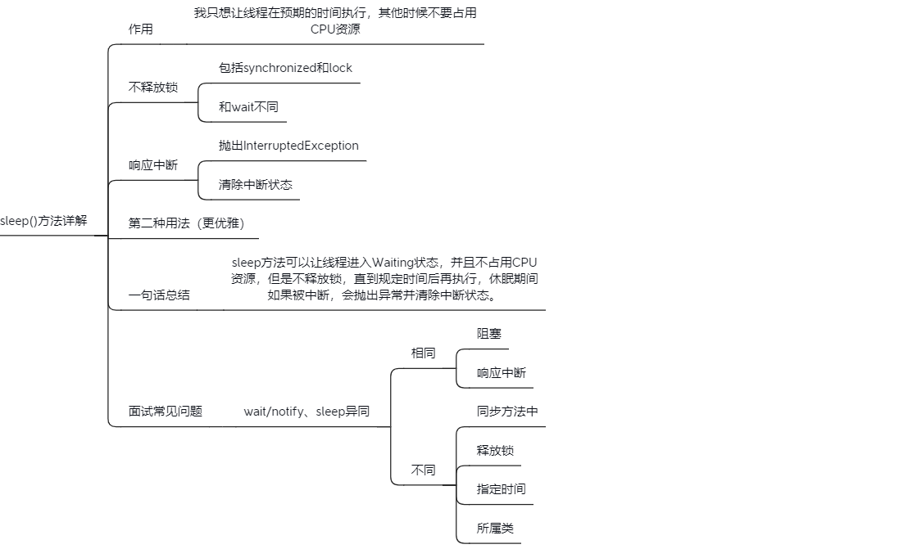

## 1. 线程八大核心基础

### 1.1 实现多线程的方法到底有1种还是2种还是4种？（实现多线程的典型错误和正确方法）

### 1.2 启动线程的正确和错误的方法

### 1.3 上山容易下山难——如何正确停止线程？

### 1.4 线程的6个状态（线程的生命周期）

### 1.5 Thread和Object类中和和线程相关的重要方法

### 1.6 线程各属性

### 1.7 线程的未捕获异常UncaughtException应该如何处理？

### 1.8 多线程是把双刃剑：可能导致安全、性能问题

