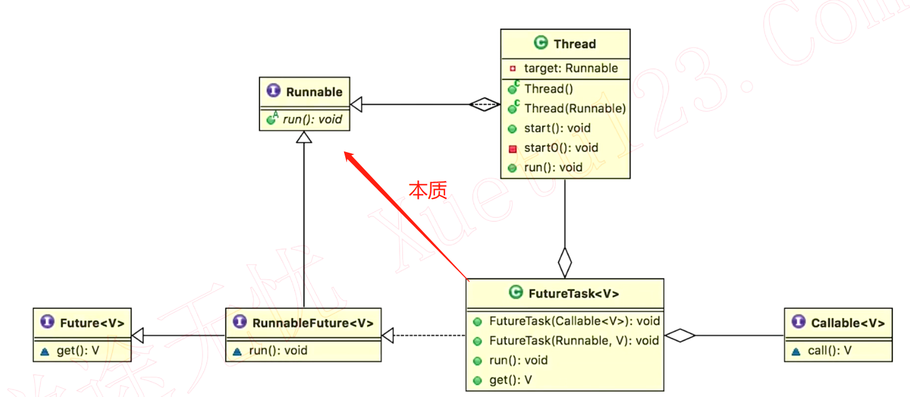

## 1. 实现多线程的方法到底有1种还是2种还是4种？

Oracle官网的文档是怎么写的？

1. 实现Runnable接口(更好)

```java
public class RunnableStyle implements Runnable {

  public static void main(String[] args) {
    Thread thread = new Thread(new RunnableStyle());
    thread.start();
  }

  @Override
  public void run() {
    System.out.println("用Runnable方法实现线程");
  }
}
```

2. 继承Thread类
   1. 具体执行的任务也就是`run()`内的代码应该与线程的创建运行是解耦的，因此方法一好`new Thread(new RunnableStyle())`外部传递参数
   2. Java不支持双继承，可扩展性差
   3. 每次新建任务只能去新建独立的线程，而新建独立的线程开销大，而如果使用Runnable就可以利用后序的线程池之类的工具减少创建销毁资源的损耗

```java
public class ThreadStyle extends Thread {

  public static void main(String[] args) {
    new ThreadStyle().start();
  }
  
  @Override
  public void run() {
    System.out.println("用Thread类实现线程");
  }
}
```

两种方法本质对比(二者都是调用了run方法)：

​	方法一：最终调用`target.run()`

```java
public interface Runnable {
    /**
     * When an object implementing interface <code>Runnable</code> is used
     * to create a thread, starting the thread causes the object's
     * <code>run</code> method to be called in that separately executing
     * thread.
     * <p>
     * The general contract of the method <code>run</code> is that it may
     * take any action whatsoever.
     *
     * @see     java.lang.Thread#run()
     */
    public abstract void run();
}
```

```java
// Thread.java

/* What will be run. */
private Runnable target;

@Override
public void run() {
  if (target != null) {
    target.run();
  }
}

因为Runnable的接口实现类中调用了Thread thread = new Thread(new RunnableStyle());意味着传入的target参数不为null
```

​	因为Runnable的接口实现类中调用了`Thread thread = new Thread(new RunnableStyle());`意味着传入的target参数不为null，但是Thread的继承类却覆写了run方法

​	方法二：`run()`整个都被重写

## 2. 同时使用两种方法会怎么样

```java
public class BothRunnableThread {
  public static void main(String[] args) {
    new Thread(new Runnable() {
      @Override
      public void run() {
        System.out.println("我来自Runnable");
      }
    }) {
      @Override
      public void run() {
        System.out.println("我来自Thread");
      }
    }.start();
  }
}
```


1. 从面向对象的思想去考虑：因为覆写的run方法已经覆盖了Thread原来经典的三行run方法，所以也就没有判断target是否为空的逻辑，也就不会去执行传递进来的Runnable代码

   ```java
   @Override
   public void run() {
     if (target != null) {
       target.run();
     }
   }
   ```

## 3. 总结

1. 准确的讲，创建线程只有一种方式那就是构造Thread类，而实现线程的执行单元有两种方式
   1. 实现Runnable接口的run方法，并把Runnable实例传递给Thread类
   2. 重写Thread的run方法(继承Thread类)

## 4. 典型错误观点分析

1. **线程池创建线程也是一种新建线程的方式**：我们知道，线程的创建和释放，需要占用不小的内存和资源。如果每次需要使用线程时，都new一个Thread的话，难免会造成资源的浪费，而且可以无限制创建，之间相互竞争，会导致过多占用系统资源导致系统瘫痪。ExecutorService是Java提供的线程池，也就是说，每次我们需要使用线程的时候，可以通过ExecutorService获得线程。它可以有效控制最大并发线程数，提高系统资源的使用率，同时避免过多资源竞争，避免堵塞。

   ```java
   public class ThreadPool5 {
     
     public static void main(String[] args) {
       ExecutorService executorService = Executors.newCachedThreadPool();
       for (int i = 0; i < 1000; i++) {
         // submit 是 ExecutorService 的方法，添加线程到线程池中。
         executorService.submit(new Task() {
         });
       }
     }
   }
   
   class Task implements Runnable {
   
     @Override
     public void run() {
       try {
         Thread.sleep(500);
       } catch (InterruptedException e) {
         e.printStackTrace();
       }
       System.out.println(Thread.currentThread().getName());
     }
   }
   ```

   但线程池的本质也是通过new出一个Thread来创建线程的

   ```java
   public Thread newThread(Runnable r) {
     Thread t = new Thread(group, r,
                           namePrefix + threadNumber.getAndIncrement(),
                           0);
     if (t.isDaemon())
       t.setDaemon(false);
     if (t.getPriority() != Thread.NORM_PRIORITY)
       t.setPriority(Thread.NORM_PRIORITY);
     return t;
   }
   ```

2. **通过Callable和FutureTask创建线程**



3. **定时器创建线程(本质还是Thread)**

   ```java
   /**
    * 描述：     定时器创建线程
    */
   public class DemoTimmerTask {
   
     public static void main(String[] args) {
       Timer timer = new Timer();
       timer.scheduleAtFixedRate(new TimerTask() {
         @Override
         public void run() {
           System.out.println(Thread.currentThread().getName());
         }
       }, 1000, 1000);
     }
   }
   ```

   