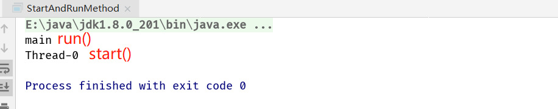
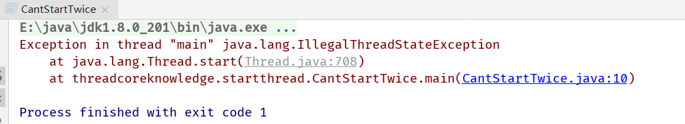

## 1. 启动线程的正确和错误方式

1. start()和run()的比较

   ```java
   /**
    * 描述：     对比start和run两种启动线程的方式
    */
   public class StartAndRunMethod {
   
     public static void main(String[] args) {
       Runnable runnable = () -> {
         System.out.println(Thread.currentThread().getName());
       };
       runnable.run();
   
       new Thread(runnable).start();
     }
   }
   ```

   

   `runnable.run();`执行的是主线程的方法，与我们的本意相差较大

2. start()方法含义

   1. 启动新线程，而且调用start()方法的顺序并不能代表线程执行的顺序，由线程调度器去决定

   2. start()会让两个线程同时运行，第一个是主线程，因为我们必须要有一个主线程或者其它线程来执行start方法，第二个才是被创建的子线程

   3. start方法被调用前的准备工作：喜闻乐见的操作系统线程状态，线程的创建(获取到数据，空间等资源)->就绪->执行(获取到cpu资源)->执行覆写run里的代码->终止

   4. 不能重复执行start方法(线程一旦终止不可返回)

      ```java
      public class CantStartTwice {
        public static void main(String[] args) {
          Thread thread = new Thread();
          thread.start();
          thread.start();
        }
      }
      ```

      

3. start()源码解析

   1. 启动新线程检查线程状态
   2. 加入线程组
   3. 吊桶start0()

   ```java
   /* Java thread status for tools,
        * initialized to indicate thread 'not yet started'
        */
   
   private volatile int threadStatus = 0;
   
   public synchronized void start() {
     /**
            * This method is not invoked for the main method thread or "system"
            * group threads created/set up by the VM. Any new functionality added
            * to this method in the future may have to also be added to the VM.
            *
            * A zero status value corresponds to state "NEW".
            */
     if (threadStatus != 0)
       throw new IllegalThreadStateException();
   
     /* Notify the group that this thread is about to be started
            * so that it can be added to the group's list of threads
            * and the group's unstarted count can be decremented. */
     group.add(this);
   
     boolean started = false;
     try {
       start0();
       started = true;
     } finally {
       try {
         if (!started) {
           group.threadStartFailed(this);
         }
       } catch (Throwable ignore) {
         /* do nothing. If start0 threw a Throwable then
                     it will be passed up the call stack */
       }
     }
   }
   
   private native void start0();
   ```

4. run()源码解析
   1. 经典的三行代码