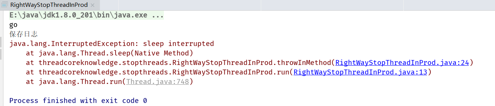
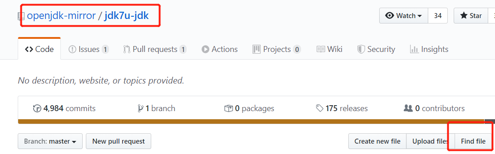

## 1. 如何正确停止线程(用户主动取消，服务需要被关闭，程序出错...)

### 1. 1 原理介绍

​	使用interrupt来通知，而不是强制(我们作为想停止线程的一方是没有能力去做到强行停止线程的，因为作为提出响应的线程它是不了解被停止线程的业务的，被停止方更清楚在停止后要去处理什么代码逻辑，所以Java在设计时把停止权交到了被停止线程手上)

### 1. 2 通常线程在什么情况下停止

1. run方法执行完毕
2. 出现异常，代码没有捕获异常

### 1. 3 正确停止方式：interrupt

1. 普通情况

   ```java
   /**
    * 描述：     run方法内没有sleep或wait方法时，停止线程
    */
   public class RightWayStopThreadWithoutSleep implements Runnable {
   
     @Override
     public void run() {
       int num = 0;
       while (num <= Integer.MAX_VALUE / 2) {
         if (num % 10000 == 0) {
           System.out.println(num + "是10000的倍数");
         }
         num++;
       }
       System.out.println("任务运行结束了");
     }
   
     public static void main(String[] args) throws InterruptedException {
       Thread thread = new Thread(new RightWayStopThreadWithoutSleep());
       thread.start();
     }
   }
   ```

   

   ```java
   // 添加如下代码，在执行1s后中断线程  
   public static void main(String[] args) throws InterruptedException {
     Thread thread = new Thread(new RightWayStopThreadWithoutSleep());
     thread.start();
     Thread.sleep(1000);
     thread.interrupt();
   }
   ```

   

   执行结果仍然与原来相同，这是因为线程是否中断的权利在子线程本身，即使强加了一个中断信号，也是有权利不加以回应的

   ```java
   // 子线程主动判断是否接收到中断信号并且处理
   while (!Thread.currentThread().isInterrupted() && num <= Integer.MAX_VALUE / 2) {
     if (num % 10000 == 0) {
       System.out.println(num + "是10000的倍数");
     }
     num++;
   }
   ```

   

2. 线程被阻塞

   ```java
   /**
    * 描述：     带有sleep的中断线程的写法
    */
   public class RightWayStopThreadWithSleep {
   
     public static void main(String[] args) throws InterruptedException {
       Runnable runnable = () -> {
         int num = 0;
         try {
           while (num <= 300 && !Thread.currentThread().isInterrupted()) {
             if (num % 100 == 0) {
               System.out.println(num + "是100的倍数");
             }
             num++;
           }
           // 由于某种业务逻辑需要这个线程去做等待，恰恰在等待期间线程被中断了
           Thread.sleep(1000);
         } catch (InterruptedException e) {
           e.printStackTrace();
         }
       };
       Thread thread = new Thread(runnable);
       thread.start();
       Thread.sleep(500);
       thread.interrupt();
     }
   }
   ```

   整个循环的时间不超过500ms，而在子线程被阻塞时主线程发起了中断信号，子线程便响应了中断信号，但它响应中断的方式是抛出异常，因为线程被设计是绝对有响应中断的能力的不管他是否被阻塞，而当子线程被阻塞时他就无法主动去响应中断(堵车了，车想开也开不了)，所以该中断响应就是抛出异常

   

3. 线程在迭代中被阻塞

   ```java
   /**
    * 描述：     如果在执行过程中，每次循环都会调用sleep或wait等方法，那么不需要每次迭代都检查是否已中断
    */
   public class RightWayStopThreadWithSleepEveryLoop {
     public static void main(String[] args) throws InterruptedException {
       Runnable runnable = () -> {
         int num = 0;
         try {
           while (num <= 10000) {
             if (num % 100 == 0) {
               System.out.println(num + "是100的倍数");
             }
             num++;
             Thread.sleep(10);
           }
         } catch (InterruptedException e) {
           e.printStackTrace();
         }
       };
       Thread thread = new Thread(runnable);
       thread.start();
       Thread.sleep(5000);
       thread.interrupt();
     }
   }
   ```

   

注意上述代码循环条件没了`!Thread.currentThread().isInterrupted()`因为每个循环中触发的异常本身就是一种响应中断的方式，并不需要手动判断是否接受中断响应

4. while内try/catch的问题

   ```java
   /**
    * 描述：     如果while里面放try/catch，会导致中断失效，即便检查了中断
    */
   public class CantInterrupt {
   
     public static void main(String[] args) throws InterruptedException {
       Runnable runnable = () -> {
         int num = 0;
         while (num <= 10000 && !Thread.currentThread().isInterrupted()) {
           if (num % 100 == 0) {
             System.out.println(num + "是100的倍数");
           }
           num++;
           try {
             Thread.sleep(10);
           } catch (InterruptedException e) {
             e.printStackTrace();
           }
         }
       };
       Thread thread = new Thread(runnable);
       thread.start();
       Thread.sleep(5000);
       thread.interrupt();
     }
   }
   ```

   因为Java语言的设计，当sleep过程中受到中断请求时会清空isInterrupted标记位

   

### 1. 4 实际开发过程中的两种最佳实践

1. 优先选择：传递中断

   ```java
   // v1.0
   /**
    * 描述：     最佳实践：catch了InterruptedExcetion之后的优先选择：在方法签名中抛出异常 那么在run()就会强制try/catch
    */
   public class RightWayStopThreadInProd implements Runnable {
   
     @Override
     public void run() {
       while (!Thread.currentThread().isInterrupted()) {
         System.out.println("go");
         throwInMethod();
       }
     }
   
     private void throwInMethod() {
       try {
   		Thread.sleep(2000);
       } catch (InterruptedException e) {
         e.printStackTrace();
       }
     }
   
     public static void main(String[] args) throws InterruptedException {
       Thread thread = new Thread(new RightWayStopThreadInProd());
       thread.start();
       Thread.sleep(1000);
       thread.interrupt();
     }
   }
   ```

   v1.0并不是一个最佳的代码实现，因为异常在throwInMethod函数中就被try/catch了，这就导致了一个问题，即若`throwInMethod`是其他业务小组写的代码，我们不清楚代码逻辑只需要调用即可，但是我们在run函数内根本无法接收isInterrupted响应中断，因为我们之前讲到在sleep过程中会清空isInterrupted标记位，而中断信号被`throwInMethod`函数里的try/catch吞了，但本身应该是由处理run函数的一方去决定执行逻辑的，而`throwInMethod`的责任是把接收到的中断信号传递给我们，即异常的抛出

   

   ```java
   // v2.0
   
   @Override
   public void run() {
     while (!Thread.currentThread().isInterrupted()) {
       System.out.println("go");
       // run无法抛出checked Exception，只能用try/catch
       try {
         throwInMethod();
       } catch (InterruptedException e) {
         // 手动执行中断
         Thread.currentThread().interrupt();
         //保存日志、停止程序
         System.out.println("保存日志");
         e.printStackTrace();
       }
     }
   }
   
   private void throwInMethod() throws InterruptedException {
     Thread.sleep(2000);
   }
   ```

   

2. 不想或无法传递：恢复中断

   ```java
   /**
    * 描述：最佳实践2：在catch子语句中调用Thread.currentThread().interrupt()来恢复设置中断状态，以便于在后续的执行中，依然能够检查到刚才发生了中断
    * 回到刚才RightWayStopThreadInProd补上中断，让它跳出
    */
   public class RightWayStopThreadInProd2 implements Runnable {
   
     @Override
     public void run() {
       while (true) {
         if (Thread.currentThread().isInterrupted()) {
           System.out.println("Interrupted，程序运行结束");
           break;
         }
         reInterrupt();
       }
     }
   
     private void reInterrupt() {
       try {
         Thread.sleep(2000);
       } catch (InterruptedException e) {
         Thread.currentThread().interrupt();
         e.printStackTrace();
       }
     }
   
     public static void main(String[] args) throws InterruptedException {
       Thread thread = new Thread(new RightWayStopThreadInProd2());
       thread.start();
       Thread.sleep(1000);
       thread.interrupt();
     }
   }
   ```

3. 不应屏蔽中断

### 1. 5 响应中断的方法总结列表


### 1. 6 停止线程的错误方法

 1. 被弃用的stop，suspend和resume方法

    ```java
    /**
     * 描述：     错误的停止方法：用stop()来停止线程，会导致线程运行一半突然停止，没办法完成一个基本单位的操作（一个连队），会造成脏数据（有的连队多领取少领取装备）。
     */
    public class StopThread implements Runnable {
    
      @Override
      public void run() {
        //模拟指挥军队：一共有5个连队，每个连队10人，以连队为单位，发放武器弹药，叫到号的士兵前去领取
        for (int i = 0; i < 5; i++) {
          System.out.println("连队" + i + "开始领取武器");
          for (int j = 0; j < 10; j++) {
            System.out.println(j);
            try {
              Thread.sleep(50);
            } catch (InterruptedException e) {
              e.printStackTrace();
            }
          }
          System.out.println("连队" + i + "已经领取完毕");
        }
      }
    
      public static void main(String[] args) {
        Thread thread = new Thread(new StopThread());
        thread.start();
      }
    }
    ```

    

    ```java
    public static void main(String[] args) {
      Thread thread = new Thread(new StopThread());
      thread.start();
      // 假如战争突然打响，立刻停止领取工作
      try {
        Thread.sleep(1000);
      } catch (InterruptedException e) {
        e.printStackTrace();
      }
      thread.stop();
    }
    ```

    导致连队一中的7-9号士兵没有领取到装备，针对到现实业务中银行转账有十笔转账，转到七笔时突然中断就会导致数据很难追回

    

 2. 用volatile设置boolean标记位

```java
/**
 * 描述：     演示用volatile的局限：part1 看似可行
 */
public class WrongWayVolatile implements Runnable {

  private volatile boolean canceled = false;

  @Override
  public void run() {
    int num = 0;
    try {
      while (num <= 100000 && !canceled) {
        if (num % 100 == 0) {
          System.out.println(num + "是100的倍数。");
        }
        num++;
        Thread.sleep(1);
      }
    } catch (InterruptedException e) {
      e.printStackTrace();
    }
  }

  public static void main(String[] args) throws InterruptedException {
    WrongWayVolatile r = new WrongWayVolatile();
    Thread thread = new Thread(r);
    thread.start();
    Thread.sleep(5000);
    r.canceled = true;
  }
}
```

```java
/**
 * 描述：     演示用volatile的局限part2 陷入阻塞时，volatile是无法停止线程的 
 *            此例中，生产者的生产速度很快，消费者消费速度慢，所以阻塞队列满了以后，生产者会阻塞，等待消费者进一步消费
 */
public class WrongWayVolatileCantStop {

  public static void main(String[] args) throws InterruptedException {
    ArrayBlockingQueue storage = new ArrayBlockingQueue(10);

    Producer producer = new Producer(storage);
    Thread producerThread = new Thread(producer);
    producerThread.start();
    Thread.sleep(1000);

    Consumer consumer = new Consumer(storage);
    while (consumer.needMoreNums()) {
      System.out.println(consumer.storage.take() + "被消费了");
      Thread.sleep(100);
    }
    System.out.println("消费者不需要更多数据了。");

    // 一旦消费不需要更多数据了，我们应该让生产者也停下来，但是实际情况
    producer.canceled = true;
    System.out.println(producer.canceled);
  }
}

class Producer implements Runnable {

  public volatile boolean canceled = false;

  BlockingQueue storage;

  public Producer(BlockingQueue storage) {
    this.storage = storage;
  }


  @Override
  public void run() {
    int num = 0;
    try {
      while (num <= 100000 && !canceled) {
        if (num % 100 == 0) {
          storage.put(num);
          System.out.println(num + "是100的倍数,被放到仓库中了。");
        }
        num++;
      }
    } catch (InterruptedException e) {
      e.printStackTrace();
    } finally {
      System.out.println("生产者结束运行");
    }
  }
}

class Consumer {

  BlockingQueue storage;

  public Consumer(BlockingQueue storage) {
    this.storage = storage;
  }

  public boolean needMoreNums() {
    if (Math.random() > 0.95) {
      return false;
    }
    return true;
  }
}
```

程序并没有被停止下来


```java
// 错误原因在于
@Override
public void run() {
  int num = 0;
  try {
    while (num <= 100000 && !canceled) {
      if (num % 100 == 0) {
        // 当storage满时，因为对于BlockingQueue而言，队列满时将不会执行下去，程序被阻塞在这里
        // 而不会去执行循环条件 while (num <= 100000 && !canceled) 
        storage.put(num);
        System.out.println(num + "是100的倍数,被放到仓库中了。");
      }
      num++;
    }
  } catch (InterruptedException e) {
    e.printStackTrace();
  } finally {
    System.out.println("生产者结束运行");
  }
}
}
```

```java
// 修复代码
// 即使被阻塞，isInterrupted也能响应线程的中断请求
while (num <= 100000 && !Thread.currentThread().isInterrupted()) {
  if (num % 100 == 0) {
    storage.put(num);
    System.out.println(num + "是100的倍数,被放到仓库中了。");
  }
  num++;
}
```


### 1. 7 停止线程相关重要函数解析


### 1. 8 如何分析native方法(C,C++代码)

1. 进入github(也可以进入openJDK网站)

   


### 1. 9 中断相关方法


```java
/**
 * 描述：     注意interrupted()方法的目标对象是“当前线程”，本例中是主函数Main，而不管本方法来自于哪个对象
 */
public class RightWayInterrupted {

  public static void main(String[] args) throws InterruptedException {

    Thread threadOne = new Thread(new Runnable() {
      @Override
      public void run() {
        for (; ; ) {
        }
      }
    });

    // 启动线程
    threadOne.start();
    //设置中断标志
    threadOne.interrupt();
    //获取中断标志
    System.out.println("isInterrupted: " + threadOne.isInterrupted());
    //获取中断标志并重置(由于主函数没有被中断，所以是false)
    System.out.println("isInterrupted: " + threadOne.interrupted());
    //获取中断标志并重直(由于主函数没有被中断，所以是false)
    System.out.println("isInterrupted: " + Thread.interrupted());
    //获取中断标志
    System.out.println("isInterrupted: " + threadOne.isInterrupted());
    threadOne.join();
    System.out.println("Main thread is over.");
  }
}
```


### 1. 9 面试常见问题


