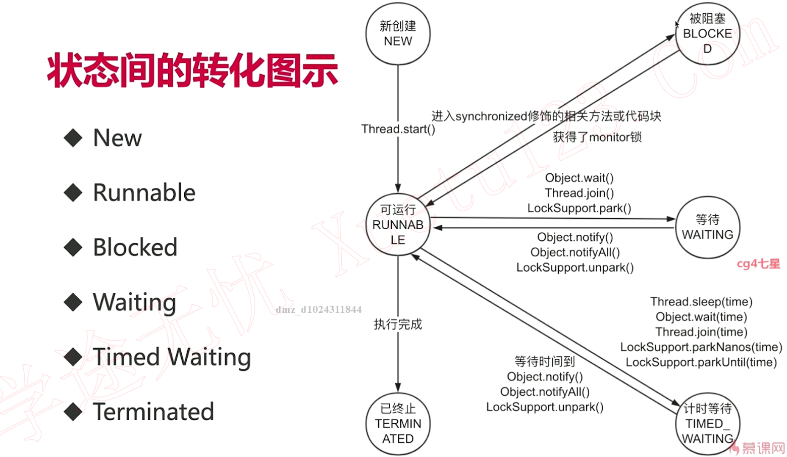
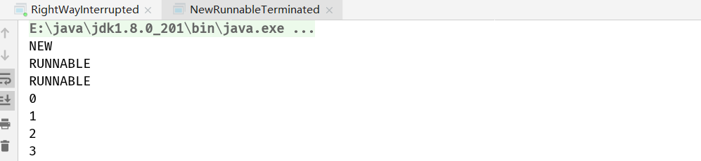
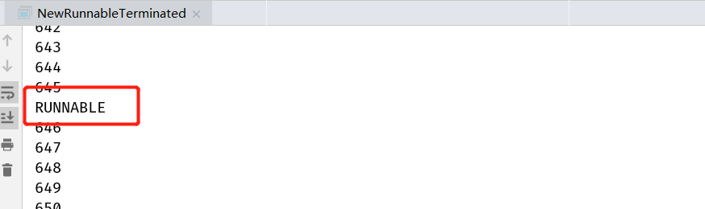
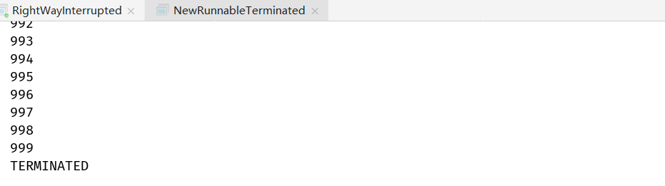
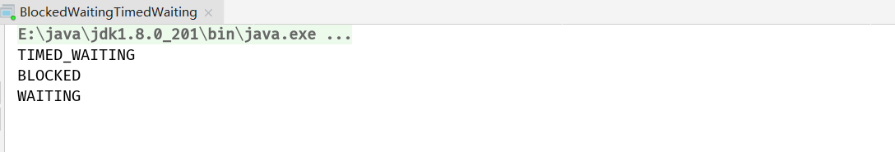

## 1. 线程生命周期


1. 一旦调用start方法，线程状态就会为Runnable，此处的Runnable代表了两种状态：1. 可运行的， 2.正在运行的

2. 当线程进入了被synchronized修饰的代码块中，并且该锁已经被其它线程拿走了时，线程的状态就是Blocked



```java
/**
 * 描述：     展示线程的NEW、RUNNABLE、Terminated状态。即使是正在运行，也是Runnable状态，而不是Running。
 */
public class NewRunnableTerminated implements Runnable {

  public static void main(String[] args) {
    Thread thread = new Thread(new NewRunnableTerminated());
    //打印出NEW的状态
    System.out.println(thread.getState());
    thread.start();
    System.out.println(thread.getState());
    try {
      Thread.sleep(10);
    } catch (InterruptedException e) {
      e.printStackTrace();
    }
    //打印出RUNNABLE的状态，即使是正在运行，也是RUNNABLE，而不是RUNNING
    System.out.println(thread.getState());
    try {
      Thread.sleep(100);
    } catch (InterruptedException e) {
      e.printStackTrace();
    }
    //打印出TERMINATED状态
    System.out.println(thread.getState());
  }

  @Override
  public void run() {
    for (int i = 0; i < 1000; i++) {
      System.out.println(i);
    }
  }
}
```







```java
/**
 * 描述：     展示Blocked, Waiting, TimedWaiting
 */
public class BlockedWaitingTimedWaiting implements Runnable {
  public static void main(String[] args) {
    BlockedWaitingTimedWaiting runnable = new BlockedWaitingTimedWaiting();
    Thread thread1 = new Thread(runnable);
    thread1.start();
    Thread thread2 = new Thread(runnable);
    thread2.start();
    try {
      Thread.sleep(5);
    } catch (InterruptedException e) {
      e.printStackTrace();
    }
    //打印出Timed_Waiting状态，因为正在执行Thread.sleep(1000);
    System.out.println(thread1.getState());
    //打印出BLOCKED状态，因为thread2想拿得到sync()的锁却拿不到
    System.out.println(thread2.getState());
    try {
      Thread.sleep(1300);
    } catch (InterruptedException e) {
      e.printStackTrace();
    }
    //打印出WAITING状态，因为执行了wait()
    System.out.println(thread1.getState());

  }

  @Override
  public void run() {
    syn();
  }

  private synchronized void syn() {
    try {
      Thread.sleep(1000);
      wait();
    } catch (InterruptedException e) {
      e.printStackTrace();
    }
  }
}
```




