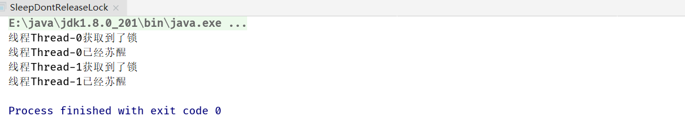
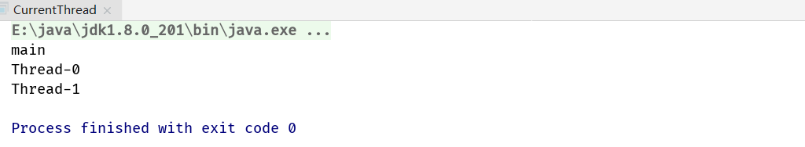

## 1. Thread和Object类中的重要方法详解


### 1.1 方法概览


### 1.2 wait/notify/notifyAll相关


#### 1.1.1 阻塞阶段


#### 1.1.2 唤醒阶段

#### 1.1.3 遇到中断

```java
/**
 * 描述：     展示wait和notify的基本用法 1. 研究代码执行顺序 2. 证明wait释放锁
 */
public class Wait {

  public static Object object = new Object();

  static class Thread1 extends Thread {

    @Override
    public void run() {
      synchronized (object) {
        System.out.println(Thread.currentThread().getName() + "开始执行了");
        try {
          // 抛弃锁
          object.wait();
        } catch (InterruptedException e) {
          e.printStackTrace();
        }
        // 一旦执行到这行代码就意味着线程又重新拿到了这把锁
        System.out.println("线程" + Thread.currentThread().getName() + "获取到了锁。");
      }
    }
  }

  static class Thread2 extends Thread {

    @Override
    public void run() {
      synchronized (object) {
        object.notify();
        // 即使唤醒了线程一，但是线程二仍然持有这把锁，得等synchronized同步代码代码块执行完成之后采取执行线程一
        //	这把锁在线程间相互移交
        System.out.println("线程" + Thread.currentThread().getName() + "调用了notify()");
      }
    }
  }

  public static void main(String[] args) throws InterruptedException {
    Thread1 thread1 = new Thread1();
    Thread2 thread2 = new Thread2();
    // 保证thread1的wait方法先执行
    thread1.start();
    Thread.sleep(200);
    thread2.start();
  }
}
```


```java
/**
 * 描述：     3个线程，线程1和线程2首先被阻塞，线程3唤醒它们。notify, notifyAll。 start先执行不代表线程先启动。
 */
public class WaitNotifyAll implements Runnable {

  private static final Object resourceA = new Object();

  public static void main(String[] args) throws InterruptedException {
    Runnable r = new WaitNotifyAll();
    Thread threadA = new Thread(r);
    Thread threadB = new Thread(r);
    Thread threadC = new Thread(new Runnable() {
      @Override
      public void run() {
        synchronized (resourceA) {
          resourceA.notifyAll();
          System.out.println("ThreadC notified.");
        }
      }
    });
    threadA.start();
    threadB.start();
    Thread.sleep(200);
    threadC.start();
  }

  @Override
  public void run() {
    synchronized (resourceA) {
      System.out.println(Thread.currentThread().getName() + " got resourceA lock.");
      try {
        System.out.println(Thread.currentThread().getName() + " waits to start.");
        resourceA.wait();
        System.out.println(Thread.currentThread().getName() + "'s waiting to end.");
      } catch (InterruptedException e) {
        e.printStackTrace();
      }
    }
  }
}
```


1. 若把`resourceA.notifyAll();`改为`resourceA.notify();`则只唤醒一个线程，另一个线程一直被阻塞


2. 若把`Thread.sleep(200);`去掉，同样的只唤醒一个线程，另一个线程一直被阻塞，因为`resourceA.notifyAll();`在第二个线程被阻塞前执行


3. 执行`wait`方法的一定是个对象，对象其实就代表了那把锁，哪一个对象执行了`wait`方法就会释放掉哪一个对象的锁而不影响其他锁的行为，每一个锁的状态是独立的

```java
/**
 * 描述：     证明wait只释放当前的那把锁
 */
public class WaitNotifyReleaseOwnMonitor {

  private static volatile Object resourceA = new Object();
  private static volatile Object resourceB = new Object();

  public static void main(String[] args) {
    Thread thread1 = new Thread(new Runnable() {
      @Override
      // 验证thread1持有resourceB这把锁
      public void run() {
        synchronized (resourceA) {
          System.out.println("ThreadA got resourceA lock.");
          synchronized (resourceB) {
            System.out.println("ThreadA got resourceB lock.");
            try {
              System.out.println("ThreadA releases resourceA lock.");
              resourceA.wait();
            } catch (InterruptedException e) {
              e.printStackTrace();
            }
          }
        }
      }
    });

    Thread thread2 = new Thread(new Runnable() {
      @Override
      public void run() {
        try {
          // 等待thread1释放锁
          Thread.sleep(1000);
        } catch (InterruptedException e) {
          e.printStackTrace();
        }
        synchronized (resourceA) {
          System.out.println("ThreadB got resourceA lock.");
          System.out.println("ThreadB tries to resourceB lock.");

          synchronized (resourceB) {
            System.out.println("ThreadB got resourceB lock.");
          }
        }
      }
    });

    thread1.start();
    thread2.start();
  }
}
```


### 1.3 wait/notify/notifyAll特点


### 1.4 手写生产者消费者设计模式


```java
/**
 * 描述：     用wait/notify来实现生产者消费者模式
 */
public class ProducerConsumerModel {
  public static void main(String[] args) {
    EventStorage eventStorage = new EventStorage();
    Producer producer = new Producer(eventStorage);
    Consumer consumer = new Consumer(eventStorage);
    new Thread(producer).start();
    new Thread(consumer).start();
  }
}

class Producer implements Runnable {

  private EventStorage storage;

  public Producer(
      EventStorage storage) {
    this.storage = storage;
  }

  @Override
  public void run() {
    for (int i = 0; i < 100; i++) {
      storage.put();
    }
  }
}

class Consumer implements Runnable {

  private EventStorage storage;

  public Consumer(
      EventStorage storage) {
    this.storage = storage;
  }

  @Override
  public void run() {
    for (int i = 0; i < 100; i++) {
      storage.take();
    }
  }
}

class EventStorage {

  private int maxSize;
  private LinkedList<Date> storage;

  public EventStorage() {
    maxSize = 10;
    storage = new LinkedList<>();
  }

  public synchronized void put() {
    while (storage.size() == maxSize) {
      try {
        wait();
      } catch (InterruptedException e) {
        e.printStackTrace();
      }
    }
    storage.add(new Date());
    System.out.println("仓库里有了" + storage.size() + "个产品。");
    notify();
  }

  public synchronized void take() {
    while (storage.size() == 0) {
      try {
        wait();
      } catch (InterruptedException e) {
        e.printStackTrace();
      }
    }
    System.out.println("拿到了" + storage.poll() + "，现在仓库还剩下" + storage.size());
    notify();
  }
}
```

生产者消费者模式并不是生产完了再消费，而是交替生产消费的过程


### 1.5 wait/notify/notifyAll常见面试问题


```java
/**
 * 描述：     两个线程交替打印0~100的奇偶数，用synchronized关键字实现，synchronized代码块执行完自动释放锁
 */
public class WaitNotifyPrintOddEvenSyn {

  private static int count;

  private static final Object lock = new Object();

  //新建2个线程
  //1个只处理偶数，第二个只处理奇数（用位运算）
  //用synchronized来通信
  public static void main(String[] args) {
    new Thread(new Runnable() {
      @Override
      public void run() {
        while (count < 100) {
          synchronized (lock) {
            // 位运算，让1与count最后一位相于，相同取0，不同取1
            if ((count & 1) == 0) {
              System.out.println(Thread.currentThread().getName() + ":" + count++);
            }
          }
        }
      }
    }, "偶数").start();

    new Thread(new Runnable() {
      @Override
      public void run() {
        while (count < 100) {
          synchronized (lock) {
            if ((count & 1) == 1) {
              System.out.println(Thread.currentThread().getName() + ":" + count++);
            }
          }
        }
      }
    }, "奇数").start();
  }
}
```

```java
/**
 * 描述：     两个线程交替打印0~100的奇偶数，用wait和notify
 */
public class WaitNotifyPrintOddEveWait {
  private static int count = 0;
  private static final Object lock = new Object();

  public static void main(String[] args) {
    new Thread(new TurningRunner(), "偶数").start();
    Thread.sleep(10);
    new Thread(new TurningRunner(), "奇数").start();
  }

  //1. 拿到锁，我们就打印
  //2. 打印完，唤醒其他线程，自己就休眠
  //3. notify和wait是配对的，只有先wait被阻塞才能唤醒，如果一开始就notify就相当于没这步操作
  static class TurningRunner implements Runnable {

    @Override
    public void run() {
      while (count <= 100) {
        synchronized (lock) {
          //拿到锁就打印
          System.out.println(Thread.currentThread().getName() + ":" + count++);
          // 把另外线程唤醒
          lock.notify();
          if (count <= 100) {
            try {
              //如果任务还没结束，就让出当前的锁，并自己休眠
              lock.wait();
            } catch (InterruptedException e) {
              e.printStackTrace();
            }
          }
        }
      }
    }
  }
}
```


防止出现死锁，因为不放在`synchronized`代码块中可能会导致notify函数在wait函数之前被调用，进程间需要配合的方法都需要放在同步代码块中


因为`wait/notify/notifyAll`是锁级别的操作，而锁是属于某个对象的，而并不是线程中，一个线程可以配置多把锁

### 1.6 sleep方法概览


```java
/**
 * 展示线程sleep的时候不释放synchronized的monitor，等sleep时间到了以后，正常结束后才释放锁
 */
public class SleepDontReleaseMonitor implements Runnable {

  public static void main(String[] args) {
    SleepDontReleaseMonitor sleepDontReleaseMonitor = new SleepDontReleaseMonitor();
    new Thread(sleepDontReleaseMonitor).start();
    new Thread(sleepDontReleaseMonitor).start();
  }

  @Override
  public void run() {
    syn();
  }

  private synchronized void syn() {
    System.out.println("线程" + Thread.currentThread().getName() + "获取到了monitor。");
    try {
      Thread.sleep(2000);
    } catch (InterruptedException e) {
      e.printStackTrace();
    }
    System.out.println("线程" + Thread.currentThread().getName() + "退出了同步代码块");
  }
}
```


```java
/**
 * 描述：     演示sleep不释放lock（lock需要手动释放）
 */
public class SleepDontReleaseLock implements Runnable {

  private static final Lock lock = new ReentrantLock();

  @Override
  public void run() {
    lock.lock();
    System.out.println("线程" + Thread.currentThread().getName() + "获取到了锁");
    try {
      Thread.sleep(1000);
      System.out.println("线程" + Thread.currentThread().getName() + "已经苏醒");
    } catch (InterruptedException e) {
      e.printStackTrace();
    } finally {
      lock.unlock();
    }
  }

  public static void main(String[] args) {
    SleepDontReleaseLock sleepDontReleaseLock = new SleepDontReleaseLock();
    new Thread(sleepDontReleaseLock).start();
    new Thread(sleepDontReleaseLock).start();
  }
}
```



### 1.7 sleep方法响应中断


```java
/**
 * 描述：     每个1秒钟输出当前时间，被中断，观察。
 * Thread.sleep()
 * TimeUnit.SECONDS.sleep()
 */
public class SleepInterrupted implements Runnable {

  public static void main(String[] args) throws InterruptedException {
    Thread thread = new Thread(new SleepInterrupted());
    thread.start();
    Thread.sleep(3000);
    thread.interrupt();
  }

  @Override
  public void run() {
    for (int i = 0; i < 5; i++) {
      System.out.println(new Date());
      try {
        // 休眠3小时25分1秒
        TimeUnit.HOURS.sleep(3);
        TimeUnit.MINUTES.sleep(25);
        TimeUnit.SECONDS.sleep(1);
      } catch (InterruptedException e) {
        System.out.println("我被中断了！");
        e.printStackTrace();
      }
    }
  }
}
```


### 1.8 join方法详解


业务逻辑：需要等待好几个资源的初始化，等初始化完毕主线程再进行下一步工作

1. 普通方法

```java
/**
 * 描述：     演示join，注意语句输出顺序，会变化。
 */
public class Join {
  public static void main(String[] args) throws InterruptedException {
    Thread thread = new Thread(new Runnable() {
      @Override
      public void run() {
        try {
          Thread.sleep(1000);
        } catch (InterruptedException e) {
          e.printStackTrace();
        }
        System.out.println(Thread.currentThread().getName() + "执行完毕");
      }
    });
    Thread thread2 = new Thread(new Runnable() {
      @Override
      public void run() {
        try {
          Thread.sleep(1000);
        } catch (InterruptedException e) {
          e.printStackTrace();
        }
        System.out.println(Thread.currentThread().getName() + "执行完毕");
      }
    });

    thread.start();
    thread2.start();
    System.out.println("开始等待子线程运行完毕");
    thread.join();
    thread2.join();
    System.out.println("所有子线程执行完毕");
  }
}	
```


当把`join`语句注释掉后


2. 遇到中断

```java
/**
 * 描述：     演示join期间被中断的效果
 */
public class JoinInterrupt {
  public static void main(String[] args) {
    Thread mainThread = Thread.currentThread();
    Thread thread1 = new Thread(new Runnable() {
      @Override
      public void run() {
        try {
          // 子线程对主线程进行中断
          mainThread.interrupt();
          Thread.sleep(5000);
          System.out.println("Thread1 finished.");
        } catch (InterruptedException e) {
          System.out.println("子线程中断");
        }
      }
    });
    thread1.start();
    System.out.println("等待子线程运行完毕");
    try {
      // 注意是主线程等待Thread1完成期间，一旦中断是主线程触发的异常
      thread1.join();
    } catch (InterruptedException e) {
      System.out.println(Thread.currentThread().getName() + "主线程中断了");
      thread1.interrupt();
    }
    System.out.println("子线程已运行完毕");
  }
}
```


3. Join替代写法

```java
/**
 * 描述：     通过讲解join原理，分析出join的代替写法
 */
public class JoinPrinciple {

  public static void main(String[] args) throws InterruptedException {
    Thread thread = new Thread(new Runnable() {
      @Override
      public void run() {
        try {
          Thread.sleep(1000);
        } catch (InterruptedException e) {
          e.printStackTrace();
        }
        System.out.println(Thread.currentThread().getName() + "执行完毕");
      }
    });

    thread.start();
    System.out.println("开始等待子线程运行完毕");
    //    thread.join();
    // main线程拿到了thread这把锁并且休眠，等run方法执行完毕时会重新唤醒main线程
    synchronized (thread) {
      thread.wait();
    }
    System.out.println("所有子线程执行完毕");
  }
}
```


### 1.9 yield方法详解


注意这里只是释放CPU的资源，其他资源(数据，锁...)并不会被释放

### 1.10 currentThread

```java
/**
 * 描述：     演示打印main, Thread-0, Thread-1
 */
public class CurrentThread implements Runnable {

  public static void main(String[] args) {
    new CurrentThread().run();
    new Thread(new CurrentThread()).start();
    new Thread(new CurrentThread()).start();
  }

  @Override
  public void run() {
    System.out.println(Thread.currentThread().getName());
  }
}
```



