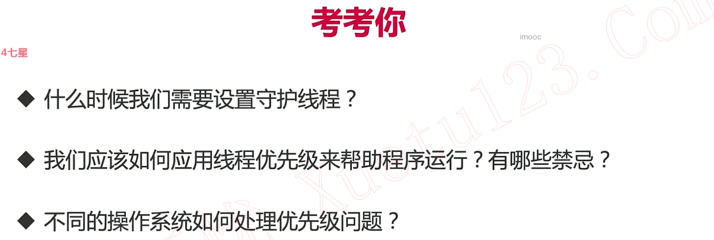
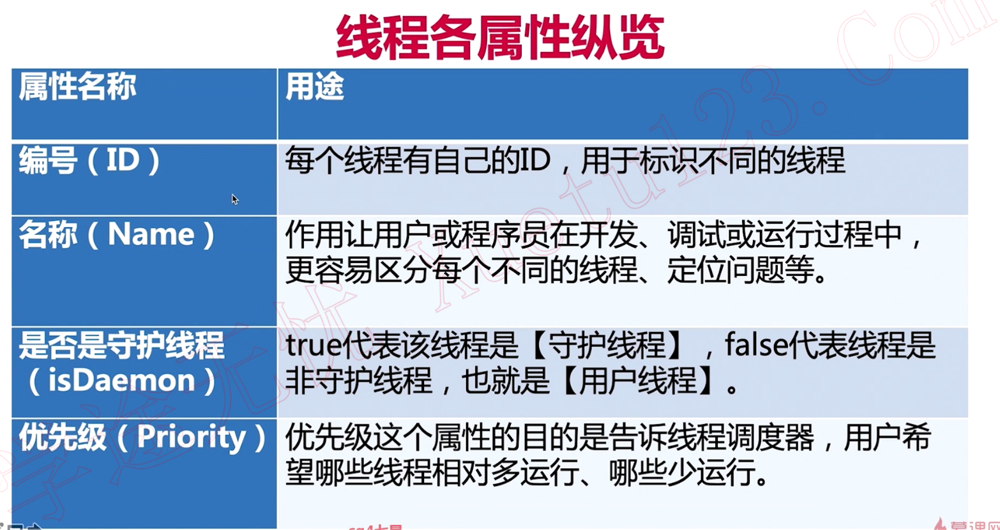
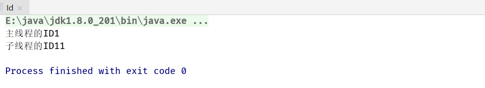

## 1. 线程各属性



### 1.1 线程ID

```java
/**
 * 描述：     ID从1开始，JVM运行起来后，我们自己创建的线程的ID早已不是2.
 */
public class Id {

  public static void main(String[] args) {
    Thread thread = new Thread();
    System.out.println("主线程的ID" + Thread.currentThread().getId());
    System.out.println("子线程的ID" + thread.getId());
  }
}
```



### 1.2 线程名字


### 1.3 守护线程(比如垃圾处理者...)


被JVM自动启动


