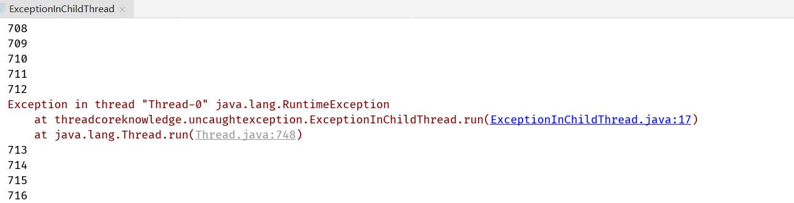

## 1. 线程未捕获异常处理(UncaughtExceptionHandle)


子线程抛出异常但是主线程不受影响



```java
/**
 * 描述： 1. 不加try catch抛出4个异常，都带线程名字 2. 加了try catch,期望捕获到第一个线程的异常，线程234不应该运行，希望看到打印出Caught Exception
 * 3. 执行时发现，根本没有Caught Exception，线程234依然运行并且抛出异常
 * <p>
 * 说明线程的异常不能用传统方法捕获
 */
public class CantCatchDirectly implements Runnable {

  public static void main(String[] args) throws InterruptedException {
    try {
      new Thread(new CantCatchDirectly(), "MyThread-1").start();
      Thread.sleep(300);
      new Thread(new CantCatchDirectly(), "MyThread-2").start();
      Thread.sleep(300);
      new Thread(new CantCatchDirectly(), "MyThread-3").start();
      Thread.sleep(300);
      new Thread(new CantCatchDirectly(), "MyThread-4").start();
    } catch (RuntimeException e) {
      System.out.println("Caught Exception.");
    }
  }

  @Override
  public void run() {
    throw new RuntimeException();
  }
}
```

子线程的异常无法让主线程捕获


```java
@Override
public void run() {
  try {
    throw new RuntimeException();
  } catch (RuntimeException e) {
    System.out.println("Caught Exception.");
  }
}
```


```java
/**
 * 描述：     自己的MyUncaughtExceptionHanlder
 */
public class MyUncaughtExceptionHandler implements Thread.UncaughtExceptionHandler {

  private String name;

  public MyUncaughtExceptionHandler(String name) {
    this.name = name;
  }

  @Override
  public void uncaughtException(Thread t, Throwable e) {
    Logger logger = Logger.getAnonymousLogger();
    logger.log(Level.WARNING, "线程异常，终止啦" + t.getName());
    System.out.println(name + "捕获了异常" + t.getName() + "异常");
  }
}
```

```java
/**
 * 描述：     使用刚才自己写的UncaughtExceptionHandler
 */
public class UseOwnUncaughtExceptionHandler implements Runnable {

  public static void main(String[] args) throws InterruptedException {
    Thread.setDefaultUncaughtExceptionHandler(new MyUncaughtExceptionHandler("捕获器1"));

    new Thread(new UseOwnUncaughtExceptionHandler(), "MyThread-1").start();
    Thread.sleep(300);
    new Thread(new UseOwnUncaughtExceptionHandler(), "MyThread-2").start();
    Thread.sleep(300);
    new Thread(new UseOwnUncaughtExceptionHandler(), "MyThread-3").start();
    Thread.sleep(300);
    new Thread(new UseOwnUncaughtExceptionHandler(), "MyThread-4").start();
  }


  @Override
  public void run() {
    throw new RuntimeException();
  }
}
```


