## 1. 进程&线程

操作系统是包含多个进程的容器，而每个进程有事容纳多个线程的容器，线程利用进程提供的资源执行代码

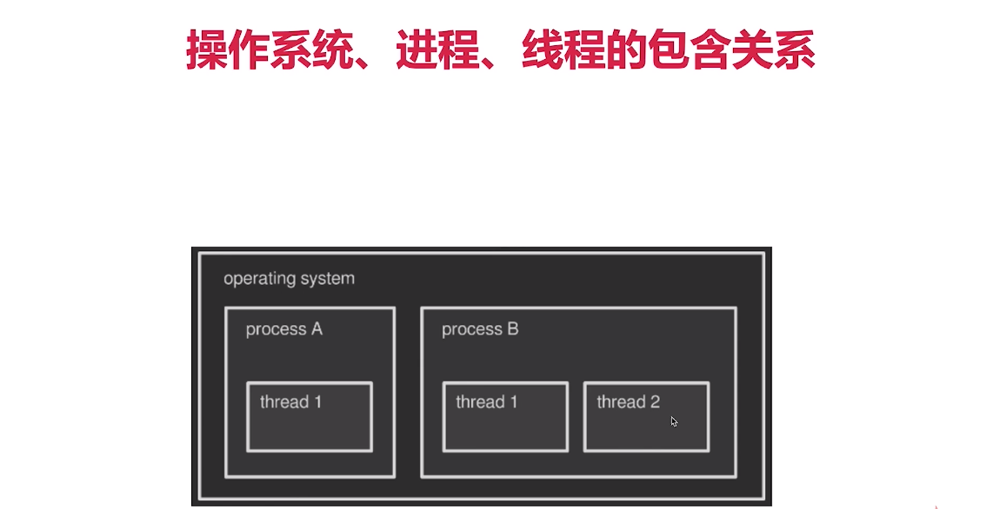

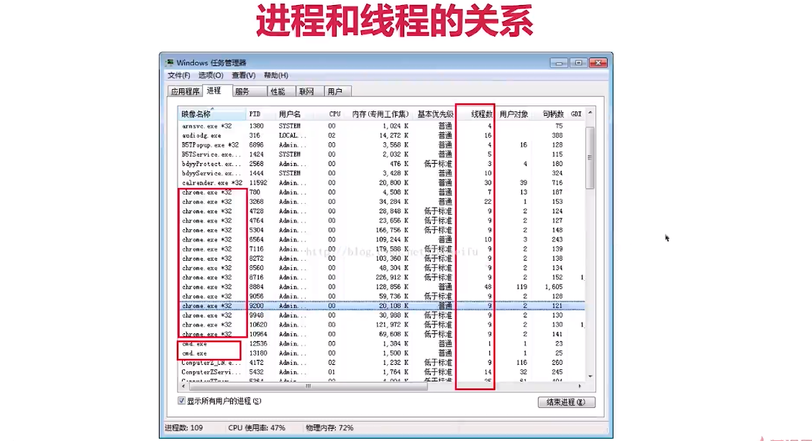

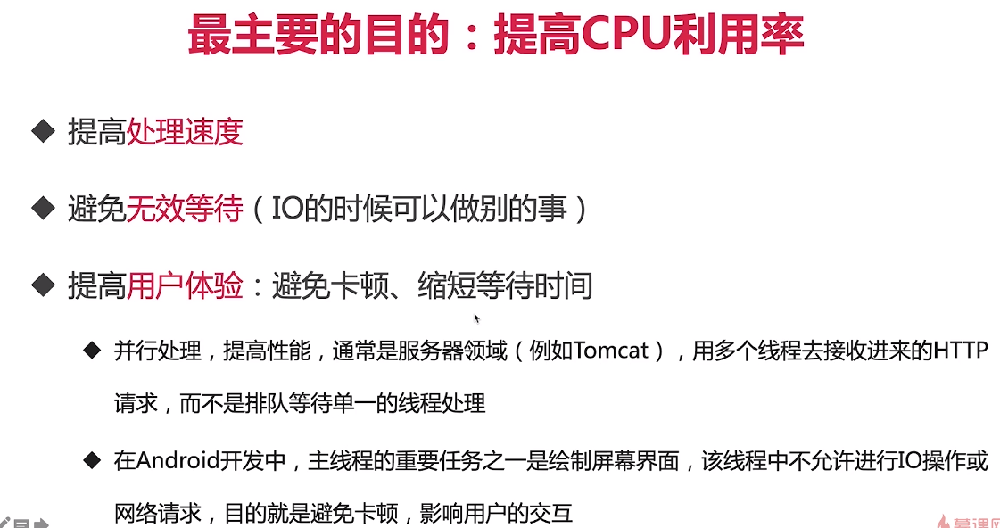

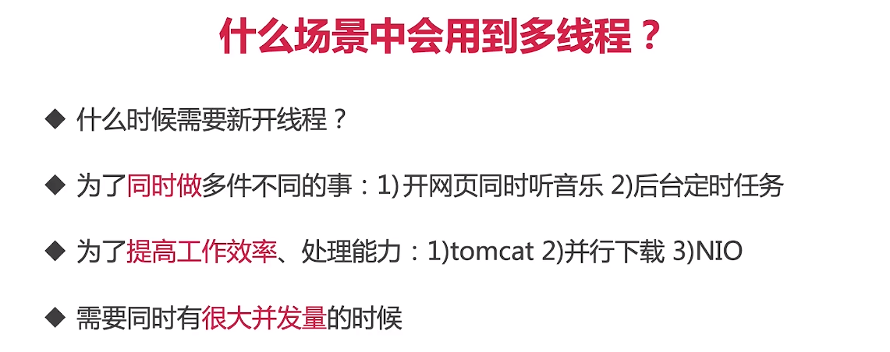

1. Tomcat或者Nginx对于比如过来了100个http请求，那么极端点来说对于
   `@PostMapping(value="/list")`下的方法就会开100个线程去执行这串代码

2. 并行下载：若干个线程会对服务器上的下载数据进行拆解，然后下载完成之后就会拼接

   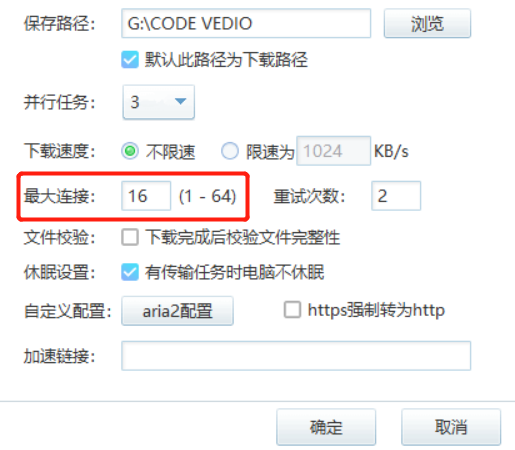

3. 压力测试

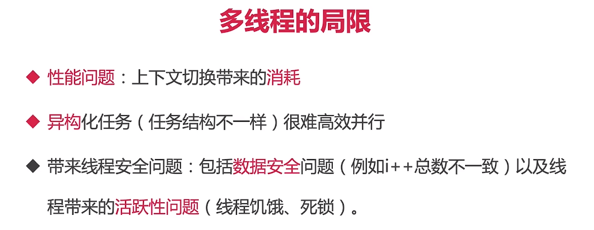

## 2. 并行&并发

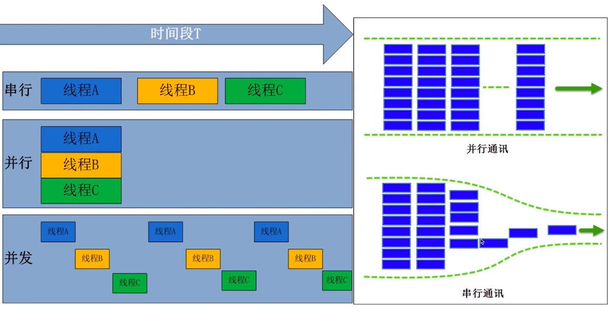

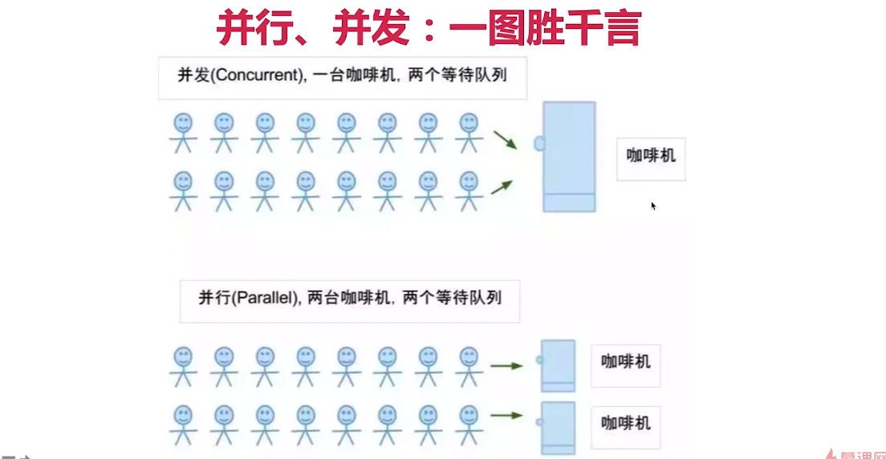

## 3. 同步&异步

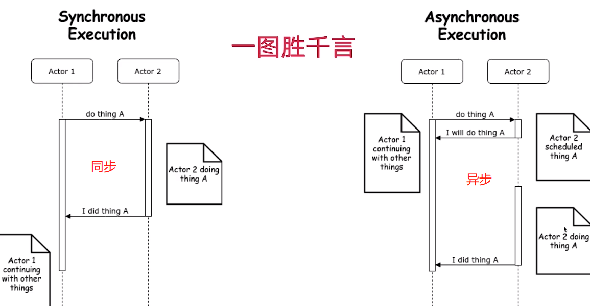

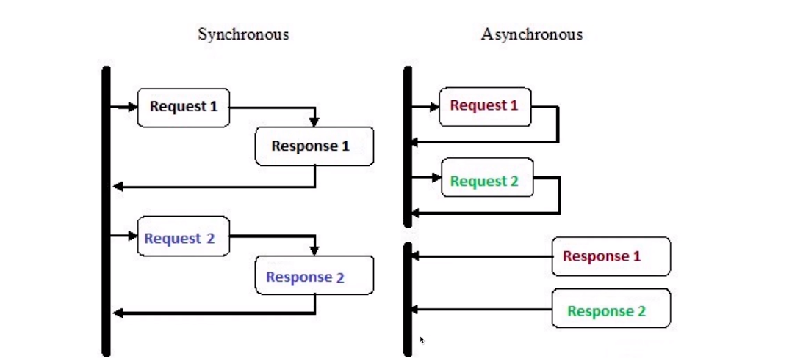

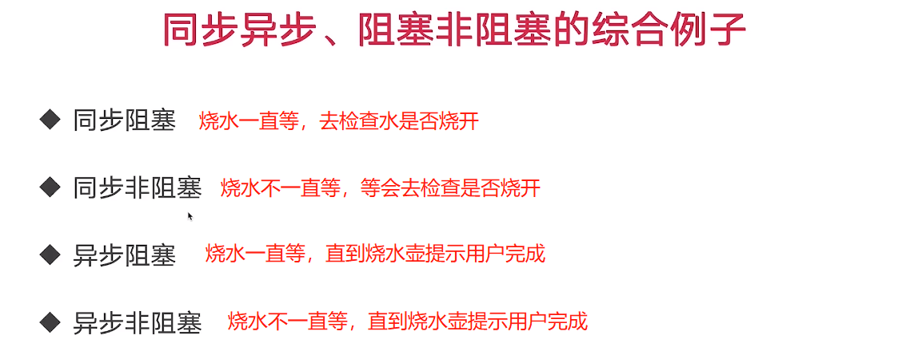

