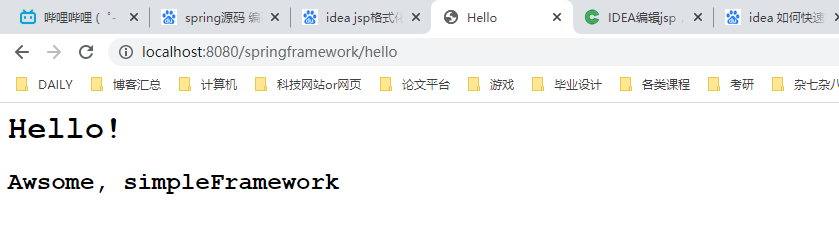

## 1. Spring源码的下载和编译（1）

Spring官网：https://spring.io/projects/spring-framework

Spring源码下载地址：https://github.com/spring-projects/spring-framework/releases/tag/v5.2.0.RELEASE

Spring源码编译方法：https://github.com/spring-projects/spring-framework#build-from-source


****


****

* 需要先在build.gradle文件中配置阿里云的镜像以方便下载依赖

    

* 项目的依赖存放在allprojects中，同样需要在这块地方的repositories代码块中加上阿里云的依赖

    

* 在Spring源码目录中执行`./gradlew :spring-oxm:compileTestJava`

* 因为AspectJ有自己的编译器ajc，会影响jvm的加载，所以需要移除spring-aspects

    

## 2. Spring源码的下载和编译（2）

引用Spring源码构建一个demo

* 在源码的根目录下去创建一个Module，注意需要用gradle而不是maven创建，目的是引用Spring源码目录下的其他模块，其中一个最重要的模块就是"容器"模块；

    

* 我们的目的是实现一个接口并创建这个接口的实现类，把该实现类通过容器管理起来。当需要用到这个实现类实例的时候通过容器来获取

spring-demo目录结构


1. 创建一个入口类Entrance

    ```java
    /**
     * @description: 在这个Main函数里需要获取Spring Bean容器的实例，然后从这个容器中获取Bean的实例
     * @author: liangruuu
     * @date: 2021/3/7
     */
    public class Entrance {
    	public static void main(String[] args) {
    		System.out.println("Hello World!");
    		// 因为Bean是在xml文件中定义的，所以需要获取xml文件的路径（这里采用绝对值路径）
    		String xmlPath = "D:\\study\\code\\spring-framework-5.2.0.RELEASE\\spring-demo\\src\\main\\resources\\spring\\spring-config.xml";
    		/**
    		 * 拿到路径之后需要去解析XML文件，同时生成Spring容器并返回给调用者
    		 * 而解析XML文件的类存放在spring-context模块下，这也意味着Entrance类需要依赖于spring-context模块
    		 * 若以gradle构建项目，则需要在spring-demo模块下的build.gradle的dependencies代码块中新增compile(project(":spring-context"))
    		 * 作用为把spring-context模块引入到这个项目里面来，引入之后就可以使用相关的解析类了
    		 * ApplicationContext就是对应的容器对象
    		 */
    		ApplicationContext applicationContext = new FileSystemXmlApplicationContext(xmlPath);
    		// 这里的name就是在xml文件里配置的<bean>对应的id属性值，第二个参数就是对应的class属性值
    		WelcomeService welcomeService = applicationContext.getBean("welcomeService", WelcomeService.class);
    		// 调用实现类的sayHello方法
    		welcomeService.sayHello("spring is strong");
    
    	}
    }
    ```

2. 实现接口类

    ```java
    public interface WelcomeService {
    	String sayHello(String name);
    }
    ```

3. 实现接口类

    ```java
    /**
     * @description: 定义了接口的实现类之后需要告诉Spring这是你需要管理的Bean，需要将其放入到容器内
     * 我们可以通过注解Annotation或者XML的方式放入，这里采用XML方式，在resources目录下创建XML文件
     * 有了接口，有了实现类，有了Bean的定义之后我们就能将相关的实现类化为Bean托管到Spring的容器里
     * @author: liangruuu
     * @date: 2021/3/7
     */
    public class WelcomeServiceImpl implements WelcomeService {
    
    	@Override
    	public String sayHello(String name) {
    		System.out.println("welcome: " + name);
    		return "success";
    	}
    }
    ```

4. 配置xml文件，定义Bean

    ```xml
    <?xml version="1.0" encoding="UTF-8"?>
    <beans xmlns="http://www.springframework.org/schema/beans"
    	   xmlns:xsi="http://www.w3.org/2001/XMLSchema-instance"
    	   xsi:schemaLocation="http://www.springframework.org/schema/beans
    	   http://www.springframework.org/schema/beans/spring-beans.xsd">
    	<bean id="welcomeService" class="club.singlelucky.service.impl.WelcomeServiceImpl"/>
    </beans>
    ```

5. 最后在入口Main文件里调用获取容器内存放的Bean对象，并且调用方法

    

## 3. 自研框架的整体介绍及雏形搭建


****


1. 新建一个简单的web项目用来实现一个输出HelloWorld的页面（使用maven构建）

    

    ****

    

2. 因为需要让servlet接受http请求，并且返回jsp页面，所以需要导入servlet和jsp两个依赖

    ```xml
    <dependencies>
        <dependency>
            <groupId>javax.servlet</groupId>
            <artifactId>javax.servlet-api</artifactId>
            <version>4.0.1</version>
            <scope>provided</scope>
        </dependency>
        <dependency>
            <groupId>javax.servlet.jsp</groupId>
            <artifactId>javax.servlet.jsp-api</artifactId>
            <version>2.3.3</version>
            <scope>provided</scope>
        </dependency>
    </dependencies>
    ```

3. 调用Servlet框架自带的服务

    ```java
    @WebServlet("/hello")
    public class HelloServlet extends HttpServlet {
        @Override
        protected void doGet(HttpServletRequest request, HttpServletResponse response) throws ServletException, IOException {
            String name = "simpleFramework";
            // jsp页面其中一个name属性被赋值成name
            request.setAttribute("name", name);
            // 把请求转发到jsp页面进行处理，jsp页面一般存放在/WEB-INF/jsp目录下
            request.getRequestDispatcher("/WEB-INF/jsp/hello.jsp").forward(request, response);
        }
    }
    ```

4. jsp页面

    ```jsp
    <%@ page pageEncoding="UTF-8" %>
    <html>
    <head>
        <title>Hello</title>
    </head>
    <body>
    <h1>Hello!</h1>
    
    <h2>Awsome, ${name}</h2>
    </body>
    </html>
    ```

5. 仅仅编码是不够的的，我们需要通过maven对项目进行编译，因此需要配置编译所需要的配置项

    ```xml
    <?xml version="1.0" encoding="UTF-8"?>
    <project xmlns="http://maven.apache.org/POM/4.0.0"
             xmlns:xsi="http://www.w3.org/2001/XMLSchema-instance"
             xsi:schemaLocation="http://maven.apache.org/POM/4.0.0 http://maven.apache.org/xsd/maven-4.0.0.xsd">
        <modelVersion>4.0.0</modelVersion>
    
        <groupId>club.singlelucky</groupId>
        <artifactId>springframework</artifactId>
        <version>1.0-SNAPSHOT</version>
        <!-- 指定项目打成jar包还是war包，因为本项目是一个web应用，所以打成web包 -->
        <packaging>war</packaging>
        <properties>
            <project.build.sourceEncoding>UTF-8</project.build.sourceEncoding>
        </properties>
        <dependencies>
            <dependency>
                <groupId>javax.servlet</groupId>
                <artifactId>javax.servlet-api</artifactId>
                <version>4.0.1</version>
                <scope>provided</scope>
            </dependency>
            <dependency>
                <groupId>javax.servlet.jsp</groupId>
                <artifactId>javax.servlet.jsp-api</artifactId>
                <version>2.3.3</version>
                <scope>provided</scope>
            </dependency>
        </dependencies>
        <!-- 在build标签编译所需配置项 -->
        <build>
            <!-- 编译产生的最终项目名 -->
            <finalName>simpleframework</finalName>
            <!-- 使用插件进行编译，可以有多个插件 -->
            <pluginManagement>
                <plugins>
                    <!-- maven-compiler-plugin插件是编译工具 -->
                    <plugin>
                        <groupId>org.apache.maven.plugins</groupId>
                        <artifactId>maven-compiler-plugin</artifactId>
                        <version>3.8.1</version>
                        <!-- 需要告诉maven程序编译时依赖的jdk版本和编译后的依赖jdk版本 -->
                        <configuration>
                            <source>8</source>
                            <target>8</target>
                        </configuration>
                    </plugin>
                    <!-- 需要一个web容器来让程序跑起来从而接受web请求 -->
                    <plugin>
                        <groupId>org.apache.tomcat.maven</groupId>
                        <artifactId>tomcat7-maven-plugin</artifactId>
                        <version>2.2</version>
                        <!-- 告诉tomcat编译的是哪个项目 -->
                        <configuration>
                            <path>/${project.artifactId}</path>
                        </configuration>
                    </plugin>
                </plugins>
            </pluginManagement>
        </build>
    
    </project>
    ```

6. 设置tomcat启动命令

    

7. 运行结果

    

****


