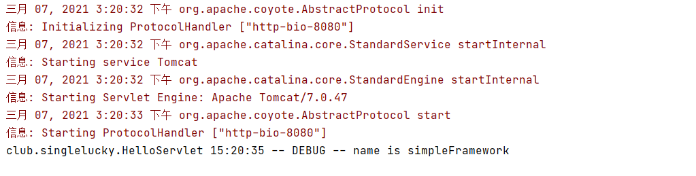

## 1. 项目业务梳理、数据库和实体类的设计

### 1.1 项目总体需求

* 只关注模块间的交互以及类的灌流
* 核心目标：抽象出通用的框架


### 1.2 用例分析


### 1.3 数据库分析


****


****


### 1.4 实体类设计


## 2. 项目依赖配置以及门面模式（1）

### 2.1 架构设计

从整体到局部逐渐实现，采用MVC架构


* Model层是一个泛化的概念，它可以包括service层，dao层和实体类等层
* control层是用来调度view层和model层的，将业务逻辑和用户界面合理组织在一起。主要作用为请求的分发，因此在编写程序的时候应尽可能把复杂逻辑抽离，即把复杂的业务逻辑下沉至Model层

### 2.2 单一职责原则

* 让Control层的类只关注请求的派发，让代码更加简洁


### 2.3 目录结构

* service层主要负责业务模块的逻辑应用设计
* dao层主要负责数据持久层的工作，主要与数据库交互
* entity层主要用于存放实体类


****

引入项目所需要的两个依赖slf4j-log4j12和lombok

```xml
<dependency>
    <groupId>org.slf4j</groupId>
    <artifactId>slf4j-log4j12</artifactId>
    <version>1.7.28</version>
</dependency>
```

* 引入slf4j-log4j12后，maven会额外引入slf4j-api和log4j两个jar包
* 既然我们底层主要应用log4j这个日志框架，为什么我们不直接引入lof4j依赖而是要引入slf4j-log4j12这个依赖呢？
    * 原因是虽然能保证系统只是用log4j这个底层日志框架，但是我们没法保证项目所引入的其他jar包不引用其余的日志框架，比如logback。此时系统就不得不同时支持并维护多种日志框架了，非常之不方便。为了解决多种日志框架的兼容问题，我们就需要用到slf4j这个jar包了

### 2.4 门面模式（Facade Pattern）

* 子系统的外部与其内部的通信必须通过同意的对象进行
* 提供一个高层次的接口，使得子系统更易于使用；要想访问子系统就必须通过该对象的入口才能访问，而这个入口对象往往将子系统的方法打包成了一块，提供完整功能供外界使用


****


****


### 2.5 通过slf4j实现对多种日志框架的兼容


* slf4j入口是众多接口的集合，它不提供具体日志实现，只在编译时寻找合适的日志系统进行绑定。具体有哪些接口全都定义在slf4j-api中，我们可以统一调用slf4j-api中提供的接口来调用底层的日志方法而不需要关心如何实现
* 这样当我们更换日志源的时候就不需要更改相关的日志代码
* 但是由于不同框架设计的诸如方法名，方法调用规则，参数返回值不尽相同。为了解决这个差异，我们需要一层适配层(Apapter)。该层封装了日志框架的底层调用，与slf4j交互时提供了统一的接口。比如log4j对应的适配层就是slf4j-log412

当引入slf4j-log412依赖之后，我们可以直接使用统一的代码来实现日志工作

`Logger log = LoggerFactory.getLogger(Object.class);`

**src/main/resources/log4j.properties**

```properties
### 设置日志的打印机别以及要输出到的地方 ###
# 优先级从高到低分别是ERROR、WARN、INFO、DEBUG
# 比如在这里定义了INFO级别，则应用程序中所有DEBUG级别的日志信息将不被打印
# stdout只带要输出到的地方，可以是不同的自定义名称，也可以有多个，表示输出到多端口
log4j.rootLogger=debug,stdout

### 输出信息到控制台 ###
log4j.appender.stdout=org.apache.log4j.ConsoleAppender
log4j.appender.stdout.Target=System.out
log4j.appender.stdout.layout=org.apache.log4j.PatternLayout

### 输出日志的格式 ###
#%c: 输出日志信息所属的类目，通常就是所在类的全名
#%d: 输出日志时间点的日期或时间
#%p: 输出日志信息优先级，即DEBUG, INFO, WARN, ERROR, FATAL
#%m: 输出代码中指定的信息，产生的日志具体信息
#%n: 输出一个回车换行符，Windows平台为"\r\n", Unix平台为"\n"输出日志信息换行
#这里的示例: club.singlelucky.HelloServlet 15:14:00 -- INFO -- test
log4j.appender.stdout.layout.ConversionPattern=%c %d{HH:mm:ss} -- %p -- %m%n
```

使用日志框架方法

```java
@WebServlet("/hello")
public class HelloServlet extends HttpServlet {
    Logger log = LoggerFactory.getLogger(HelloServlet.class);

    @Override
    protected void doGet(HttpServletRequest request, HttpServletResponse response) throws ServletException, IOException {
        String name = "simpleFramework";
        log.debug("name is " + name);
        // jsp页面其中一个name属性被赋值成name
        request.setAttribute("name", name);
        // 把请求转发到jsp页面进行处理，jsp页面一般存放在/WEB-INF/jsp目录下
        request.getRequestDispatcher("/WEB-INF/jsp/hello.jsp").forward(request, response);
    }
}
```



### 2.6 idea安装Lombok插件

```xml
<dependency>
    <groupId>org.projectlombok</groupId>
    <artifactId>lombok</artifactId>
    <version>1.18.10</version>
    <scope>provided</scope>
</dependency>
```


**当我们引入lombok之后，可以通过注解方式省去使用日志框架时那行固定代码**

```java
@Slf4j
@WebServlet("/hello")
public class HelloServlet extends HttpServlet {
    
    @Override
    protected void doGet(HttpServletRequest request, HttpServletResponse response) throws ServletException, IOException {
        String name = "simpleFramework";
        log.debug("name is " + name);
        // jsp页面其中一个name属性被赋值成name
        request.setAttribute("name", name);
        // 把请求转发到jsp页面进行处理，jsp页面一般存放在/WEB-INF/jsp目录下
        request.getRequestDispatcher("/WEB-INF/jsp/hello.jsp").forward(request, response);
    }
}
```

### 2.7 编写Entity层代码

* @Data是@Getter和@Setter的聚合写法

```java
@Data
public class HeadLine {
    private Long lineId;
    private String lineName;
    private String lineLink;
    private String lineImg;
    private Integer priority;
    private Integer enableStatus;
    private Date createTime;
    private Date lastEditTime;
}
```

```java
@Data
public class ShopCategory {
    private Long shopCategoryId;
    private String shopCategoryName;
    private String shopCategoryDesc;
    private String shopCategoryImg;
    private Integer priority;
    private Date createTime;
    private Date lastEditTime;
    private ShopCategory parent;
}
```

### 2.8 编写Service层代码

* 业务逻辑的处理，Controller无需知道具体的业务逻辑，只需要从Service层获取通用格式的返回数据

## 3. Service层代码架子的搭建

* 使用泛型构造返回数据

```java
@Data
public class Result<T> {
    /**
     * 本次请求结果的状态码，200表示成功
     */
    private int code;
    /**
     * 本次请求结果的详情
     */
    private String msg;
    /**
     * 本次请求返回的结果集
     */
    private T data;
}
```

## 4. Controller层代码架子的搭建

### 4.1 Servlet


* Servlet用来接受和处理前端的请求，本质上是一段Java程序。这段程序无法独立运行，必须放在诸如tomcat，jetty等容器中运行，由容器调用执行。
* Servlet在第一次被访问的时候由容器实现，同时调用init()方法。之后Servlet会一直驻留在容器中，只要有请求访问就会调用service()方法处理

```java
public abstract class HttpServlet extends GenericServlet {
    protected void doGet(HttpServletRequest req, HttpServletResponse resp);
    protected void doPost(HttpServletRequest req, HttpServletResponse resp);
    ......
}
```


```java
@Slf4j
@WebServlet("/hello")
public class HelloServlet extends HttpServlet {
    @Override
    public void init() {
        System.out.println("init Servlet...");
    }

    @Override
    protected void service(HttpServletRequest req, HttpServletResponse resp) throws ServletException, IOException {
        System.out.println("doGet entrance...");
        doGet(req, resp);
    }

    @Override
    protected void doGet(HttpServletRequest req, HttpServletResponse resp) throws ServletException, IOException {
        String name = "simpleFramework";
        log.debug("name is " + name);
        // jsp页面其中一个name属性被赋值成name
        req.setAttribute("name", name);
        // 把请求转发到jsp页面进行处理，jsp页面一般存放在/WEB-INF/jsp目录下
        req.getRequestDispatcher("/WEB-INF/jsp/hello.jsp").forward(req, resp);
    }

    @Override
    public void destroy() {
        System.out.println("destroy...");
    }
}
```


### 4.2 DispatcherServlet

 

```java
// "/"意味着拦截所有请求
@WebServlet("/")
public class DispatcherServlet extends HttpServlet {
    @Override
    protected void service(HttpServletRequest req, HttpServletResponse resp) throws ServletException, IOException {
        System.out.println("request path is: " + req.getServletPath());
        System.out.println("request method is: " + req.getMethod());
        if ("/frontend/getmainpageinfo".equals(req.getServletPath()) && "GET".equals(req.getMethod())) {
            new MainPageController().getMainPageInfo(req, resp);
        } else if ("/superadmin/addheadline".equals(req.getServletPath()) && "POST".equals(req.getMethod())) {
            new HeadLineOperationController().addHeadLine(req, resp);
        }
    }
}
```


