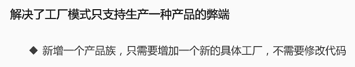

## 1. 尝试引入简单工厂模式


****


```java
public interface Mouse {
    void sayHi();
}
```

```java
public class HpMouse implements Mouse{
    @Override
    public void sayHi() {
        System.out.println("i am Hpmouse...");
    }
}
```

```java
public class DellMouse implements Mouse{
    @Override
    public void sayHi() {
        System.out.println("i am dellmouse...");
    }
}
```

```java
public class MouseFactory {
    public static Mouse createMouse(int type) {
        switch (type) {
            case 0:
                return new DellMouse();
            case 1:
                return new HpMouse();
            default:
                return new DellMouse();
        }
    }

    public static void main(String[] args) {
        Mouse mouse = MouseFactory.createMouse(1);
        mouse.sayHi();
    }
}
```


### 1.1 开闭原则

* 一个软件实体，应该对扩展开发，对修改关闭
* 应该通过扩展实现变化，而不是通过修改已有的代码来实现变化

如果想新增一种鼠标，比如新增联想鼠标，则只需要新增一个lenovomouse的实现类。即如果新增一个鼠标只需要新增一个类，这个类是扩展自Mouse接口的。对于这部分接口的继承体系是符合开闭原则的，因为新增联想鼠标是通过扩展来实现的变换，而并未对原本的接口造成代码上的改动

```java
public class LenovoMouse implements Mouse{
    @Override
    public void sayHi() {
        System.out.println("i am lenovomouse...");
    }
}
```

但是对于工厂类MouseFactory而言就需要修改createMouse方法了，即新增一个switch-case逻辑，这就违背了开闭原则，因为修改了原本的代码

```java
case 2:
	return new LenovoMouse();
```

通过在简单工厂模式上发现的问题，我们回过头来看之前项目的DispatcherServlet类。当新增一个路径的时候就需要新增一个if-else判断逻辑

```java
@WebServlet("/")
public class DispatcherServlet extends HttpServlet {
    @Override
    protected void service(HttpServletRequest req, HttpServletResponse resp) throws ServletException, IOException {
        System.out.println("request path is: " + req.getServletPath());
        System.out.println("request method is: " + req.getMethod());
        if ("/frontend/getmainpageinfo".equals(req.getServletPath()) && "GET".equals(req.getMethod())) {
            new MainPageController().getMainPageInfo(req, resp);
        } else if ("/superadmin/addheadline".equals(req.getServletPath()) && "POST".equals(req.getMethod())) {
            new HeadLineOperationController().addHeadLine(req, resp);
        }
    }
}
```

## 2. 尝试引入工厂方法模式

不再提供一个统一的工厂类来创建所有的对象，而是针对不同的对象提供不同的工厂。也就是说每个对象都有一个与之相对应的工厂，将创建特定类型鼠标的实现逻辑下沉至MouseFactory的不同的特定实现类中，即不同的Mouse工厂（HpMouseFactory，DellMouseFactory...）


```java
public interface MouseFactory {
    Mouse createMouse();
}
```

```java
public class HpMousreFactory implements MouseFactory{
    @Override
    public Mouse createMouse() {
        return new HpMouse();
    }
}
```

```java
public class DellMouseFactory implements MouseFactory{
    @Override
    public Mouse createMouse() {
        return new DellMouse();
    }
}
```

```java
public class MouseFactoryDemo {
    public static void main(String[] args) {
        HpMousreFactory hpMousreFactory = new HpMousreFactory();
        Mouse mouse = hpMousreFactory.createMouse();
        mouse.sayHi();
    }
}
```

对于工厂方法模式不会违反开闭原则。比如新增联想鼠标的时候对于简单工厂模式需要修改MouseFactory类中的方法，而对于工厂方法来讲在同样需要创建联想鼠标实体时只需要新增一个制造联想鼠标的工厂类，而不需要改变现有代码


* 除了新增对应的新产品还需要提供与之对应的具体工厂类，项目的代码量将是之前的2倍
* 随着业务的增长，不可能只生产鼠标，还会生产诸如键盘，耳机等产品

## 3. 尝试引入抽象工厂模式

* 抽象工厂模式侧重的是同一产品族
* 工厂方法模式更加侧重于同一产品等级


****



****


但是抽象工厂模式添加新产品时依旧未被开闭原则，增加系统复杂度。即再生产诸如耳机，主板，内存条等产品，就得在ComputerFactory类中添加各式的create方法。

结合工厂模式和反射机制的Spring IOC容器就值得借鉴

## 4. 利器之反射

反射部分内容参考博客或者java对应章节

## 5. 必知必会的注解

注解部分内容参考博客或者java对应章节

## 6. IOC前传

* 使用注解标记需要工厂管理的实例，并依据注解属性做精细控制


* 如可以给所有的Controller类设置一个@Controller注解标签来标识这个类是用于处理页面请求的；同时再给Controller设置一个@RequestMapping注解用来标识这是Controller用来处理特定路径下的特定方法（/index路径下处理GET请求）
* 如此DispatcherServlet便不需要通过增加if-else分支来处理新的方法，只需要使用通用的方法根据获取到的请求路径和请求方法定位到特定的Controller里面的特定的方法去处理。这样做既能使项目在添加新的Controller-Service-Dao时遵循开闭原则，同时还能使用户在调用项目后端提供的某个服务的时候不需要实例化服务所在的类本身，即不需要关心细节

### 6.1 控制翻转IOC

* 依托一个类似工厂的IOC容器来解析和管理项目所需要用到的对象实例
* 将对象的创建，依赖关系的管理以及生命周期交由IOC容器管理
* 降低系统在实现上的复杂性和耦合度，易于拓展，满足开闭原则

### 6.2 依赖注入DI


****


如果新增一个需求：可以自定义轮子大小，则改变需求之后的代码为


由此可见，仅仅是修改了能自定义轮子大小的功能，就改变了这么多地方的代码


****


通过使用依赖注入方法之后再改变需求之后的代码为


改动地方很少，不用修改上层对象的代码

**依赖注入其实就是UML里的组合思想**

### 6.3 IOC、DI、DL的关系


### 6.4 依赖倒置原则、IOC、DI、IOC容器的关系


### 6.5 IOC容器的优势

* 避免在各处使用new来创建类，并且可以做到统一维护
* 创建实例的时候不需要了解其中的细节
* 反射+工厂模式的合体，满足开闭原则


****


