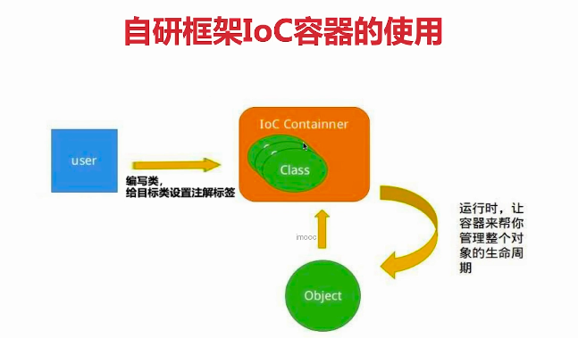
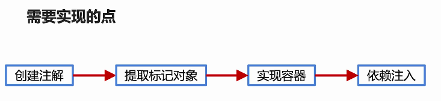

## 1. 实现思路概述以及注解标签的创建

### 1.1 框架具备的最基本功能

* 解析配置：将相关的配置加载进内存里，存入定义好的数据结构，才能知道要管理哪些目标对象。这就好比框架要掌握至少一门语言，而用户需要使用框架支持的语言和框架进行沟通，框架能够解析的配置就是所谓的语言了，如XML，注解等
* 定位与注册对象：解析完配置之后，需要能通过获取内存中的配置信息去定位到目标对象，比如自研的web框架，框架解析完后就知道去哪里获取Controller，Service，Dao并且给管理起来。那么定位就涉及到了标记，注解就是一种很好的标记方式。定位到目标对象之后就需要将对象注射到容器中，也就是将对象给管理起来方便后续去使用
* 注入对象：将用户需要使用的时候能够将正确的对象实例精确返回给用户
* 提供通用的工具类

### 1.2 IOC容器的实现

1. 确定好标记的方式，才能有后续对象的定位与管理操作
2. 用注解标记目标对象，标记之后需要定位到相关标记并且提取出目标对象
3. 提取出对象之后要实现控制翻转离不开容器载体，因此需要创建容器，并将对象信息存入容器里。对于Spring IOC而言，为了做更为精细的控制，存储的不仅是类的实例本身，而是类的Class对象以及注解和XML配置里的属性信息，将它们组成BeanDefination实例存入到容器里，之后再决定是否在容器初始化完成时直接创建经过包装后的目标类的实例，或者在首次用到目标对象的地方再创建出经过包装后的目标类实例。
4. 依赖注入