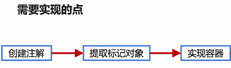

## 1. 实现思路概述以及注解标签的创建


### 1.1 框架具备的最基本功能

* 解析配置：将相关的配置加载进内存里，存入定义好的数据结构，才能知道要管理哪些目标对象。这就好比框架要掌握至少一门语言，而用户需要使用框架支持的语言和框架进行沟通，框架能够解析的配置就是所谓的语言了，如XML，注解等
* 定位与注册对象：解析完配置之后，需要能通过获取内存中的配置信息去定位到目标对象，比如自研的web框架，框架解析完后就知道去哪里获取Controller，Service，Dao并且给管理起来。那么定位就涉及到了标记，注解就是一种很好的标记方式。定位到目标对象之后就需要将对象注射到容器中，也就是将对象给管理起来方便后续去使用
* 注入对象：将用户需要使用的时候能够将正确的对象实例精确返回给用户
* 提供通用的工具类

### 1.2 IOC容器的实现


1. 确定好标记的方式，才能有后续对象的定位与管理操作
2. 用注解标记目标对象，标记之后需要定位到相关标记并且提取出目标对象
3. 提取出对象之后要实现控制翻转离不开容器载体，因此需要创建容器，并将对象信息存入容器里。对于Spring IOC而言，为了做更为精细的控制，存储的不仅是类的实例本身，而是类的Class对象以及注解和XML配置里的属性信息，将它们组成BeanDefination实例存入到容器里，之后再决定是否在容器初始化完成时直接创建经过包装后的目标类的实例，或者在首次用到目标对象的地方再创建出经过包装后的目标类实例。
4. 依赖注入

### 1.3 注解的创建

定义用在类上的注解标签，自动将这些被标签的标注的类对应的实例加载到内存中


* 因为创建的这批注解是应用到类上的，所以设置的Target属性值为ElementType.TYPE
* 由于程序要在运行的时候通过反射获取到注解的信息，因此需要将注解的生命周期设置为RUNTIME
* 比如当一个类被@Controller标记之后，就代表该类是Controller需要让容器管理起来，方便对前端请求进行处理
* Component可以代表Controller，Repository，Service。@Component是通用的标签，而后s三者是扩展，而用后三者替代Component是因为能够在逻辑含以上划分出不同的组件模块，即针对不同的使用场景采用特定功能化的注解组件，并在需要获取比如说Controller层类的实例时能够依据@Controller标签直接筛选出来

```java
@Target(ElementType.TYPE)
@Retention(RetentionPolicy.RUNTIME)
public @interface Component {
}
```

```java
@Target(ElementType.TYPE)
@Retention(RetentionPolicy.RUNTIME)
public @interface Controller {
}
```

```java
@Target(ElementType.TYPE)
@Retention(RetentionPolicy.RUNTIME)
public @interface Repository {
}
```

```java
@Target(ElementType.TYPE)
@Retention(RetentionPolicy.RUNTIME)
public @interface Service {
}
```

## 2. 根据package获取类集合之通过类加载器获取资源信息

### 2.1 提取标记对象

* 想要找到被注解的对象，遍历是必不可少的。而遍历的前提是需要确定范围，而范围应该如何确定呢？
* 范围的确定肯定不是框架所能实现的，而是由框架的使用者来定义的。只有使用框架的人才能结合业务来确定范围，即需要遍历业务项目里的哪几个package，以获取这几个package里被标注了特定注解的类 


### 2.2 extractPackageClass里面需要完成的事情


* 获取项目类加载器的目的？
    * 获取项目发布的实际路径，比如我们在传入包路径的时候往往只会传递诸如club.singlelucky.xxx，而不是具体的如D:/file/club/singlelucky/xxx。因此无法定位到包的具体路径，所以必须先拿到具体路径才能遍历该路径下的所有类文件
* 为什么不让用户传入绝对路径？
    * 不够友好：因为不同机器之间的绝对路径可能不同，比如Linux和windows下的路径就不同
    * 如果打的是war包或者jar包，根本找不到路径
    * 因此通用的做法是通过项目的类加载器来获取

### 2.3 类加载器ClassLoader


* 加载Java应用所需的资源：定位并且加载资源，比如说图片文件，配置文件以及文件目录（资源的信息以及路径）

### 2.4 统一资源定位符URL


### 2.5 根据package获取类集合之实现Class对象的提取

把Class对象的提取放在Util包下

```java
package org.simpleframework.util;

import lombok.extern.slf4j.Slf4j;

import java.io.File;
import java.io.FileFilter;
import java.net.URL;
import java.util.HashSet;
import java.util.Set;

/**
 * @description: TODO
 * @author: liangruuu
 * @date: 2021/3/8
 */
@Slf4j
public class ClassUtil {

    public static final String FILE_PROTOCOL = "file";

    /**
     * 获取包下类的集合
     *
     * @param packageName 包名
     * @return 类集合
     */
    public static Set<Class<?>> extractPackageClass(String packageName) {
        // 1.获取到类的加载器
        ClassLoader classLoader = getClassLoader();
        // 2.通过类加载器获取到加载的资源
        // The name of a resource is a '/'-separated path name that identifies the resource.
        // club.singlelucky.entity替换成club/singlelucky/entity
        // *** 小技巧: 在调试过程中可以通过选中方法packageName.replace(".", "/")，右键点击Evaluate Expression来直接计算出结果
        // url ==> file:/D:/study/code/springframework/target/classes/club/singlelucky/entity
        URL url = classLoader.getResource(packageName.replace(".", "/"));
        if (null == url) {
            log.warn("unable to receive anything from package: " + packageName);
            return null;
        }
        // 3.依据不同的资源类型，采用不同的方式获取资源的集合
        Set<Class<?>> classSet = null;
        // 过滤出file类型的资源
        // url.getProtocol() ==> "file"
        if (FILE_PROTOCOL.equalsIgnoreCase(url.getProtocol())) {
            classSet = new HashSet<>();
            // package的实际路径url.getPath() ==> D:\study\code\springframework\target\classes\club\singlelucky\entity
            File packageDirectory = new File(url.getPath());
            // 从package的实际路径中提取所需的Class文件，因为packageDirectory是一个目录
            // 所以获取到目录之后可以遍历目录及其子目录下的所有文件，并且通过文件拓展名.class提取出类名
            extractClassFile(classSet, packageDirectory, packageName);
        }
        // TODO 此处可以加入针对其他类型资源的处理，比如jar包资源...

        return classSet;
    }

    /**
     * 递归获取目标package里面的所有class文件（包括package里的class文件）
     * 比如fileSource为D:\study\code\springframework\target\classes\club\singlelucky\entity
     * packageName为club.singlelucky.entity
     * 而club.singlelucky.entity包下又存在dto、bo等package
     *
     * @param emptyClassSet 装载目标类的集合
     * @param fileSource    文件或者目录
     * @param packageName   包名
     */
    private static void extractClassFile(Set<Class<?>> emptyClassSet, File fileSource, String packageName) {
        // 递归函数的关键点有两步，第一步是能够推进，第二步是能够终止
        // 1.终止（何时停止递归）：当找到的fileSource是文件而非文件夹就停止递归
        if (!fileSource.isDirectory()) {
            return;
        }
        // 2.如果是一个文件夹，则调用器listFiles方法获取文件夹下的文件或者文件夹
        File[] files = fileSource.listFiles(new FileFilter() {
            // 通过过滤器过滤文件夹以及Class文件，其余格式的文件均抛弃掉
            @Override
            public boolean accept(File file) {
                if (file.isDirectory()) {
                    return true;
                } else {
                    // 获取文件的绝对值路径
                    // D:\study\code\springframework\target\classes\club\singlelucky\entity\bo\HeadLine.class
                    String absoluteFilePath = file.getAbsolutePath();
                    if (absoluteFilePath.endsWith(".class")) {
                        // 若是class文件，则直接加载
                        addToClassSet(absoluteFilePath);
                    }
                }
                return false;
            }

            // 根据class文件的绝对值路径，获取并且生成class对象，并放入classSet中
            private void addToClassSet(String absoluteFilePath) {
                /**
                 * 1.从class文件的绝对路径里提取出包含package的类名
                 * 如D:\study\code\springframework\target\classes\club\singlelucky\entity\bo\HeadLine.class
                 * 需要弄成club.singlelucky.entity.bo.HeadLine
                 */
                // D:.study.code.springframework.target.classes.club.singlelucky.entity.bo.HeadLine.class
                absoluteFilePath = absoluteFilePath.replace(File.separator, ".");
                // packageName ==> club.singlelucky.entity
                // club.singlelucky.entity.bo.HeadLine.class
                String className = absoluteFilePath.substring(absoluteFilePath.indexOf(packageName));
                // 除去.class拓展名
                // club.singlelucky.entity.bo.HeadLine
                className = className.substring(0, className.lastIndexOf("."));
                // 2.通过反射机制获取对应的Class对象并且加入到classSet中
                Class<?> targetClass = loadClass(className);
                emptyClassSet.add(targetClass);
            }
        });
        if (null != files) {
            for (File file : files) {
                // 递归调用
                extractClassFile(emptyClassSet, file, packageName);
            }
        }

    }

    /**
     * 获取ClassLoader是一个通用的需求
     * 所以创建一个专门获取ClassLoader实例的通用函数
     * 1. ClassLoader提供了一个`public URL getResource(String name)`
     * Finds the resource with the given name.
     * A resource is some data (images, audio, text, etc) that can be accessed by class code
     * in a way that is independent of the location of the code.
     * 2. 统一资源定位符URL：某个资源的唯一地址，比如常见的http、ftp、file
     * 通过获取java.net.URL实例获取协议名、资源名路径等信息
     *
     * @return 当前的ClassLoader
     */
    public static ClassLoader getClassLoader() {
        /**
         * 程序是通过线程来执行的，而获取到当前执行该方法的线程便能通过线程所属的加载器获取到程序资源信息
         * 因为在实际使用过程中，资源框架和业务项目都被类加载器加载到JVM内存中，所以我们便能定位到业务的package所在路径
         */
        return Thread.currentThread().getContextClassLoader();
    }

    /**
     * 获取Class对象
     * 如club.singlelucky.entity.bo.HeadLine
     * @param className class全名=package+类名
     * @return Class
     */
    public static Class<?> loadClass(String className) {
        try {
            return Class.forName(className);
        } catch (ClassNotFoundException e) {
            log.error("load class error...", e);
            throw new RuntimeException(e);
        }
    }

}
```


### 2.6 创建单元测试

引入maven配置

```xml
<dependency>
    <groupId>org.junit.jupiter</groupId>
    <artifactId>junit-jupiter-api</artifactId>
    <version>5.5.2</version>
    <scope>test</scope>
</dependency>
```

```java
public class ClassUtilTest {
    @DisplayName("提取目标类方法：extractPackageClassTest")
    @Test
    public void extractPackageClassTest() {
        Set<Class<?>> classSet = ClassUtil.extractPackageClass("club.singlelucky.entity");
        System.out.println(classSet);
        /**
         * club.singlelucky.entity包下目前一共有4个类
         * club.singlelucky.entity.bo.HeadLine
         * club.singlelucky.entity.dto.Result
         * club.singlelucky.entity.dto.MainPageInfoDTO
         * club.singlelucky.entity.bo.ShopCategory
         */
        Assertions.assertEquals(4, classSet.size());
    }
}
```


## 3. 烂大街的单例真的足够安全吗

解决了实例的创建问题之后再来实现容器，因为需要使用同一个容器实例将所有被标记的目标对象给管理起来，所以容器需要用单例模式去实现

### 3.1 单例模式 Singleton Pattern


* StarvingSingleton

    ```java
    public class StarvingSingleton {
        private static final StarvingSingleton starvingSingleton = new StarvingSingleton();
    
        private StarvingSingleton() {
        }
    
        public static StarvingSingleton getInstance() {
            return starvingSingleton;
        }
    }
    ```

* LazyDoubleCheckSingleton

    ```java
    public class LazyDoubleCheckSingleton {
        private volatile static LazyDoubleCheckSingleton instance;
    
        private LazyDoubleCheckSingleton() {
        }
    
        public static LazyDoubleCheckSingleton getInstance() {
            // 第一次检测
            if (instance == null) {
                // 同步
                synchronized (LazyDoubleCheckSingleton.class) {
                    if (instance == null) {
                        // memory = allocate(); // 1.分配对象内存空间
                        // instance(memory); // 2.初始化对象
                        // instance = memory; // 3.设置instance指向刚分配的内存地址，此时instance != null
                        instance = new LazyDoubleCheckSingleton();
                    }
                }
            }
            return instance;
        }
    }
    ```

* 测试类

    ```java
    public class SingletonDemo {
        public static void main(String[] args)
                throws NoSuchMethodException, IllegalAccessException, InvocationTargetException, InstantiationException {
            /**
             * 调用两次返回的是同一个对象
             * demo.pattern.singleton.StarvingSingleton@2503dbd3
             * demo.pattern.singleton.StarvingSingleton@2503dbd3
             */
            System.out.println(StarvingSingleton.getInstance());
            System.out.println(StarvingSingleton.getInstance());
            /**
             * 调用两次返回的是同一个对象
             * demo.pattern.singleton.LazyDoubleCheckSingleton@4b67cf4d
             * demo.pattern.singleton.LazyDoubleCheckSingleton@4b67cf4d
             */
            System.out.println(LazyDoubleCheckSingleton.getInstance());
            System.out.println(LazyDoubleCheckSingleton.getInstance());
    
            /**
             * 我们使用单例模式设计类的目的就是为了让外界通过静态方法getInstance来获取实例
             * 但即使是私有构造函数也能通过反射机制来获取对象，即绕过了静态方法getInstance
             * demo.pattern.singleton.StarvingSingleton@7ea987ac
             */
            Class clazz = StarvingSingleton.class;
            Constructor constructor = clazz.getDeclaredConstructor();
            constructor.setAccessible(true);
            System.out.println(constructor.newInstance());
        }
    }
    ```

## 4. 无视反射和序列化攻击的单例

```java
package demo.pattern.singleton;

import java.lang.reflect.Constructor;
import java.lang.reflect.InvocationTargetException;

/**
 * @description: TODO
 * @author: liangruuu
 * @date: 2021/3/8
 */
public class SingletonDemo {
    public static void main(String[] args)
            throws NoSuchMethodException, IllegalAccessException, InvocationTargetException, InstantiationException {
        /**
         * 通过对象示例获取到的instance和直接通过类的静态方法获取到的instance是同一个
         * demo.pattern.singleton.EnumStarvingSingleton@12a3a380
         * demo.pattern.singleton.EnumStarvingSingleton@12a3a380
         * 这就说明了反射虽然攻克了EnumStarvingSingleton的外围防线
         * 但暂时没法攻克ContainerHolder里的instance实例
         */
        System.out.println(EnumStarvingSingleton.getInstance());
        Class clazz2 = EnumStarvingSingleton.class;
        Constructor constructor2 = clazz2.getDeclaredConstructor();
        constructor2.setAccessible(true);
        EnumStarvingSingleton enumStarvingSingleton = (EnumStarvingSingleton) constructor2.newInstance();
        System.out.println(enumStarvingSingleton.getInstance());

    }
}
```

```java
package demo.pattern.singleton;

import java.lang.reflect.Constructor;
import java.lang.reflect.InvocationTargetException;

/**
 * @description: TODO
 * @author: liangruuu
 * @date: 2021/3/8
 */
public class EnumStarvingSingleton {
    private EnumStarvingSingleton() {
    }

    public static EnumStarvingSingleton getInstance() {
        return ContainerHolder.HOLDER.instance;
    }

    private enum ContainerHolder {
        HOLDER;
        // 单例对象被存放在HOLDER中
        private EnumStarvingSingleton instance;

        ContainerHolder() {
            instance = new EnumStarvingSingleton();
        }
    }

    // Exception in thread "main" java.lang.IllegalArgumentException: Cannot reflectively create enum objects
    //	at java.lang.reflect.Constructor.newInstance(Constructor.java:417)
    // 反射无法调用枚举的私有构造函数，因此这种方式是较为安全的创建容器的方法
    public static void main(String[] args)
            throws NoSuchMethodException, IllegalAccessException, InvocationTargetException, InstantiationException {
        Class clazz = ContainerHolder.class;
        Constructor constructor = clazz.getDeclaredConstructor(String.class, int.class);
        constructor.setAccessible(true);
        System.out.println(EnumStarvingSingleton.getInstance());
        System.out.println(constructor.newInstance());
    }
}
```

## 5. 容器的载体以及容器的加载



* 由于容器属于自研框架的核心，所以需要在org/simpleframework/core目录下创建。对于需要由IOC容器管理起来的Class对象示例，通过Class对象的newInstance方法创建出来的实例在Spring中被称为Bean

```java
package org.simpleframework.core;

import lombok.AccessLevel;
import lombok.NoArgsConstructor;
import lombok.extern.slf4j.Slf4j;

/**
 * @description: TODO
 * @author: liangruuu
 * @date: 2021/3/8
 */
@Slf4j
// 由lombok提供的私有构造函数创建，访问修饰符为private
@NoArgsConstructor(access = AccessLevel.PRIVATE)
public class BeanContainer {
    /**
     * 获取IOC容器的实例
     * @return BeanContainer
     */
    public static BeanContainer getInstance() {
        return ContainerHolder.HOLDER.instance;
    }

    private enum ContainerHolder {
        HOLDER;
        private BeanContainer instance;

        ContainerHolder() {
            instance = new BeanContainer();
        }
    }
}
```

### 5.1 实现容器


* 容器的加载：定义根据配置获取并过滤目标对象的方法，之前代码实现了获取指定package下面的所有Class对象，但是并非所有Class对象都是容器管理的对象，而是需要从中选出配置里指定的Class对象，也就是注解标记的对象才将其存入载体并管理起来
* 容器的操作方式：便于使用者操作存放在容器里的对象

```java
@Slf4j
// 由lombok提供的私有构造函数创建，访问修饰符为private
@NoArgsConstructor(access = AccessLevel.PRIVATE)
public class BeanContainer {

    /**
     * 存放所有被配置标记的目标对象的Map
     * final: 一开始就被初始化好了
     * Map<Class<?>, Object>: 用来存放Class对象以及它对应的由newInstance创建出来的实例
     */
    private final Map<Class<?>, Object> beanMap = new ConcurrentHashMap<>();

    /**
     * 获取IOC容器的实例
     * @return BeanContainer
     */
    public static BeanContainer getInstance() {
        return ContainerHolder.HOLDER.instance;
    }

    private enum ContainerHolder {
        HOLDER;
        private BeanContainer instance;

        ContainerHolder() {
            instance = new BeanContainer();
        }
    }
}
```

### 5.2 实现容器的加载


* 配置的管理与获取：如何将注解管理起来，这样就能够随时去读取目标注解以过滤出这些注解标记的Class对象
* 获取指定范围内的Class对象：直接复用ClassUtil类里的extractPackageClass方法

src/main/java/org/simpleframework/core/BeanContainer.java

```java
/**
     * 配置的获取与管理：加载bean的注解列表
     * 当类被Component、Controller、Service、Repository注解的话，这些类及其实例就需要通过BeanContainer管理起来
     */
private static final List<Class<? extends Annotation>> BEAN_ANNOTATION
    = Arrays.asList(Component.class, Controller.class, Service.class, Repository.class);
```

src/main/java/org/simpleframework/core/BeanContainer.java

```java
/**
     * 扫描加载所有的Bean
     *
     * @param packageName 包名
     */
public synchronized void loadBeans(String packageName) {

    Set<Class<?>> classSet = ClassUtil.extractPackageClass(packageName);
    // 把classSet == null || classSet.isEmpty()逻辑抽出成一个单独的校验类ValidationUtil
    if (ValidationUtil.isEmpty(classSet)) {
        log.warn("extract nothing from packageName" + packageName);
        return;
    }
    for (Class<?> clazz : classSet) {
        for (Class<? extends Annotation> annotation : BEAN_ANNOTATION) {
            // 如果类上标记了定义的注解
            if (clazz.isAnnotationPresent(annotation)) {
                /**
                     * 将目标类本身作为键，目标类的实例作为值，放入到beanMap中
                     * beanMap.put(clazz, clazz.newInstance());
                     * 因为clazz.newInstance()是一个过时方法，并且获取Class对应的实例是一个通用的方法
                     * 所以可以在ClassUtil类中定义创建Class对象的方法
                     * ClassUtil.newInstance(clazz, true)表示生成一个public对象
                     */
                beanMap.put(clazz, ClassUtil.newInstance(clazz, true));
            }
        }
    }

    loaded = true;
}
```

src/main/java/org/simpleframework/util/ClassUtil.java

```java
/**
     * 实例化Class对象
     *
     * @param clazz class
     * @param accessible 是否支持创建出私有class对象的实例. true为public; false为private
     * @param <T>   class的类型
     * @return 类的实例化
     */
public static <T> T newInstance(Class<?> clazz, boolean accessible) {
    try {
        // 通过无参构造函数创建对象
        Constructor constructor = clazz.getDeclaredConstructor();
        // 让用户决定是否生成private的实例
        constructor.setAccessible(accessible);
        return (T)constructor.newInstance();
    } catch (Exception e) {
        log.error("newInstance error...", e);
        throw new RuntimeException(e);
    }
}
```

src/main/java/org/simpleframework/util/ValidationUtil.java

```java
public class ValidationUtil {
    /**
     * Collection是否为null或者size为0
     *
     * @param obj Collection
     * @return 是否为空
     */
    public static boolean isEmpty(Collection<?> obj) {
        return obj == null || obj.isEmpty();
    }

    /**
     * String是否为null或者为""
     *
     * @param obj String
     * @return 是否为空
     */
    public static boolean isEmpty(String obj) {
        return (obj == null || "".equals(obj));
    }

    /**
     * Array是否为null或者为size为0
     *
     * @param obj Array
     * @return 是否为空
     */
    public static boolean isEmpty(Object[] obj) {
        return obj == null || obj.length == 0;
    }

    /**
     * Map是否为null或者为size为0
     * @param obj Map
     * @return 是否为空
     */
    public static boolean isEmpty(Map<?,?> obj){
        return obj == null || obj.isEmpty();
    }
}
```

src/main/java/org/simpleframework/core/BeanContainer.java

```java
/**
     * 由于容器载体的加载是一个比较耗时的过程，为了防止重复加载，
     * 可以给容器新增一个私有的bool类型的名为loaded的成员变量，防止容器多次加载
     * 容器是否已经加载过Bean
     */
private boolean loaded = false;

/**
     * @return 是否已经加载过Bean
     */
public boolean isLoaded() {
    return loaded;
}

/**
     * 扫描加载所有的Bean
     * synchronized用于添加互斥逻辑
     * 因为如果有多个线程同时执行loadBeans方法，loaded又是共享变量，则可能会出现多个线程执行方法时的loaded值都为true
     * 这就导致了多次加载Bean容器
     * @param packageName 包名
     */
public synchronized void loadBeans(String packageName) {
    // 判断bean容器是否被加载过
    if (isLoaded()) {
        log.warn("BeanContainer has been loaded...");
        return;
    }

    Set<Class<?>> classSet = ClassUtil.extractPackageClass(packageName);
    // 把classSet == null || classSet.isEmpty()逻辑抽出成一个单独的校验类ValidationUtil
    if (ValidationUtil.isEmpty(classSet)) {
        log.warn("extract nothing from packageName" + packageName);
        return;
    }
    for (Class<?> clazz : classSet) {
        for (Class<? extends Annotation> annotation : BEAN_ANNOTATION) {
            // 如果类上标记了定义的注解
            if (clazz.isAnnotationPresent(annotation)) {
                /**
                     * 将目标类本身作为键，目标类的实例作为值，放入到beanMap中
                     * beanMap.put(clazz, clazz.newInstance());
                     * 因为clazz.newInstance()是一个过时方法，并且获取Class对应的实例是一个通用的方法
                     * 所以可以在ClassUtil类中定义创建Class对象的方法
                     * ClassUtil.newInstance(clazz, true)表示生成一个public对象
                     */
                beanMap.put(clazz, ClassUtil.newInstance(clazz, true));
            }
        }
    }

    loaded = true;
}
```

### 5.3 编写测试类

src/main/java/org/simpleframework/core/BeanContainer.java

```java
/**
     * Bean实例数量
     * @return 数量
     */
public int size(){
    return beanMap.size();
}
```

src/test/java/org/simpleframework/util/ClassUtilTest.java

```java
public class BeanContainerTest {
    private static BeanContainer beanContainer;

    @BeforeAll
    static void init() {
        beanContainer = BeanContainer.getInstance();
    }

    @Test
    public void loadBeansTest(){
        // 在未初始化容器之前的loaded值为false
        Assertions.assertEquals(false, beanContainer.isLoaded());
        // 把club.singlelucky包下被Controller、Service修饰的类都加载到容器里
        beanContainer.loadBeans("club.singlelucky");
        // 一共5个被Controller、Service修饰的类
        Assertions.assertEquals(5, beanContainer.size());
        // 初始化容器之后的loaded值为true
        Assertions.assertEquals(true, beanContainer.isLoaded());
    }
}
```


## 6. 提供容器对外操作的方法

* 涉及到容器的增删改查 ，即能够允许客户端往容器载体添加需要容器管理的新的Class对象及其对应的实例
* 根据Class获取对应实例，Class作为键值
* 获取所有的Class和实例
* 通过注解来获取被注解标注的Class
* 通过超类获取对应的子类Class，比如根据Service接口获取Service实现类
* 获取容器载体保存Class的数量

```java
/**
     * 添加一个class对象及其Bean实例
     *
     * @param clazz Class对象
     * @param bean  Bean实例
     * @return 原有的Bean实例，没有则返回null
     */
public Object addBean(Class<?> clazz, Object bean) {
    return beanMap.put(clazz, bean);
}

/**
     * 移除一个IOC容器管理的对象
     *
     * @param clazz Class对象
     * @return 删除的Bean实例，没有则返回null
     */
public Object removeBean(Class<?> clazz) {
    return beanMap.remove(clazz);
}

/**
     * 根据Class对象获取Bean实例
     *
     * @param clazz Class对象
     * @return Bean实例
     */
public Object getBean(Class<?> clazz) {
    return beanMap.get(clazz);
}

/**
     * 获取容器管理的所有Class对象集合
     *
     * @return Class集合
     */
public Set<Class<?>> getClasses() {
    return beanMap.keySet();
}

/**
     * 获取所有Bean对象
     *
     * @return Bean集合
     */
public Set<Object> getBeans() {
    return new HashSet<>(beanMap.values());
}

/**
     * 根据注解筛选出Bean的Class集合
     *
     * @param annotation 注解
     * @return Class集合
     */
public Set<Class<?>> getClassesByAnnotation(Class<? extends Annotation> annotation) {
    // 1.获取beanMap的所有class对象
    Set<Class<?>> keySet = getClasses();
    if (ValidationUtil.isEmpty(keySet)) {
        log.warn("nothing in beanMap...");
        return null;
    }
    // 2.通过注解筛选被注解标记的class对象，并添加到classSet里
    Set<Class<?>> classSet = new HashSet<>();
    for (Class<?> clazz : keySet) {
        // 类是否有相关的注解标记
        if (clazz.isAnnotationPresent(annotation)) {
            classSet.add(clazz);
        }
    }
    return classSet.size() > 0 ? classSet : null;
}

/**
     * 通过接口或者父类获取实现类的或者子类的Class集合，不包括其本身
     *
     * @param interfaceOrClass 接口Class或者父类Class
     * @return Class集合
     */
public Set<Class<?>> getClassesBySuper(Class<?> interfaceOrClass) {
    // 1.获取beanMap的所有class对象
    Set<Class<?>> keySet = getClasses();
    if (ValidationUtil.isEmpty(keySet)) {
        log.warn("nothing in beanMap...");
        return null;
    }
    // 2.判断keySet里的元素是否是传入的接口或者类的子类，如果是就添加到classSet里
    Set<Class<?>> classSet = new HashSet<>();
    for (Class<?> clazz : keySet) {
        // 判断keySet里的元素是否是传入的接口或者类的子类
        // parent.isAssignableFrom(child) ==> true
        // child.isAssignableFrom(child) == >true
        // !clazz.equals(interfaceOrClass) 排除本身的情况
        if (interfaceOrClass.isAssignableFrom(clazz) && !clazz.equals(interfaceOrClass)) {
            classSet.add(clazz);
        }
    }
    return classSet.size() > 0 ? classSet : null;
}
```

### 6.1 编写测试类

```java
// @TestMethodOrder(MethodOrderer.OrderAnnotation.class) & @Order(1)
// 因为beanContainer.loadBeans需要在最开始被执行，所以测试类也需要有先后顺序
@TestMethodOrder(MethodOrderer.OrderAnnotation.class)
public class BeanContainerTest {
    private static BeanContainer beanContainer;

    @BeforeAll
    static void init() {
        beanContainer = BeanContainer.getInstance();
    }

    @DisplayName("加载目标类机及其实例到BeanContainer：loadBeansTest")
    @Order(1)
    @Test
    public void loadBeansTest() {
        // 在未初始化容器之前的loaded值为false
        Assertions.assertEquals(false, beanContainer.isLoaded());
        // 把club.singlelucky包下被Controller、Service修饰的类都加载到容器里
        beanContainer.loadBeans("club.singlelucky");
        // 一共5个被Controller、Service修饰的类
        Assertions.assertEquals(5, beanContainer.size());
        // 初始化容器之后的loaded值为true
        Assertions.assertEquals(true, beanContainer.isLoaded());
    }

    @DisplayName("根据类获取其实例：getBeanTest")
    @Order(2)
    @Test
    public void getBeanTest() {
        MainPageController controller = (MainPageController) beanContainer.getBean(MainPageController.class);
        //由于MainPageController类被添加了Controller注解，所以能被容器扫描到
        Assertions.assertEquals(true, controller instanceof MainPageController);
        // 而DispatcherServlet类没有被Controller注解，所以容器扫描不到也无法通过容器获取实例对象
        DispatcherServlet servlet = (DispatcherServlet) beanContainer.getBean(DispatcherServlet.class);
        Assertions.assertEquals(null, servlet);
    }

    @DisplayName("根据注解获取对应的实例：getClassesByAnnotationTest")
    @Order(3)
    @Test
    public void getClassesByAnnotationTest() {
        Assertions.assertEquals(true, beanContainer.isLoaded());
        // 被Controller注解标记的类一共有2个
        Assertions.assertEquals(2, beanContainer.getClassesByAnnotation(Controller.class).size());
    }

    @DisplayName("根据接口获取实现类：getClassesBySuperTest")
    @Order(4)
    @Test
    public void getClassesBySuperTest() {
        Assertions.assertEquals(true, beanContainer.isLoaded());
        Assertions.assertEquals(true, beanContainer.getClassesBySuper(HeadLineService.class).contains(HeadLineServiceImpl.class));
    }
}
```


### 6.2 容器管理的Bean实例

* Spring存放在容器内的Bean对象都是单例对象
* Spring框架有多重作用域
    * singleton
    * prototype
    * request
    * session


## 7. 实现容器的依赖注入

* 目前容器里面管理的Bean实例仍可能是不完备的
    * 实例里面某些必须的成员变量还没有被创建出来

以`MainPageController`为例，虽然MainPageController已经通过newInstance创建出来并存入到了容器里，但是它里面的成员变量headLineShopCategoryCombineService并没有被注入实例

```java
@Controller
public class MainPageController {
    private HeadLineShopCategoryCombineService headLineShopCategoryCombineService;

    public Result<MainPageInfoDTO> getMainPageInfo(HttpServletRequest req, HttpServletResponse resp) {
        return headLineShopCategoryCombineService.getMainPageInfo();
    }
}
```

通过测试类可以发现headLineShopCategoryCombineService仍然为null。之后如果调用`headLineShopCategoryCombineService.getMainPageInfo();`就会报空指针异常。这意味着通过容器创建出来的实例有相当一部分是不完整的，还需要告诉容器对所管理的Bean实例对象做创建，即通过标记来告诉容器需要将哪些对应的实例给注入到所管理的Bean实例的成员变量上去


### 7.1 实现思路

* 定义相关的注解标签
* 实现创建被注解标记的成员变量实例，并将其注入到成员变量里：遍历容器里管理的Class对象，将被上述定义的标签标记的地方获取到，将需要的实例给创建出来并设置进被标记的Class对象对应的实例里
* 依赖注入的使用：根据业务去标记需要容器进行注入的地方

src/main/java/org/simpleframework/inject/DependencyInjector.java

```java
package org.simpleframework.inject;

import lombok.extern.slf4j.Slf4j;
import org.simpleframework.core.BeanContainer;
import org.simpleframework.inject.annotation.AutoWired;
import org.simpleframework.util.ClassUtil;
import org.simpleframework.util.ValidationUtil;

import java.lang.reflect.Field;
import java.util.Set;

/**
 * @description: TODO
 * @author: liangruuu
 * @date: 2021/3/8
 */
@Slf4j
public class DependencyInjector {
    // Bean容器
    private BeanContainer beanContainer;

    public DependencyInjector() {
        beanContainer = BeanContainer.getInstance();
    }

    /**
     * 执行Ioc
     */
    public void doIoc() {
        // 1.遍历Bean容器中所有的Class对象
        if (ValidationUtil.isEmpty(beanContainer.getClasses())) {
            log.warn("empty classes in BeanContainer...");
            return;
        }
        for (Class<?> clazz : beanContainer.getClasses()) {
            // 2.遍历Class对象的所有成员变量
            Field[] fields = clazz.getDeclaredFields();
            if (ValidationUtil.isEmpty(fields)) {
                continue;
            }
            for (Field field : fields) {
                // 3.找出被AutoWired标记的成员变量
                if (field.isAnnotationPresent(AutoWired.class)) {
                    // 4.获取这些成员变量的类型
                    Class<?> fieldClass = field.getType();
                    // 5.获取这些成员变量的类型在容器里对应的实例
                    Object fieldValue = getFieldInstance(fieldClass);
                    if (fieldValue == null) {
                        throw new RuntimeException("unable to inject relevant type, target fieldClass is: " + fieldClass.getName());
                    } else {
                        // 6.通过反射将对应的成员变量实例注入到成员变量所在类的实例里
                        Object targetBean = beanContainer.getBean(clazz);
                        ClassUtil.setField(field, targetBean, fieldValue, true);
                    }
                }
            }
        }
    }
}
```

src/main/java/org/simpleframework/util/ClassUtil.java

```java
/**
     * 设置类的属性值
     *
     * @param field      成员变量
     * @param target     类实例
     * @param value      成员变量的值
     * @param accessible 是否允许设置私有属性
     */
public static void setField(Field field, Object target, Object value, boolean accessible) {
    field.setAccessible(accessible);
    try {
        field.set(target, value);
    } catch (IllegalAccessException e) {
        log.error("setField error...", e);
        throw new RuntimeException(e);
    }
}
```

src/main/java/org/simpleframework/inject/DependencyInjector.java

```java
/**
     * 根据Class在beanContainer里获取其实例或者实现类
     * 比如MainPageController类中有成员变量HeadLineShopCategoryCombineService
     * 但是HeadLineShopCategoryCombineService是一个接口，并不是实现类，同时它并没有被@Service标记
     * 我们需要的是接口对应的实现类HeadLineShopCategoryCombineServiceImpl，该实现类被@Service标记
     *
     * @param fieldClass 成员变量类
     * @return 成员变量
     */
private Object getFieldInstance(Class<?> fieldClass, String autowiredValue) {
    Object fieldValue = beanContainer.getBean(fieldClass);
    /**
         * 若不为空则表明成员变量的类型并非是接口而是其实现类，所以我们将其返回
         * 若为空则表明成员变量对应的类型是接口，如果返回的是HeadLineShopCategoryCombineService类
         * 而该类又未被标记Service注解，因而不会被容器管理起来
         */
    if (fieldValue != null) {
        return fieldValue;
    } else {
        // 获取fieldClass对应的实现类
        Class<?> implementedClass = getImplementClass(fieldClass);
        if (implementedClass != null) {
            return beanContainer.getBean(implementedClass);
        } else {
            return null;
        }
    }
}
```

src/main/java/org/simpleframework/inject/DependencyInjector.java

```java
/**
     * 获取接口的实现类
     *
     * @param fieldClass 成员变量类
     * @return 接口的实现类
     */
private Class<?> getImplementClass(Class<?> fieldClass, String autowiredValue) {
    /**
         * 如果出现了多个实现类该怎么办呢?
         * 如 A a; / A aa;
         * 对于Spring框架而言，它也考虑到了这样一种情况，即对同一个接口有多个实现类的问题
         * Spring在AutoWired的基础上还外加了一个叫Qualifier标签，在Qualifier标签制定具体的实现类名，以便业务方进一步告诉容器需要使用哪个实现类来进行注入操作
         * public class Controller{
         *     @Qualifier("Chinese")   // 指定注入的是Chinese bean
         *     @AutoWired
         *     private Person person;
         * }
         * 在自研框架中尝试使用最简单的实现方式：给AutoWired注解定义value属性，从而获取autowiredValue值
         */
    Set<Class<?>> classSet = beanContainer.getClassesBySuper(fieldClass);
    if (!ValidationUtil.isEmpty(classSet)) {
        if (ValidationUtil.isEmpty(autowiredValue)) {
            if (classSet.size() == 1) {
                return classSet.iterator().next();
            } else {
                // 如果多于两个实现类且用户未指定其中一个实现类，则抛出异常
                throw new RuntimeException("multiple implemented classes for " + fieldClass.getName() + " please set @AutoWired's value to pick one");
            }
        } else {
            for (Class<?> clazz : classSet) {
                // clazz.getSimpleName(): 去除package之后的名字
                if (autowiredValue.equals(clazz.getSimpleName())) {
                    return clazz;
                }
            }
        }
    }
    return null;
}
```

src/main/java/org/simpleframework/inject/annotation/AutoWired.java

```java
@Target(ElementType.FIELD)
@Retention(RetentionPolicy.RUNTIME)
public @interface AutoWired {
    String value() default "";
}
```

src/main/java/org/simpleframework/inject/DependencyInjector.java

```java
public void doIoc() {
    // ...
    for (Field field : fields) {
        AutoWired autoWired = field.getAnnotation(AutoWired.class);
        String autowiredValue = autoWired.value();

        // ...
        Object fieldValue = getFieldInstance(fieldClass, autowiredValue);
        // ...
    }
}
```

### 7.2 编写测试类

src/test/java/org/simpleframework/inject/DependencyInjectorTest.java

```java
public class DependencyInjectorTest {
    @DisplayName("依赖注入doIoc")
    @Test
    public void doIocTest() {
        BeanContainer beanContainer = BeanContainer.getInstance();
        beanContainer.loadBeans("club.singlelucky");
        Assertions.assertEquals(true, beanContainer.isLoaded());
        MainPageController mainPageController = (MainPageController) beanContainer.getBean(MainPageController.class);
        Assertions.assertEquals(true, mainPageController instanceof MainPageController);
        // 依赖注入之前HeadLineShopCategoryCombineService的值为null
        Assertions.assertEquals(null, mainPageController.getHeadLineShopCategoryCombineService());
        new DependencyInjector().doIoc();
        // 依赖注入之后HeadLineShopCategoryCombineService的值不为null
        Assertions.assertNotEquals(null, mainPageController.getHeadLineShopCategoryCombineService());
    }
}
```


### 7.3 测试多个实现类依赖注入

创建HeadLineShopCategoryCombineServiceImpl2，此时MainPageController类下的HeadLineShopCategoryCombineService接口就有两个实现类。如果不使用@AutoWired里的value属性指明是哪个实现类的话就会抛出异常


因此需要设定一个AutoWired值来选择一个具体的实现类，下面例子选择的是HeadLineShopCategoryCombineServiceImpl这个实现类，而不是HeadLineShopCategoryCombineServiceImpl2

```java
@Controller
@Getter
public class MainPageController {
    @AutoWired(value = "HeadLineShopCategoryCombineServiceImpl")
    private HeadLineShopCategoryCombineService headLineShopCategoryCombineService;

    public Result<MainPageInfoDTO> getMainPageInfo(HttpServletRequest req, HttpServletResponse resp) {
        return headLineShopCategoryCombineService.getMainPageInfo();
    }
}
```


