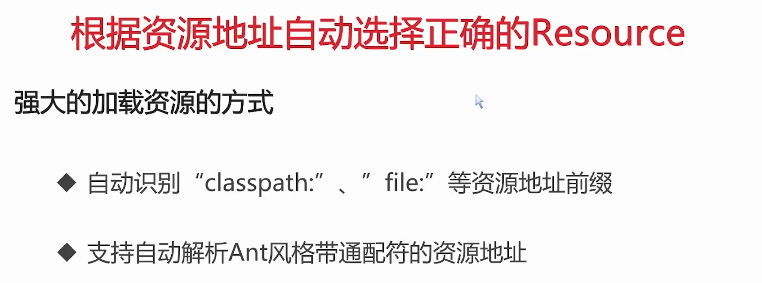

## 1. 挖掘切入源码的线索

* 我们在之前引入Spring源码时创建了一个名为spring-demo的模块并且使用了Spring容器的能力，主要是先编写一个WelcomeService的接口以及改接口对应的实现类WelcomeServiceImpl，然后再resources目录下创建了spring-config.xml文件，通过配置去告诉Spring将WelcomeServiceImpl加载到Spring容器里面并管理起来。这样在Spring容器创建的时候告知Spring解析配置文件的路径，让容器在启动的时候去加载其中的配置，从而使程序在运行的过程中能够随时通过getBean方法去获取到WelcomeServiceImpl这个Bean实例，并调用Bean实例的sayHello方法来满足业务需求。
* 其实除了xml配置，还可以使用注解形式来达到相同的目的，只需要在WelcomeService类的上方添加上@Service，然后再Entrance类上面引入@Configuration，表示要将Enrance这个类当成配置类，其作用就类似于xml配置文件；再加上@ComponentScan("club.singlelucky")，代表要扫描的package，即WelcomeServiceImpl所在的类。这样我们就能脱离XML的配置来达到同样的目的
* SpringIOC的主心骨：给框架指明需要扫描的package，容器在启动的时候会将被@Controller、@Service、@Repository、@Component标记的类给加载进容器里，在通过@AutoWired进行依赖注入   ===>   1. 解析配置   2. 定位与注册对象   3. 注入对象

java/club/singlelucky/Entrance.java

```java
package club.singlelucky;

import club.singlelucky.controller.WelcomeController;
import club.singlelucky.service.WelcomeService;
import club.singlelucky.service.impl.WelcomeServiceImpl;
import org.springframework.context.ApplicationContext;
import org.springframework.context.annotation.AnnotationConfigApplicationContext;
import org.springframework.context.annotation.ComponentScan;
import org.springframework.context.annotation.Configuration;
import org.springframework.context.support.FileSystemXmlApplicationContext;
import org.springframework.core.io.support.EncodedResource;

/**
 * @description: 在这个Main函数里需要获取Spring Bean容器的实例，然后从这个容器中获取Bean的实例
 * @author: liangruuu
 * @date: 2021/3/7
 */
@Configuration
@ComponentScan("club.singlelucky")
public class Entrance {
    public static void main(String[] args) {
        /**
		 * AnnotationConfigApplicationContext与FileSystemXmlApplicationContext不同
		 * 该容器是支持解析Annotation的，该类需要传递一个Class对象，表示需要解析哪一个配置类
		 * 比如该例中需要解析的配置类为Entrance.class
		 */
        AnnotationConfigApplicationContext applicationContext = new AnnotationConfigApplicationContext(Entrance.class);
        // 获取容器内管理的BeanDefinition数组，可以理解成Class对象名字的集合
        String[] beanDefinitionNames = applicationContext.getBeanDefinitionNames();
        /**
		 * 结果打印为:
		 * > Task :spring-demo:Entrance.main()
		 * org.springframework.context.annotation.internalConfigurationAnnotationProcessor
		 * org.springframework.context.annotation.internalAutowiredAnnotationProcessor
		 * org.springframework.context.annotation.internalCommonAnnotationProcessor
		 * org.springframework.context.event.internalEventListenerProcessor
		 * org.springframework.context.event.internalEventListenerFactory
		 * entrance
		 * WelcomeServiceImpl
		 *
		 *
		 * 打印出WelcomeServiceImpl是因为该类添加上了@Service注解
		 * 而前面的几个类是容器必备的Class对象
		 * entrance类会被打印出来的原因是@Configration内部就已经添加了@Component注解
		 * 在之前的学习中知道@Component其实就是@Service的本质
		 */
        for (String beanDefinitionName : beanDefinitionNames) {
            System.out.println(beanDefinitionName);
        }

        /**
		 * 此时容器中便有了WelcomeServiceImpl的Bean实例，则就能像之前一样通过getBean方法调用该对象
		 * 输出:
		 * 	welcome: spring is strong
		 */
        WelcomeService welcomeService = applicationContext.getBean("welcomeServiceImpl", WelcomeServiceImpl.class);
        welcomeService.sayHello("spring is strong");

        /**
		 * 在同一个包名下创建controller和dao包, 在controller下创建WelcomeController类
		 * 并且添加@Controller注解，之前在自研框架里学习了@Controller和@AutoWired具体的实现方法，这里不再赘述
		 * 这也就意味着被@Controller、@Service、@Repository标记的类均会被Spring容器给加载进来
		 * 输出:
		 * 	welcome: greetings from controller...
		 */
        WelcomeController welcomeController = applicationContext.getBean("welcomeController", WelcomeController.class);
        welcomeController.handleRequest();
    }
}
```

## 2. Bean与BeanDefinition

### 2.1 全局掌握核心接口和类


### 2.2 Bean与BeanDefinition


* WelcomeServiceImpl便是Spring容器里的Bean，可以看到和普通的Java对象没有什么区别。只是通过XML或者注解的方式被SPring管理了起来


* 延迟加载：只有在去使用该Bean实例的时候才会将Bean实例给创建出来
* 如果存在一个接口对应多个实现Bean的情况，则设置为true的Bean会是优先的实现类，就如在自研框架里对AutoWired注解设置的value属性值为具体的实现类名一样 
* factory-bean是工厂Bean的名字，factory-method是工厂方法的名称

resources/spring/spring-config.xml

```xml
<beans xmlns="http://www.springframework.org/schema/beans"
       xmlns:xsi="http://www.w3.org/2001/XMLSchema-instance"
       xsi:schemaLocation="http://www.springframework.org/schema/beans
                           http://www.springframework.org/schema/beans/spring-beans.xsd">
    <bean id="welcomeService" class="club.singlelucky.service.impl.WelcomeServiceImpl"/>

    <!-- 1. 使用类的无参构造函数创建
    scope="singleton": 表示该Bean对象在Spring容器里有且只有一个
    lazy-init="true": 在第一次使用到该Bean的时候，即首次调用Spring容器的getBean方法时才会创建出Bean的实例出来
  -->
    <bean id="user1" class="club.singlelucky.entity.User" scope="singleton" lazy-init="true" primary="true"/>
    <!-- 2. 使用静态工厂进行创建 -->
    <!-- class的值不是写User对象的全路径，而是写静态工厂的全路径 -->
    <!-- factory-method的值写要调用的方法 -->
    <bean id="user2" class="club.singlelucky.entity.factory.StaticFactory" factory-method="getUser" scope="singleton"/>

    <!-- 3. 使用实例工厂进行创建 -->
    <!-- 需要先创建factoryBean对象，再通过factoryBean对象进行调用 -->
    <bean id="userFactory" class="club.singlelucky.entity.factory.UserFactory"/>
    <bean id="user3" factory-bean="userFactory" factory-method="getUser" scope="singleton"/>
</beans>
```

java/club/singlelucky/entity/factory/StaticFactory.java

```java
/**
 * @description: 静态工厂调用
 * @author: liangruuu
 * @date: 2021/3/10
 */
public class StaticFactory {
    // 静态的方法，返回User对象
    public static User getUser() {
        return new User();
    }
}
```

java/club/singlelucky/entity/factory/UserFactory.java

```java
/**
 * @description: 实例工厂调用
 * @author: liangruuu
 * @date: 2021/3/10
 */
public class UserFactory {
    /**
	 * 普通的方法，返回User对象
	 * 不能通过类名调用，需要通过对象调用
	 * @return
	 */
    public User getUser() {
        return new User();
    }
}
```

java/club/singlelucky/Entrance.java

```java
public static void main(String[] args) {
    //得到无参构造函数创建的对象:
    User user1a = (User) applicationContext.getBean("user1");
    User user1b = (User) applicationContext.getBean("user1");
    //得到静态工厂创建的对象：
    User user2a = (User) applicationContext.getBean("user2");
    User user2c = (User) applicationContext.getBean("user2");
    //得到实例工厂创建的对象：
    User user3a = (User) applicationContext.getBean("user3");
    User user3b = (User) applicationContext.getBean("user3");

    /**
		 * 由于是Spring容器采用单例构造模式，从而获取了相同的Bean对象
		 * 无参构造函数创建的对象:club.singlelucky.entity.User@598067a5
		 * 无参构造函数创建的对象:club.singlelucky.entity.User@598067a5
		 * 静态工厂创建的对象：club.singlelucky.entity.User@3c0ecd4b
		 * 静态工厂创建的对象：club.singlelucky.entity.User@3c0ecd4b
		 * 实例工厂创建的对象：club.singlelucky.entity.User@14bf9759
		 * 实例工厂创建的对象：club.singlelucky.entity.User@14bf9759
		 */
    System.out.println("无参构造函数创建的对象:" + user1a);
    System.out.println("无参构造函数创建的对象:" + user1b);
    System.out.println("静态工厂创建的对象：" + user2a);
    System.out.println("静态工厂创建的对象：" + user2c);
    System.out.println("实例工厂创建的对象：" + user3a);
    System.out.println("实例工厂创建的对象：" + user3b);
}
```

### 2.3 容器初始化要做的事情（主要脉络）

* 不管是xml也好，注解也罢，都是要被Spring读取到内存中解析成一个个BeanDefination实例存储在容器中。整个过程发生在容器的初始化过程中，在容器初始化或者Bean实例首次使用的时候，容器会按照BeanDefination实例属性的指示将BeanDefination对应的Bean实例给创建出来，这主要取决于Bean的创建策略，即究竟是立即加载还是延时加载；究竟是singleton还是prototype


 ### 2.4 BeanDefination以及它的家族成员


* BeanDefination存放在spring-beans模块里，spring-beans模块存放了Beans以及简单容器相关的接口和类，BeanDefination继承自AttributeAccessor, BeanMetadataElement两个接口。Spring中充斥的大量的接口，每种接口都有不同的能力，某个类实现了某个接口就代表拥有某种能力。
* AttributeAccessor接口定义了最基本的对任意对象的元数据的修改或者获取方式，用在BeanDefination里主要是为了获取BeanDefination的属性，并对这些属性进行操作
* BeanMetadataElement主要提供了一个getSource方法，用来传输一个可配置的元对象。用在BeanDefination里主要是为了返回BeanDefination这个Class对象本身

## 3. 击破简单容器【上】

Spring IOC容器是一个管理Bean的容器，在Spring的定义中要求所有的IOC容器都需要实现接口BeanFactory，它位于org.springframework.beans.factory包下，它是一个顶级的容器接口 。


* BeanFactory定义了一个String类型的FACTORY_BEAN_PREFIX变量，该变量主要用于获取FactoryBean的实例，这里需要注意的一点是BeanFactory和FactoryBean是不一样的两个东西

    ```java
    // 对FactoryBean的转义定义，提供获取FactoryBean的方式，
    // 如果使用bean的名字检索FactoryBean得到的对象是工厂生成的对象，
    // 如果需要得到工厂本身，需要转义
    String FACTORY_BEAN_PREFIX = "&";
    ```

* BeanFactory是Spring IOC容器的根结口，定义了Bean工厂最基础的功能特性，比如getBean()方法：根据bean的名字从容器中获取bean实例，BeanFactory是 管理Bean的容器，Spring生成的Bean都是由这个接口的实现类来管理的

* 而FactoryBean同样也是接口，基于这个类里的getObject方法，用户可以通过一套复杂的逻辑来生成Bean对象。FactoryBean的本质也是一个Bean，但是这个Bean不是用来注入到其他地方，像Service，Dao一样去使用的。它的作用是生成普通的Bean对象的，实现了FactoryBean接口后，Spring在初始化时会把实现这个接口的Bean给取出来，然后使用FactoryBean里的getObject方法生成我们想要的Bean对象。生成Bean的业务逻辑需要写在getObject方法体里

### 3.1 通过FACTORY_BEAN_PREFIX变量获取FactoryBean实例

​	spring-config.xml

* 在前面的例子里我们是通过factory-bean属性值来使用Factory里面的方法getUser，从而创建出user3的Bean实例，此种并不是FactoryBean的方式，因为对应的工厂类UserFactory并没有实现FactoryBean的接口

    ```xml
    <bean id="userFactory" class="club.singlelucky.entity.factory.UserFactory"/>
    <bean id="user3" factory-bean="userFactory" factory-method="getUser" scope="singleton"/>
    ```

    ```java
    public class UserFactory {
        public User getUser() {
            return new User();
        }
    }
    ```

* 使用FactoryBean方式创建Bean对象

    ```java
    public class UserFactoryBean implements FactoryBean<User> {
        @Override
        public User getObject() throws Exception {
            return new User();
        }
    
        @Override
        public Class<?> getObjectType() {
            return User.class;
        }
    }
    ```

    在spring-config.xml里定义一个新的Bean

    ```xml
    <bean id="userFactoryBean" class="club.singlelucky.entity.factory.UserFactoryBean"/>
    ```

    在Entrance里以同样的方式调用

    ```java
    //得到beanFactory创建的对象
    User user4a = applicationContext.getBean("userFactory", User.class);
    User user4b = applicationContext.getBean("userFactory", User.class);
    
    /**
    		 * 虽然在xml配置里指定的是UserFactoryBean的实例，但是打印出来的确是User实例，而并非UserFactoryBean实例
    		 * 也就是说从容器里获取到的对象是UserFactoryBean类中getObject方法所返回的对象
    		 * factoryBean创建的对象：club.singlelucky.entity.User@247bddad
    		 * factoryBean创建的对象：club.singlelucky.entity.User@247bddad
    		 */
    System.out.println("factoryBean创建的对象" + user4a);
    System.out.println("factoryBean创建的对象" + user4b);
    ```

* 获取FactoryBean实例

    如果此时想获取UserFactoryBean实例的话就需要在调用applicationContext.getBean()时给Bean名字前面加上FACTORY_BEAN_PREFIX，也就是加上一个&

    ```java
    //获取userFactoryBean实例
    UserFactoryBean userFactoryBean = applicationContext.getBean("&userFactoryBean", UserFactoryBean.class);
    
    // ==> factoryBean对象：club.singlelucky.entity.UserFactoryBean@d35dea7
    System.out.println("factoryBean对象" + userFactoryBean);
    ```

### 3.2 getBean()

BeanFactory类中含有多个getBean方法，它们的作用就是从Spring IOC容器中获取Bean对象。它们有按照名字获取的，有按照Class类获取的

### 3.3 isSingleton()

在Spring IOC容器中，Bean对象默认的是按照单例形式存在的，也就是getBean方法返回的都是用一个对象实例

```java
// 根据bean名字得到bean实例，并判断这个bean是不是单例
boolean isSingleton(String name) throws NoSuchBeanDefinitionException;
```

### 3.4 isPrototype()

如果返回为true，则当使用getBean方法获取Bean的时候，Spring IOC容器就会为我们创建一个新的Bean实例返回给调用者

```java
// 根据bean名字得到bean实例，并判断这个bean是不是多例
boolean isPrototype(String name) throws NoSuchBeanDefinitionException;
```

### 3.5 getType()

```java
// 得到bean实例的Class类型
@Nullable
Class<?> getType(String name) throws NoSuchBeanDefinitionException;
```

在BeanFactory里只对IOC容器的基本行为做了定义，根本不会去关心Bean是如何去定义加载的，正如我们只关心工厂里得到什么产品而不会去关心产品是如何生产出来的，BeanFactory这个基本的接口不会去关心。

### 3.6 BeanFactory家族体系

Spring IOC容器的设计可以分为两个主要的路线，一个是以BeanFactory接口为主的简单容器；而另一个是以ApplicationContext为主的高级容器，也是广泛使用的容器类型，相对于BeanFactory而言，高级容器增加了许多面向实际应用的功能，让原本在BeanFactory里需要编码实现的功能简化到用配置即可完成

### 3.7 简单容器

根据程序设计的单一职责原则，其实每一个较顶层的接口都是单一职责的，只提供某一方面的功能

* ListableBeanFactory：该接口里的方法可以以列表的形式提供Bean的相关信息，这个接口的最大特点就是可以批量列出工厂生产出的实例的信息，比如getBeanDefinitionNames()去获取容器里所有的Bean名字，getBeanDefinitionCount()去获取容器里所有的Bean个数便是来自于该接口

## 4. 击破简单容器【下】

### 4.1 术语补充

* 组件扫描：自动发现应用容器中需要创建的Bean，即在指定范围内找出被controller，service，repository，component注解标签标记的Bean对象
* 自动装配：自动满足Bean之间的依赖，主要就是Spring的依赖注入功能，比如对被@AutoWired标签标记的成员变量进行自动的注入

### 4.2 DefaultListableBeanFactory

* 实现了BeanDefinitionRegistry接口，BeanDefinitionRegistry是BeanDefinition的注册接口

* beanDefinitionMap：`Map<String, BeanDefinition>`最关键的成员变量，存储容器里所有已经注册了的BeanDefinition实例的载体

## 5. 轰炸高级容器


* 高级容器均实现了ApplicationContext接口，为了区别于简单容器，高级容器一般被称为Context（上下文），多了许多除了创建Bean之外的额外功能，方便用户结合自己的需求开箱即用，这点有别于之前的BeanFactory工厂，在我们使用Spring IOC容器的时候与我们有直接接触的绝大多数都是ApplicationContext的实现类

* BeanFactory时Spring框架的基础设施，面向Spring自身，而ApplicationContext则面向的是使用Spring框架的开发者。如果把Spring容器比做是一辆汽车的话，那么BeanFactory就是发动机，而ApplicationContext就是汽车本身，它既包含了发动机也包含了离合器方向盘等需要驾驶者操作的部件

* ApplicationContext之所以被称为高级容器，就是因为它比BeanFactory多了更多功能，因为它继承了多个接口，为了区别于简单容器系列，ApplicationContext系列被存放在`org.springframework.context`包下

    ```java
    public interface ApplicationContext extends EnvironmentCapable, ListableBeanFactory, HierarchicalBeanFactory,
    MessageSource, ApplicationEventPublisher, ResourcePatternResolver{
    
    }
    ```

### 5.1 EnvironmentCapable

* 用来获取Environment，即Spring容器的启动参数。比如在执行main函数启动容器的时候，在java指令里面传入"-Dparam1=value1"，那么就可以通过getEnvironment()获取Environment实例

    ```java
    public interface EnvironmentCapable {
        Environment getEnvironment();
    }
    ```

* 通过getEnvironment()返回的Environment接口实例还可能会整合更多的功能，比如说返回的可能是ConfigurableEnvironment的实例，因为该接口继承自Environment，通过ConfigurableEnvironment类中的getSystemProperties()方法传入先前定义好的param1去获取对应的value1

    ```java
    public interface ConfigurableEnvironment extends Environment, ConfigurablePropertyResolver{
        Map<String, Object> getSystemProperties();
    }
    ```

* 对于Web容器来讲，还可以通过Environment访问到Servlet的配置信息，比如说可以通过Environment货渠道web项目里的web.xml里contextConfigLocation的值，再根据这些值去加载所有的classpath下面的Spring配置文件

    ```xml
    <servlet>
        <servlet-name>spring-dispatcher</servlet-name>
        <servlet-class>org.springframework,web.servlet.DispatcherServlet</servlet-class>
        <init-param>
            <param-name>contextConfigLocation</param-name>
            <param-value>classpath:spring/spring-*.xml</param-value>
        </init-param>
    </servlet>
    ```

### 5.2 ListableBeanFactory

通过列表的方式来管理Bean

### 5.3 ResourcePatternResolver

该接口是ResourceLoader的子类，用来加载资源文件

### 5.4 ApplicationEventPublisher

继承自该类说明ApplicationContext具备事件发布的能力，容器在启动的时候会给自己注册一些Listener，这些Listener就是用来监听容器发布的事件的，即所谓的监听机制

### 5.5 ApplicationContext常用容器

传统的基于XML配置的经典容器

* FileSystemXmlApplicationContext：从文件系统加载配置
* ClassPathXmlApplicatinContext：从classpath加载配置
* XmlWebApplicationContext：用于Web应用程序的容器

目前比较流行的容器（基于注解）

* AnnotationConifgApplicationContext

容器的共性：不管是基于xml还是基于注解配置的容器，虽然实现以及应用方式有所不同，但是他们也有相同的一步即必须调用refresh()方法，该方法可以看作是IOC容器的启动方法

* 容器初始化、配置解析
* BeanFactoryPostProcessor和BeanPostProcessor的注册和激活
* 国际化配置
* ......

ApplicationContext本身只是可读的，他内部的所有方法都是以get打头的，但是它最终的实现类都是可以配置的，因此还需要使用子接口来赋予ApplicationContext可配置的能力，该接口便是ConfigurableApplicationContext，就提供了诸如setId，setParent，setEnviroment等方法用来配置ApplicationContext

```java
public interface ConfigurableApplicationContext extends ApplicationContext, Lifecycle, Closeable{}
```

ConfigurableApplicationContext的实现主要是位于AbstractApplicationContext，该类时Spring高级容器中最重要的一个类，主要是容器工厂的处理，事件的发送广播，监听器的注册，容器的初始化操作还有就是getBean方法的实现等等，几乎把大部分的容器逻辑都实现了，即使没事实现，也留给子类去实现

AbstractApplicationContext通过组合将众多容易变动的功能逻辑代理给它的一些成员变量来实现，最后再使用模板方法模式让子类为父类提供一些函数的支持或者设置替换父类的上述成员变量从而实现了对扩展开放对修改关闭的设计原则

### 5.6 模板方法模式

围绕抽象类，实现通用逻辑，定义模板结构，部分逻辑由子类实现，模板设计模式的意义在于

* 复用代码：将相同部分的代码放在抽象的父类中进行服用，而将具体业务逻辑的代码下沉至子类中
* 反向控制：通过父类调用子类的操作，通过对子类的具体实现扩展出不同的行为，符合开闭原则


* 模板方法：需要定义了整个方法需要实现的业务操作的骨架
* 具体方法：骨架中可能有一些逻辑是确定不变的，这个时候就可以直接在父类中定义完全的已经实现的方法，无需子类再进行覆盖
* 钩子方法：钩子指的是在特定时间或者条件发生的时候由另外一方，也就是抽象类的调用方来调用，以用于对发生的事件或者条件进行响应，钩子就是在整体流程实现中故意留出给子类进行灵活变更的钥匙

```java
public abstract class KTVRoom {
    public void procedure(){
        openDevice();
        orderSong();
        orderExtra();
        pay();
    }

    // 模板自带方法，使用前必须得打开设备
    private void openDevice(){
        System.out.println("打开视频和音响...");
    }
    // 子类必须实现的方法，必须得选择
    protected abstract void orderSong();
    // 钩子方法，额外开销视情况选择
    protected void orderExtra(){};
    // 模板自带方法，用后必须得付款
    private void pay(){
        System.out.println("支付本次的消费账单...");
    }
}
```

```java
public class RoomForAmericanSinger extends KTVRoom{
    @Override
    protected void orderSong() {
        System.out.println("来一首劲爆的英文歌曲...");
    }
}
```

```java
public class RoomForChineseSinger extends KTVRoom{
    @Override
    protected void orderSong() {
        System.out.println("来一首劲爆的中文歌曲...");
    }
    @Override
    protected void orderExtra(){
        System.out.println("东西真便宜，一样来一份...");
    }
}
```

```java
public class TemplateDemo {
    public static void main(String[] args) {
        RoomForChineseSinger room1 = new RoomForChineseSinger();
        room1.procedure();
        RoomForAmericanSinger room2 = new RoomForAmericanSinger();
        room2.procedure();
    }
}
```


回到ApplicationContext的源码里面，后面讲到的和容器初始化相关的refresh方法就是模板方法模式的一个非常好的应用，refresh本身就是一个模板方法，主要定义了ApplicationContextx下面的容器启动的时候需要做什么事情

* 在该方法里首先是`prepareRefresh()`，它是一个具体的方法，具体的实现由ApplicationContext本身来完成

* 另外一步便是`obtainFreshBeanFactory()`，此方法里调用了两个方法，这两个方法都是抽象方法，也就是强制ApplicationContext的子类必须去做实现

    ```java
    protected ConfigurableListableBeanFactory obtainFreshBeanFactory() {
        refreshBeanFactory();
        return getBeanFactory();
    }
    ```

* `postProcessBeanFactory`就是所谓的钩子方法

    ```java
    protected void postProcessBeanFactory(ConfigurableListableBeanFactory beanFactory) {
    }
    ```

## 6. 弄清Resource、ResourceLoader、容器之间的微妙关系

前面在学习资源框架的过程中，我们了解到在java中资源会被抽象成URL，我们可以通过解析URL里面的protocoly也就是协议来处理不同资源的操作逻辑，而Springz则将对物理资源的访问方式抽象成Resource

```java
public interface Resource extends InputStreamSource{}
```

Resource是一个接口，位于`org.springframework.core.io`下。在接口里定义了基本的操作，包括判断资源是否存在，是否可读，是否已经打开等等；而InputStreamSource接口只提供了唯一一个方法

```java
InputStream getInputStream() throws IOException;
```

针对不同的资源定义了不同的实现类，`Resource`接口是Spring资源访问策略的抽象，他本身并不提供任何资源访问的实现，具体的资源访问由该接口的实现类来完成，每一个实现类代表了某一个资源的访问策略


* EncodedResource：该类主要用来实现对资源文件的编码处理，该类的具体逻辑实现在`getReader()`方法中，当我们给资源设置了编码属性的时候，Spring会使用相应的编码作为输入流的编码

* AbstractResource：主要提供对Resource接口的大部分方法默认的公共实现，如果要实现自定义的Resource不推荐直接继承自Resource接口，而更应该继承AbstractResource这个抽象类，然后根据当前的具体资源需求覆盖相应的方法即可

* Resouce只提供相应的读操作，基于AbstractResource衍生出了需要多Spring自带的特定类型的Resouce实例实现，如ServeletContextResource、ClassPathResource、FileSystemResource，它们都能支持写操作

    * ServeletContextResource：是为访问Web容器的上下文中的资源而设计的类，负责以相对于Web应用程序根目录的路径去加载资源，它支持以流和URL的形式进行访问，在war包解压出来的情况下也可以通过file的形式去访问，还可以直接从jar包中去访问资源
    * ClassPathResource：是用来访问类加载路径下的资源，相对于其他的Resource实现类，其主要优势是方便访问类加载路径里的资源，尤其对于Web应用来说，ClassPathResource可自动搜索位于`WEB-INF/classes`目录下面的资源文件，无需使用绝对路径访问。熟悉web开发的人员都知道，项目一旦被发布之后，所有被编译出来的class文件都会保存在该目录底下，而ClassPathResource则让我们可以用相对路径的形式，如`/my-package/demo`==>`WEB-INF/classes/my-package/demo.class`

    * FileSystemResource：用于访问文件系统资源，它会继承WritableResource接口，该接口相对于之前说的InputStreamSource接口下的getInputStream()方法，定义了getOutputStream()并且返回的是OutputStream实例，正好与之前相反

        ```java
        public class ResourceDemo {
            public static void main(String[] args) throws IOException {
                FileSystemResource fileSystemResource = new FileSystemResource(
                    "D:\\study\\code\\spring\\spring-framework-study-5.2.0\\spring-demo\\src\\main\\java\\club\\singlelucky\\demo\\resource\\test.txt"
                );
                File file = fileSystemResource.getFile();
                System.out.println(file.length());
                OutputStream outputStream = fileSystemResource.getOutputStream();
                BufferedWriter bufferedWriter = new BufferedWriter(new OutputStreamWriter(outputStream));
                bufferedWriter.write("Hello World...");
                bufferedWriter.flush();
        
                outputStream.close();
                bufferedWriter.close();
            }
        }
        ```

        

### 6.1 Ant

是否可以在不显式使用Resource子类实现类的情况下，仅通过资源地址的特殊标识符j就可以访问相应的资源呢？答案是肯定的



Ant其实就是一种路径统配表达式，主要就是用来匹配URL地址的，跟正则表达式作用相近，只不过正则表达式适用面更广，Ant仅仅用于路径匹配

* "?"匹配任何单字符
* "*"匹配0或者任意数量的字符
* "**"匹配0或者更多的目录


### 6.2 ResourceLoader

Spring提供了一个强大的方式来根据传入的资源地址自动构建出适配于该资源的Resource实现类实例，该方式便是ResourceLoader

ResourceLoader实现不同的Resource加载策略，按需返回特定类型的Resource。

```java
public interface ResourceLoader{}
```

* Resource是一个接口，在该接口中主要定义了`getResouce()`方法，该方法会根据资源location地址来返回对应的Resource实例，实例可以是前面说的ServeletContextResource、ClassPathResource、FileSystemResource等等
* 此外Resource接口还提供了`getClassLoader()`方法，将ClassLoader暴露出来。对于想要获取ResourceLoader所使用的ClassLoader实例的用户可以直接调用该方法获得。


DefaultResourceLoader便是提供了ResourceLoader接口的实现，最关键的就是其中的`getResouce()`方法，起作用主要是获取Resource的具体实现类实例

```java
// 获取Resource的具体实现类实例
@Override
public Resource getResource(String location) {
    Assert.notNull(location, "Location must not be null");
    // ProtocolResolver, 用户自定义协议资源解决策略
    // 如果用户有自定义的协议资源解决策略就拿来用一下去解析路径的值
    for (ProtocolResolver protocolResolver : getProtocolResolvers()) {
        Resource resource = protocolResolver.resolve(location, this);
        if (resource != null) {
            return resource;
        }
    }
    /**
		 * 如果是以/开头，则构造ClassPathContextResource返回
		 *
		 * 	protected Resource getResourceByPath(String path) {
		 * 		return new ClassPathContextResource(path, getClassLoader());
		 *  }
		 */
    if (location.startsWith("/")) {
        return getResourceByPath(location);
    }
    /**
		 * 若以classpath:开头，则构造ClassPathResource类型资源并返回，在构造该资源时
		 * 通过getClassLoader()获取当前的ClassLoader
		 */
    else if (location.startsWith(CLASSPATH_URL_PREFIX)) {
        return new ClassPathResource(location.substring(CLASSPATH_URL_PREFIX.length()), getClassLoader());
    }
    else {
        /**
			 * 构造URL，尝试通过它进行资源定位，若没有抛出MalformedURLException异常
			 * 则判断是否为FileURL，如果是则构造FileUrlResource实例，否则构造UrlResource实例
			 * 若在加载过程中抛出MalformedURLException异常，则委派getResourceByPath()实现资源定位
			 */
        try {
            // Try to parse the location as a URL...
            URL url = new URL(location);
            return (ResourceUtils.isFileURL(url) ? new FileUrlResource(url) : new UrlResource(url));
        }
        catch (MalformedURLException ex) {
            // No URL -> resolve as resource path.
            return getResourceByPath(location);
        }
    }
}
```

* 根据不同的路径返回不同的Resource实例像极了先前自研框架里的简单工厂模式，实际上这里使用的时策略模式，即这里有Resouce策略接口还有它对应的实现子类即策略类，然后通过DefaultResouceLoader来决定返回的是哪一个具体的实现类，即返回的是哪一个策略
* 策略模式和简单工厂模式看起来是一样的，但是简单工厂模式强调的是获取创建出来的对象，而用户并不知道对象的本身，相当于黑盒操作；但是策略模式则要求用户了解策略，即针对什么样的资源需要用什么样的Resouce来加载

ResourceLoader里面的`getResource()`方法返回一个Resource实例，这也就意味着它本身并不支持Ant风格路径的解析，如果非要支持的话需要我们单独包一层方法取解析Ant风格的路径表达式获取多个资源，然后再多次调用getResouce()来满足我们的需求，由于此类需求比较常见，Spring给我们准备了ResourcePatternResolver接口，该接口继承自ResourceLoader，该接口里加持了getResources方法，支持根据路径表达式返回多个Resource实例

```java
Resource[] getResources(String locationPattern) throws IOException;
```

ApplicationContext继承了ResourcePatternResolver接口，也就意味着间接实现了ResourceLoader接口，所以任意的ApplicationContext实现都可以看作是一个ResourceLoader的实例

AbstractApplicationContext继承了DefaultResourceLoader

```java
public abstract class AbstractApplicationContext extends DefaultResourceLoader
    implements ConfigurableApplicationContext {}
```

并且类中有`getResourcePatternResolver()`用来生成PathMatchingResourcePatternResolver的实例，该方法被调用在AbstractApplicationContext的构造函数中，

```java
protected ResourcePatternResolver getResourcePatternResolver() {
    return new PathMatchingResourcePatternResolver(this);
}
```

```java
public AbstractApplicationContext() {
    this.resourcePatternResolver = getResourcePatternResolver();
}
```

获取到resourcePatternResolver之后便调用getResource方法获取多个Resource对象实例

```java
@Override
public Resource[] getResources(String locationPattern) throws IOException {
    return this.resourcePatternResolver.getResources(locationPattern);
}
```

结合以上源码分析可知这也是为什么高级容器支持统一资源加载的原因，在容器读取配置的过程中便是委派给了PathMatchingResourcePatternResolver和DefaultResourceLoader来执行

## 7. ResourceLoader的使用者-BeanDefinitionReader

ResourceLoader和ResourcePatternResolver是资源加载的利器，利器还需要配上好的使用者：BeanDefinitionReader

BeanDefinitionReader就是用来读取BeanDefinition，他会利用ResourceLoader或者ResourcePatternResolver将配置信息解析成一个个的BeanDefinition并最终借助于BeanDefinitionRegistry的注册器接口将BeanDefinition给注册到容器里

BeanDefinitionReader定义了一系列用来加载BeanDefinition的接口，主要是针对单个、多个配置文件的加载或者单个、多个Resource实例的加载。最终的目的就是将配置文件的配置转换成一个个的BeanDefinition。ApplicationContext会视情况调用BeanDefinitionReader接口中的某一个loadBeanDefinitions方法。在loadBeanDefinitions方法里会使用ResourceLoader或者ResourcePatternResolver去读取配置资源，进而将解析出来的BeanDefinition给注射到容器里