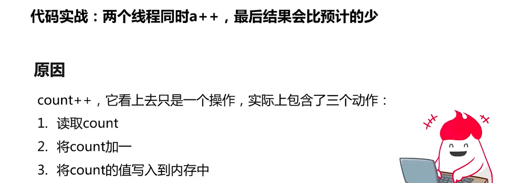

## 1. synchronized的作用(上锁)


## 2. 不用并发手段的后果预警

```java
/**
 * 描述：消失的请求
 */
public class DisapperRequest1 implements Runnable {
  static DisapperRequest1 instance = new DisapperRequest1();

  static int i = 0;

  public static void main(String[] args) throws InterruptedException {
    Thread t1 = new Thread(instance);
    Thread t2 = new Thread(instance);
    t1.start();
    t2.start();
    // 直到t1,t2执行完毕才会继续执行下面的方法
    t1.join();
    t2.join();
    System.out.println(i);
  }

  @Override
  public void run() {
    for (int j = 0; j < 100000; j++) {
      i++;
    }
  }
}
```


预期结果为200000，再次执行




