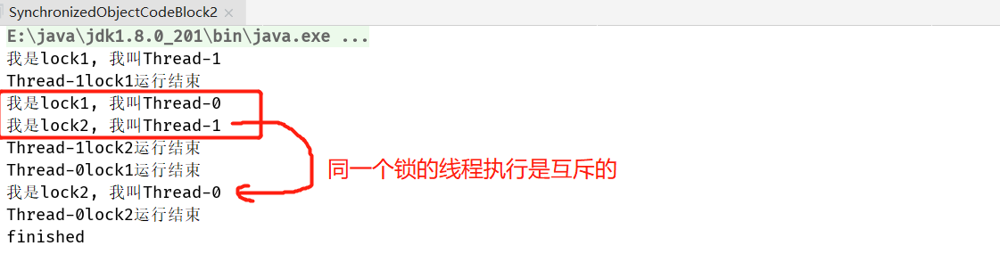

## 1 Synchronized的两个用法


### 1.1 对象锁


1. 同步代码块形式

```java
public class SynchronizedObjectCodeBlock2 implements Runnable {
  static SynchronizedObjectCodeBlock2 instance = new SynchronizedObjectCodeBlock2();

  @Override
  public void run() {
    synchronized (this) {
      System.out.println("我是对象锁的代码块形式, 我叫" + Thread.currentThread().getName());
      try {
        // 有了这2s中阻塞时间，则代码块的运行顺序会更加明显
        Thread.sleep(2000);
      } catch (InterruptedException e) {
        e.printStackTrace();
      } finally {
        System.out.println(Thread.currentThread().getName() + "运行结束");
      }
    }
  }

  public static void main(String[] args) throws InterruptedException {
    Thread t1 = new Thread(instance);
    Thread t2 = new Thread(instance);
    t1.start();
    t2.start();
    t1.join();
    t2.join();
    while (t1.isAlive() || t2.isAlive()) {
      // 死循环
    }
    System.out.println("finished");
  }
}
```


未加`synchronized`包裹时


选取锁对象(这个锁对象就形象得理解为不同门的锁就好了，设置不同锁的理由是对锁代码保护时机不同)

```java
private final Object lock = new Object();
@Override
public void run() {
  synchronized (lock) {
    System.out.println("我是对象锁的代码块形式, 我叫" + Thread.currentThread().getName());
    try {
      // 有了这2s中阻塞时间，则代码块的运行顺序会更加明显
      Thread.sleep(2000);
    } catch (InterruptedException e) {
      e.printStackTrace();
    } finally {
      System.out.println(Thread.currentThread().getName() + "运行结束");
    }
  }
}
```


```java
public class SynchronizedObjectCodeBlock2 implements Runnable {
  static SynchronizedObjectCodeBlock2 instance = new SynchronizedObjectCodeBlock2();
  private final Object lock1 = new Object();
  private final Object lock2 = new Object();

  @Override
  public void run() {
    synchronized (lock1) {
      System.out.println("我是lock1, 我叫" + Thread.currentThread().getName());
      try {
        // 有了这2s中阻塞时间，则代码块的运行顺序会更加明显
        Thread.sleep(2000);
      } catch (InterruptedException e) {
        e.printStackTrace();
      } finally {
        System.out.println(Thread.currentThread().getName() + "lock1运行结束");
      }
    }

    synchronized (lock2) {
      System.out.println("我是lock2, 我叫" + Thread.currentThread().getName());
      try {
        // 有了这2s中阻塞时间，则代码块的运行顺序会更加明显
        Thread.sleep(2000);
      } catch (InterruptedException e) {
        e.printStackTrace();
      } finally {
        System.out.println(Thread.currentThread().getName() + ", lock2运行结束");
      }
    }
  }

  public static void main(String[] args) throws InterruptedException {
    Thread t1 = new Thread(instance);
    Thread t2 = new Thread(instance);
    t1.start();
    t2.start();
    t1.join();
    t2.join();
    while (t1.isAlive() || t2.isAlive()) {
      // 死循环
    }
    System.out.println("finished");
  }
}
```

因为lock1和lock2是不同的锁，所以"我是lock1"和"我是lock2"几乎同时运行



2. 普通方法锁形式

```java
public class SynchronizedObjectMethod3 implements Runnable {
  static SynchronizedObjectMethod3 instance = new SynchronizedObjectMethod3();

  public synchronized void method() {
    System.out.println("我叫对象锁的方法修饰形式，我叫" + Thread.currentThread().getName());
    try {
      Thread.sleep(2000);
    } catch (InterruptedException e) {
      e.printStackTrace();
    } finally {
      System.out.println(Thread.currentThread().getName() + "运行结束");
    }
  }

  @Override
  public void run() {
    method();
  }

  public static void main(String[] args) throws InterruptedException {
    Thread t1 = new Thread(instance);
    Thread t2 = new Thread(instance);
    t1.start();
    t2.start();
    t1.join();
    t2.join();
    while (t1.isAlive() || t2.isAlive()) {
      // 死循环
    }
    System.out.println("finished");
  }
}
```


### 1. 2 Idea调试方法(查看线程状态)


### 1. 3 类锁


1. 静态方法锁

```java
public class SynchronizedStatic4 implements Runnable {
  static SynchronizedStatic4 instance1 = new SynchronizedStatic4();
  static SynchronizedStatic4 instance2 = new SynchronizedStatic4();

  public static synchronized void method(){
    System.out.println("我是类锁的第一种形式，我叫" + Thread.currentThread().getName());
    try {
      Thread.sleep(2000);
    } catch (InterruptedException e) {
      e.printStackTrace();
    } finally {
      System.out.println(Thread.currentThread().getName() + "运行结束");
    }
  }

  @Override
  public void run() {
    method();
  }

  public static void main(String[] args) throws InterruptedException {
    Thread t1 = new Thread(instance1);
    Thread t2 = new Thread(instance2);
    t1.start();
    t2.start();
    t1.join();
    t2.join();
    while (t1.isAlive() || t2.isAlive()) {
      // 死循环
    }
    System.out.println("finished");
  }
}
```


如果不加static关键字


2. synchronized(*.class)

```java
public class SynchronizedClass5 implements Runnable {
  static SynchronizedClass5 instance1 = new SynchronizedClass5();
  static SynchronizedClass5 instance2 = new SynchronizedClass5();

  public void method() {
    synchronized (SynchronizedClass5.class) {
      System.out.println("我是类锁的第二种形式，我叫" + Thread.currentThread().getName());
      try {
        Thread.sleep(2000);
      } catch (InterruptedException e) {
        e.printStackTrace();
      } finally {
        System.out.println(Thread.currentThread().getName() + "运行结束");
      }
    }
  }

  @Override
  public void run() {
    method();
  }

  public static void main(String[] args) throws InterruptedException {
    Thread t1 = new Thread(instance1);
    Thread t2 = new Thread(instance2);
    t1.start();
    t2.start();
    t1.join();
    t2.join();
    while (t1.isAlive() || t2.isAlive()) {
      // 死循环
    }
    System.out.println("finished");
  }
}
```


若改成`synchronized (this)`


### 1.4 消失的请求解决办法

1. 对象锁中的`synchronized`普通方法形式

```java
/**
 * 描述：消失的请求
 */
public class DisapperRequest1 implements Runnable {
  static DisapperRequest1 instance = new DisapperRequest1();

  static int i = 0;

  public static void main(String[] args) throws InterruptedException {
    Thread t1 = new Thread(instance);
    Thread t2 = new Thread(instance);
    t1.start();
    t2.start();
    // 直到t1,t2执行完毕才会继续执行下面的方法
    t1.join();
    t2.join();
    System.out.println(i);
  }

  @Override
  public synchronized void run() {
    for (int j = 0; j < 100000; j++) {
      i++;
    }
  }
}
```


2. 对象锁中的同步代码块形式

```java
@Override
public void run() {
  synchronized (this) {
    for (int j = 0; j < 100000; j++) {
      i++;
    }
  }
}
```

3. 类锁(*.class)

```java
@Override
public void run() {
  synchronized (DisapperRequest1.class) {
    for (int j = 0; j < 100000; j++) {
      i++;
    }
  }
}
```

4. 类锁的静态方法

```java
public static synchronized void method() {
  for (int j = 0; j < 100000; j++) {
    i++;
  }
}

@Override
public void run() {
  method();
}
```

