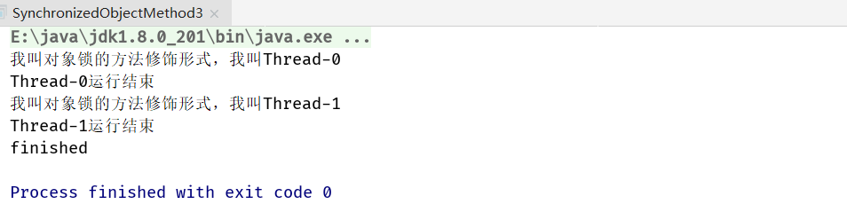
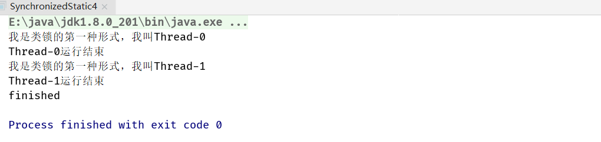

## 1. 多线程访问同步方法的7种情况(面试常考)


 

### 1.1 两个线程同时访问一个对象的同步方法

```java
public class SynchronizedObjectMethod3 implements Runnable {
  static SynchronizedObjectMethod3 instance = new SynchronizedObjectMethod3();

  public synchronized void method() {
    System.out.println("我叫对象锁的方法修饰形式，我叫" + Thread.currentThread().getName());
    try {
      Thread.sleep(2000);
    } catch (InterruptedException e) {
      e.printStackTrace();
    } finally {
      System.out.println(Thread.currentThread().getName() + "运行结束");
    }
  }

  @Override
  public void run() {
    method();
  }

  public static void main(String[] args) throws InterruptedException {
    Thread t1 = new Thread(instance);
    Thread t2 = new Thread(instance);
    t1.start();
    t2.start();
    t1.join();
    t2.join();
    while (t1.isAlive() || t2.isAlive()) {
      // 死循环
    }
    System.out.println("finished");
  }
}
```



### 1. 2 两个线程访问的是两个对象的同步方法

```java
public class SynchronizedObjectCodeBlock2 implements Runnable {
  static SynchronizedObjectCodeBlock2 instance1 = new SynchronizedObjectCodeBlock2();
  static SynchronizedObjectCodeBlock2 instance2 = new SynchronizedObjectCodeBlock2();

  @Override
  public void run() {
    synchronized (this) {
      System.out.println("我是对象锁形式, 我叫" + Thread.currentThread().getName());
      try {
        // 有了这2s中阻塞时间，则代码块的运行顺序会更加明显
        Thread.sleep(2000);
      } catch (InterruptedException e) {
        e.printStackTrace();
      } finally {
        System.out.println(Thread.currentThread().getName() + "运行结束");
      }
    }
  }

  public static void main(String[] args) throws InterruptedException {
    Thread t1 = new Thread(instance1);
    Thread t2 = new Thread(instance2);
    t1.start();
    t2.start();
    t1.join();
    t2.join();
    while (t1.isAlive() || t2.isAlive()) {
      // 死循环
    }
    System.out.println("finished");
  }
}
```


### 1. 3 两个线程访问的是synchronized的静态方法

```java
public class SynchronizedStatic4 implements Runnable {
  static SynchronizedStatic4 instance1 = new SynchronizedStatic4();
  static SynchronizedStatic4 instance2 = new SynchronizedStatic4();

  public static synchronized void method(){
    System.out.println("我是类锁的第一种形式，我叫" + Thread.currentThread().getName());
    try {
      Thread.sleep(2000);
    } catch (InterruptedException e) {
      e.printStackTrace();
    } finally {
      System.out.println(Thread.currentThread().getName() + "运行结束");
    }
  }

  @Override
  public void run() {
    method();
  }

  public static void main(String[] args) throws InterruptedException {
    Thread t1 = new Thread(instance1);
    Thread t2 = new Thread(instance2);
    t1.start();
    t2.start();
    t1.join();
    t2.join();
    while (t1.isAlive() || t2.isAlive()) {
      // 死循环
    }
    System.out.println("finished");
  }
}
```



### 1. 4 同时访问同步方法和非同步方法(非同步方法不收到影响)

```java
public class SynchronizedYesAndNo6 implements Runnable {
  static SynchronizedYesAndNo6 instance = new SynchronizedYesAndNo6();

  @Override
  public void run() {
    if ("Thread-0".equals(Thread.currentThread().getName())) {
      method1();
    } else {
      method2();
    }
  }

  public synchronized void method1() {
    System.out.println("我叫加锁方法，我叫" + Thread.currentThread().getName());
    try {
      Thread.sleep(2000);
    } catch (InterruptedException e) {
      e.printStackTrace();
    } finally {
      System.out.println(Thread.currentThread().getName() + "运行结束");
    }
  }

  public void method2() {
    System.out.println("我叫没加锁方法，我叫" + Thread.currentThread().getName());
    try {
      Thread.sleep(2000);
    } catch (InterruptedException e) {
      e.printStackTrace();
    } finally {
      System.out.println(Thread.currentThread().getName() + "运行结束");
    }
  }

  public static void main(String[] args) throws InterruptedException {
    Thread t1 = new Thread(instance);
    Thread t2 = new Thread(instance);
    t1.start();
    t2.start();
    t1.join();
    t2.join();
    while (t1.isAlive() || t2.isAlive()) {
      // 死循环
    }
    System.out.println("finished");
  }
}
```


### 1. 5 访问同一对象的不同同步方法

```java
public class SynchronizedDifferentMethod7 implements Runnable {
  static SynchronizedDifferentMethod7 instance = new SynchronizedDifferentMethod7();

  @Override
  public void run() {
    if ("Thread-0".equals(Thread.currentThread().getName())) {
      method1();
    } else {
      method2();
    }
  }

  public synchronized void method1() {
    System.out.println("我叫加锁方法，我叫" + Thread.currentThread().getName());
    try {
      Thread.sleep(2000);
    } catch (InterruptedException e) {
      e.printStackTrace();
    } finally {
      System.out.println(Thread.currentThread().getName() + "运行结束");
    }
  }

  public synchronized void method2() {
    System.out.println("我叫没加锁方法，我叫" + Thread.currentThread().getName());
    try {
      Thread.sleep(2000);
    } catch (InterruptedException e) {
      e.printStackTrace();
    } finally {
      System.out.println(Thread.currentThread().getName() + "运行结束");
    }
  }

  public static void main(String[] args) throws InterruptedException {
    Thread t1 = new Thread(instance);
    Thread t2 = new Thread(instance);
    t1.start();
    t2.start();
    t1.join();
    t2.join();
    while (t1.isAlive() || t2.isAlive()) {
      // 死循环
    }
    System.out.println("finished");
  }
}
```

`synchronized`在没指定同步锁的情况下默认`this`，即instance这个实例，则两个线程拿到的this是一样的，所以两个线程没办法同时运行


### 1. 6 同时访问静态synchronized方法和非静态synchronized方法

```java
public class SynchronizedStaticAndNomal8 implements Runnable {
  static SynchronizedStaticAndNomal8 instance = new SynchronizedStaticAndNomal8();

  @Override
  public void run() {
    if ("Thread-0".equals(Thread.currentThread().getName())) {
      method1();
    } else {
      method2();
    }
  }

  public static synchronized void method1() {
    System.out.println("我叫静态加锁方法，我叫" + Thread.currentThread().getName());
    try {
      Thread.sleep(2000);
    } catch (InterruptedException e) {
      e.printStackTrace();
    } finally {
      System.out.println(Thread.currentThread().getName() + "运行结束");
    }
  }

  public synchronized void method2() {
    System.out.println("我叫非静态加锁方法，我叫" + Thread.currentThread().getName());
    try {
      Thread.sleep(2000);
    } catch (InterruptedException e) {
      e.printStackTrace();
    } finally {
      System.out.println(Thread.currentThread().getName() + "运行结束");
    }
  }

  public static void main(String[] args) throws InterruptedException {
    Thread t1 = new Thread(instance);
    Thread t2 = new Thread(instance);
    t1.start();
    t2.start();
    t1.join();
    t2.join();
    while (t1.isAlive() || t2.isAlive()) {
      // 死循环
    }
    System.out.println("finished");
  }
}
```

静态加锁方法的锁对象是class对象，而非静态加锁方法的锁的对象是对象实例本身this，所以这两个对象是不一样的，既然锁的对象不一样，意味着二者不冲突


### 1. 7 方法抛异常会释放锁

一旦抛出异常，第二个线程会立刻进入同步方法，意味着锁已经释放

```java
public class SynchronizedException9 implements Runnable {
  static SynchronizedException9 instance = new SynchronizedException9();

  @Override
  public void run() {
    if ("Thread-0".equals(Thread.currentThread().getName())) {
      method1();
    } else {
      method2();
    }
  }

  public static void method1() {
    System.out.println("我叫静态加锁方法，我叫" + Thread.currentThread().getName());
    try {
      Thread.sleep(2000);
    } catch (InterruptedException e) {
      e.printStackTrace();
    }
    throw new RuntimeException();
  }

  public synchronized void method2() {
    System.out.println("我叫非静态加锁方法，我叫" + Thread.currentThread().getName());
    try {
      Thread.sleep(2000);
    } catch (InterruptedException e) {
      e.printStackTrace();
    } finally {
      System.out.println(Thread.currentThread().getName() + "运行结束");
    }
  }

  public static void main(String[] args) throws InterruptedException {
    Thread t1 = new Thread(instance);
    Thread t2 = new Thread(instance);
    t1.start();
    t2.start();
    t1.join();
    t2.join();
    while (t1.isAlive() || t2.isAlive()) {
      // 死循环
    }
    System.out.println("finished");
  }
}
```

