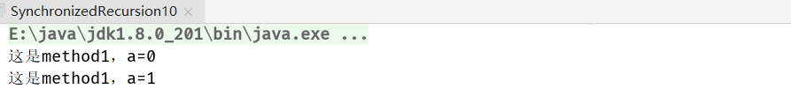
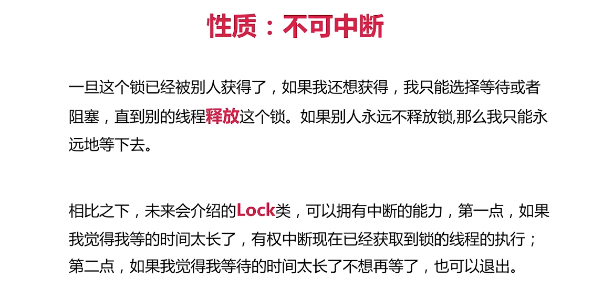

## 1. synchronized性质

一个线程获得一个方法的锁之后想试图再次获得这把锁，可以不需提前释放就可以把这把锁再次用起来，不可重入是指同一线程若想再次使用这把锁必须先释放锁再和其他线程竞争

假设有两个方法都被synchronized修饰，此时线程A执行到了方法一并且获得了这把锁，由于方法二也是synchronized修饰也就是说执行方法二也需要获得这把锁。假设synchronized不具备可重入性，对于线程A虽然拿到了方法一的锁但是这是想去访问方法二他没有这把锁也就是说不能去再次使用本身已经获得的这把锁，既想拿锁又不释放锁就造成了永远等待。

提升封装性：避免了重复的解锁加锁


### 1.1可重入粒度测试：递归调用本方法

```java
public class SynchronizedRecursion10 {
  int a = 0;
  
  private synchronized void method1() {
    System.out.println("这是method1，a=" + a);
    if (a == 0) {
      a++;
      method1();
    }
  }

  public static void main(String[] args) throws InterruptedException {
    SynchronizedRecursion10 synchronizedRecursion10 = new SynchronizedRecursion10();
    synchronizedRecursion10.method1();
  }
}
```



### 1.2 重入不要求同一个方法

```java
public class SynchronizedOtherMethod11 {
  @Override
  public void run() {
  }

  private synchronized void method1() {
    System.out.println("我是method1");
    method2();
  }

  private synchronized void method2() {
    System.out.println("我是method2");
  }

  public static void main(String[] args) throws InterruptedException {
    SynchronizedOtherMethod11 synchronizedRecursion10 = new SynchronizedOtherMethod11();
    synchronizedRecursion10.method1();
  }
}
```


### 1.3 调用父类的方法

```java
public class SynchronizedSuperClass12 {
  public synchronized void doSomething() {
    System.out.println("我是父类方法");
  }
}

class TestClass extends SynchronizedSuperClass12 {
  @Override
  public synchronized void doSomething() {
    System.out.println("我是子类方法");
    super.doSomething();
  }

  public static void main(String[] args) throws InterruptedException {
    TestClass s = new TestClass();
    s.doSomething();
  }
}
```




