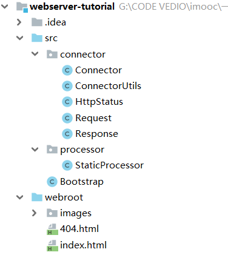
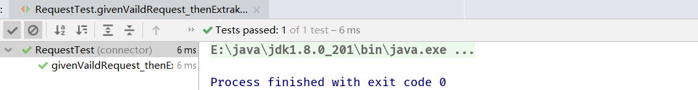
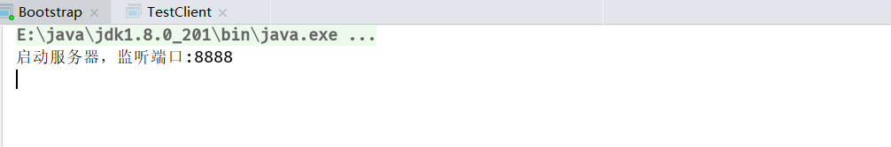
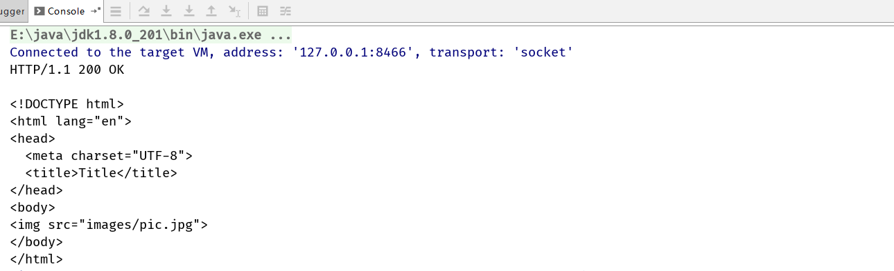
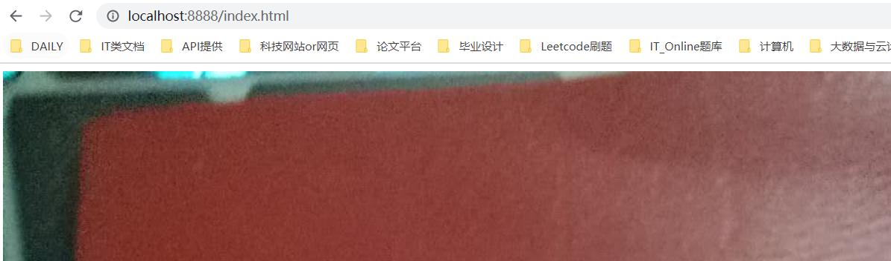
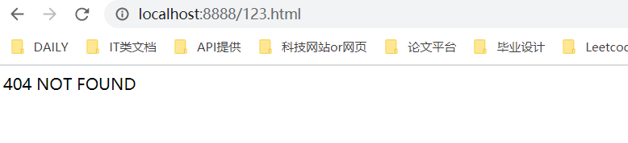

## 1. 项目整体结构



## 2. 实现Request

```java
import java.io.IOException;
import java.io.InputStream;

/**
 * GET /index.html HTTP/1.1
 * HOST:localhost:8888
 * Connection:keep-alive
 * Cache-Control:max-age=0
 * Upgrade-Insecure-Requests:1
 * User-Agent:Mozilla/5.0
 */
public class Request {
  private static final int BUFFER_SIZE = 1024;
  private InputStream input;
  /**
   * /index.html
   */
  private String uri;

  public Request(InputStream input) {
    this.input = input;
  }

  public String getRequestURI() {
    return uri;
  }

  /**
   * 解析请求
   */
  public void parse() {
    int length = 0;
    byte[] buffer = new byte[BUFFER_SIZE];
    try {
      length = input.read(buffer);
    } catch (IOException e) {
      e.printStackTrace();
    }

    StringBuilder request = new StringBuilder();
    for (int i = 0; i < length; i++) {
      request.append((char) buffer[i]);
    }
    /**
     * 把URI中请求资源部分解析出来
     */
    uri = parseUri(request.toString());
  }

  private String parseUri(String s) {
    /**
     * GET /index.html HTTP/1.1
     * 简易看成由空格分隔
     */
    int index1, index2;
    index1 = s.indexOf(' ');
    if (index1 != -1) {
      index2 = s.indexOf(' ', index1 + 1);
      if (index2 > index1) {
        return s.substring(index1 + 1, index2);
      }
    }
    return "";
  }
}
```

```java
public class RequestTest {
  private static final String vaildRequest = "GET /index.html HTTP/1.1";

  @Test
  public void givenVaildRequest_thenExtrakUri() {
    InputStream input = new ByteArrayInputStream(vaildRequest.getBytes());
    Request request = new Request(input);
    request.parse();
    Assert.assertEquals("/index.html", request.getRequestURI());
  }
}
```



## 2. 实现Response

```java
public class TestUtils {
  public static Request createRequest(String requestString) {
    InputStream input = new ByteArrayInputStream(requestString.getBytes());
    Request request = new Request(input);
    request.parse();
    return request;
  }

  public static String readFileToString(String filename) throws IOException {
    return new String(Files.readAllBytes(Paths.get(filename)));
  }
}
```

```java
/**
 * HTTP/1.1 200 OK
 */
public class Response {
  private static final int BUFFER_SIZE = 1024;

  Request request;
  OutputStream output;

  public Response(OutputStream output) {
    this.output = output;
  }

  public void setRequest(Request request) {
    this.request = request;
  }

  public void sendStaticResource() throws IOException {
    // public File(String parent, String child)
    File file = new File(ConnectorUtils.WEB_ROOT, request.getRequestURI());
    try {
      write(file, HttpStatus.SC_OK);
    } catch (IOException e) {
      write(new File(ConnectorUtils.WEB_ROOT, "404.html"), HttpStatus.SC_NOT_FOUND);
    }
  }

  private void write(File resource, HttpStatus status) throws IOException {
    FileInputStream fis = new FileInputStream(resource);
    output.write(ConnectorUtils.renderStatus(status).getBytes());
    byte[] buffer = new byte[BUFFER_SIZE];
    int length = 0;
    while ((length = fis.read(buffer, 0, BUFFER_SIZE)) != -1) {
      output.write(buffer, 0, length);
    }
    fis.close();
  }
}
```

```java
public class ResponseTest {
  private static final String vaildRequest = "GET /index.html HTTP/1.1";
  private static final String invaildRequest = "GET /notfound.html HTTP/1.1";

  private static final String status200 = "HTTP/1.1 200 OK\r\n\r\n";
  private static final String status404 = "HTTP/1.1 404 Not Found\r\n\r\n";

  @Test
  public void givenVaildRequest_thenReturnStaticResource() throws IOException {
    Request request = TestUtils.createRequest(vaildRequest);
    ByteArrayOutputStream out = new ByteArrayOutputStream();
    Response response = new Response(out);
    response.setRequest(request);
    response.sendStaticResource();

    String resource = TestUtils.readFileToString(ConnectorUtils.WEB_ROOT + request.getRequestURI());
    Assert.assertEquals(status200 + resource, out.toString());
  }

  @Test
  public void givenVaildRequest_thenReturnError() throws IOException {
    Request request = TestUtils.createRequest(invaildRequest);
    ByteArrayOutputStream out = new ByteArrayOutputStream();
    Response response = new Response(out);
    response.setRequest(request);
    response.sendStaticResource();

    String resource = TestUtils.readFileToString(ConnectorUtils.WEB_ROOT + "/404.html");
    Assert.assertEquals(status404 + resource, out.toString());
  }
}
```

## 3. 实现Connector和Processor

```java
public class StaticProcessor {
  public void process(Request request, Response response){
    try {
      response.sendStaticResource();
    } catch (IOException e) {
      e.printStackTrace();
    }
  }
}
```

```java
// 启动类
public class Bootstrap {
  public static void main(String[] args) {
    Connector connector = new Connector();
    connector.start();
  }
}
```

```java
public class Connector implements Runnable {
  private static final int DEFAULT_PORT = 8888;
  private ServerSocket server;
  private int port;

  public Connector() {
    this(DEFAULT_PORT);
  }

  public Connector(int port) {
    this.port = port;
  }

  public void start() {
    Thread thread = new Thread(this);
    thread.start();
  }

  @Override
  public void run() {
    try {
      server = new ServerSocket(port);
      System.out.println("启动服务器，监听端口:" + port);

      while (true) {
        Socket socket = server.accept();
        InputStream input = socket.getInputStream();
        OutputStream output = socket.getOutputStream();

        Request request = new Request(input);
        request.parse();

        Response response = new Response(output);
        response.setRequest(request);
        StaticProcessor processor = new StaticProcessor();
        processor.process(request, response);

        close(socket);
      }
    } catch (IOException e) {
      e.printStackTrace();
    }finally {
      close(server);
    }
  }

  private void close(Closeable closeable) {
    if (closeable != null) {
      try {
        closeable.close();
      } catch (IOException e) {
        e.printStackTrace();
      }
    }
  }
}
```

## 4. 实现TestClient

```java
public class TestClient {
  public static void main(String[] args) throws IOException {
    Socket socket = new Socket("localhost", 8888);
    OutputStream output = socket.getOutputStream();
    output.write("GET /index.html HTTP/1.1".getBytes());
    socket.shutdownOutput();
    InputStream input = socket.getInputStream();
    byte[] buffer = new byte[2048];
    int length = input.read(buffer);
    StringBuilder response = new StringBuilder();
    for (int i = 0; i < length; i++) {
      response.append((char) buffer[i]);
    }
    System.out.println(response.toString());
    socket.shutdownInput();

    socket.close();
  }
}
```









## 5. 实现ServletRequest和ServletResponse获取动态资源

```java
/**
 * 前提必须引入Tomcat jar包
 */
public class Request implements ServletRequest{
  
}
```

```java
public class Response implements ServletResponse{
  @Override
  public PrintWriter getWriter() throws IOException {
    // true表示为自动flush
    PrintWriter writer = new PrintWriter(output, true);
    return writer;
  }
}
```

```java
/**
 * TimeServlet作用为返回请求日期时间，这个不是静态资源
 */
public class TimeServlet implements Servlet {
  @Override
  public void init(ServletConfig servletConfig) throws ServletException {

  }

  @Override
  public ServletConfig getServletConfig() {
    return null;
  }

  @Override
  public void service(ServletRequest servletRequest, ServletResponse servletResponse) throws ServletException, IOException {
    PrintWriter out = servletResponse.getWriter();
    out.println(ConnectorUtils.renderStatus(HttpStatus.SC_OK));
    out.println("What time is it now?");
    out.println(new SimpleDateFormat("yyyy-MM-dd HH:mm:ss").format(new Date()));
  }

  @Override
  public String getServletInfo() {
    return null;
  }

  @Override
  public void destroy() {

  }
}
```

## 6. 实现Servlet

```java
/**
 * TimeServlet作用为返回请求日期时间，这个不是静态资源
 */
public class TimeServlet implements Servlet {
  @Override
  public void init(ServletConfig servletConfig) throws ServletException {

  }

  @Override
  public ServletConfig getServletConfig() {
    return null;
  }

  @Override
  public void service(ServletRequest servletRequest, ServletResponse servletResponse) throws ServletException, IOException {
    PrintWriter out = servletResponse.getWriter();
    out.println(ConnectorUtils.renderStatus(HttpStatus.SC_OK));
    out.println("What time is it now?");
    out.println(new SimpleDateFormat("yyyy-MM-dd HH:mm:ss").format(new Date()));
  }

  @Override
  public String getServletInfo() {
    return null;
  }

  @Override
  public void destroy() {

  }
}
```

## 7. 使用facade模式

## 8. 实现ServletProcessor

```java
public class ServletProcessor {
  private URLClassLoader getServletLoader() throws MalformedURLException {
    File webroot = new File(ConnectorUtils.WEB_ROOT);
    URL webrootUrl = webroot.toURI().toURL();
    return new URLClassLoader(new URL[]{webrootUrl});
  }

  private Servlet getServlet(URLClassLoader loader, Request request)
      throws ClassNotFoundException, IllegalAccessException, InstantiationException {
    /**
     * /servlet/TimeServlet
     */
    String uri = request.getRequestURI();
    String servletName = uri.substring(uri.lastIndexOf("/") + 1);

    Class servletClass = loader.loadClass(servletName);
    Servlet servlet = (Servlet) servletClass.newInstance();
    return servlet;
  }

  public void process(Request request, Response response) throws MalformedURLException {
    URLClassLoader loader = getServletLoader();
    try {
      Servlet servlet = getServlet(loader, request);
      servlet.service(request, response);
    } catch (ClassNotFoundException e) {
      e.printStackTrace();
    } catch (IllegalAccessException e) {
      e.printStackTrace();
    } catch (InstantiationException e) {
      e.printStackTrace();
    } catch (ServletException e) {
      e.printStackTrace();
    } catch (IOException e) {
      e.printStackTrace();
    }
  }
}
```

## 9. 向webserver请求动态资源

```java
public class TestClient {
  public static void main(String[] args) throws IOException {
    Socket socket = new Socket("localhost", 8888);
    OutputStream output = socket.getOutputStream();
    output.write("GET /servlet/TimeServlet HTTP/1.1".getBytes());
    socket.shutdownOutput();
    InputStream input = socket.getInputStream();
    byte[] buffer = new byte[2048];
    int length = input.read(buffer);
    StringBuilder response = new StringBuilder();
    for (int i = 0; i < length; i++) {
      response.append((char) buffer[i]);
    }
    System.out.println(response.toString());
    socket.shutdownInput();

    socket.close();
  }
}
```

## 10. 使用nio模型重写connector

```java
public class Connector implements Runnable {
  private static final int DEFAULT_PORT = 8888;
  private ServerSocketChannel server;
  private Selector selector;
  private int port;

  public Connector() {
    this(DEFAULT_PORT);
  }

  public Connector(int port) {
    this.port = port;
  }

  public void start() {
    Thread thread = new Thread(this);
    thread.start();
  }

  @Override
  public void run() {
    try {
      server = ServerSocketChannel.open();
      server.configureBlocking(false);
      server.socket().bind(new InetSocketAddress(port));

      selector = Selector.open();
      server.register(selector, SelectionKey.OP_ACCEPT);
      System.out.println("启动服务器，监听端口：" + port);

      while (true) {
        selector.select();
        Set<SelectionKey> selectionKeys = selector.selectedKeys();
        for (SelectionKey key : selectionKeys) {
          // 触发事件
          handles(key);
        }
        selectionKeys.clear();
      }
    } catch (IOException e) {
      e.printStackTrace();
    }
  }

  private void handles(SelectionKey key) throws IOException {
    // ACCEPT
    if (key.isAcceptable()) {
      ServerSocketChannel server = (ServerSocketChannel) key.channel();
      SocketChannel client = server.accept();
      client.configureBlocking(false);
      client.register(selector, SelectionKey.OP_READ);
    }
    // READ
    else if (key.isReadable()) {
      SocketChannel client = (SocketChannel) key.channel();
      /**
       * InputStream和OutputStream都是只支持阻塞式IO的
       * 而SocketChannel是注册在Selector上的，我们必须保证SocketChannel是非阻塞式状态
       * key.cancel()  意为着不希望SocketChannel被Selector监听，则这条SocketChannel与Selector没关系了
       * 此时就可以把SocketChannel设置为阻塞式IO，然后再去获取InputStream，OutputStream
       * 我们并不会像多人聊天室一样一直保持和客户端的链接，处理完客户端请求时就关掉连接
       * 即key.cancel()是合理的
       */
      key.cancel();
      client.configureBlocking(true);
      Socket clientSocket = client.socket();
      InputStream input = clientSocket.getInputStream();
      OutputStream output = clientSocket.getOutputStream();
      Request request = new Request(input);
      request.parse();
      Response response = new Response(output);
      response.setRequest(request);

      if (request.getRequestURI().startsWith("/servlet/")) {
        ServletProcessor processor = new ServletProcessor();
        processor.process(request, response);
      } else {
        StaticProcessor processor = new StaticProcessor();
        processor.process(request, response);
      }

      close(client);
    }
  }

  private void close(Closeable closeable) {
    if (closeable != null) {
      try {
        closeable.close();
      } catch (IOException e) {
        e.printStackTrace();
      }
    }
  }
}
```

