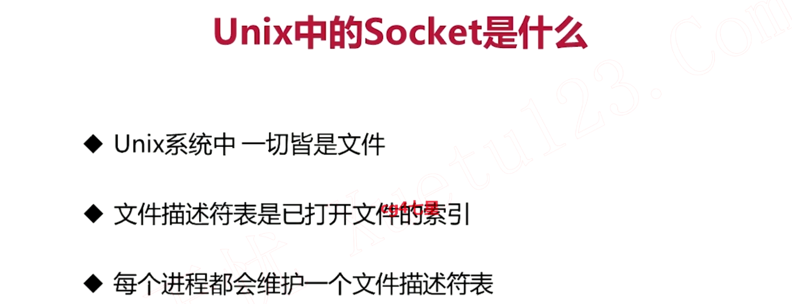
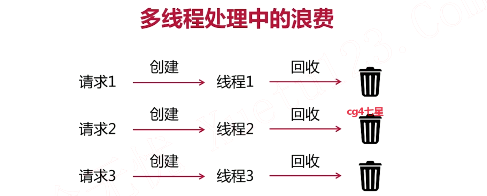

字节是最基本的数据操作单位，Java中的一个char(人类可读字符)就是由两个字节构成的，为了减少数据转换的努力，Java也包含了很多流能直接处理字符，虽然真正读到的数据是一个字节一个字节的排列

## 1. 字符流

`CharArrayReader`数据源是一个Char数组，那么这个流就是从字符数组里读取数据流，以此类推

`CharArrayWriter`就是往一个字符数组里写数据，在创建`CharArrayWriter`对象的时候需要指明数据来源

下面这张图的Reader或者Writer更高级，他们要在底层Reader或者Writer的基础上创建，可以理解为包装类以此拓展功能(字节流同理)，比如`BufferedReader`构造读取数据的缓冲区，从磁盘或者IP端口读取数据的时候可以多读取一点存放在缓冲区里（计算机组成原理基本知识：磁盘开关耗费资源大，但是每次读写操作都需要开关磁盘，所以需要尽可能减少读写操作，也就是说每次尽可能多的读写数据；此时需要找一个地方存放多余的数据，这个地方就是缓存），创建对象的时候需要传入`Reader`对象

`FileReader`或者`FileWriter`继承了`InputStreamReader`或者`InputStreamWriter`，而`InputStreamReader`是字节和字符之间转换的桥梁，对于一个File来说本身存储的应该是一个一个字节，但当我们读取文件内容时我们希望读取的文件可读性较强，我们不希望自己再花时间去处理字节到字符的转换

## 2. 字节流

`FileInputStream`意味着我只想读取文件的原始字节，不需要可读性

`DataInputStream`要和`DataOutputStream`配合起来使用，可以将所读数据直接转换成Java中的基本数据类型

## 3. Java.io中的装饰器模式

## 4. Socket

在Unix中Socket也是一个表明了ip地址和端口号的"文件"

1. 应用进程创建一个Socket
2. 把Socket绑定到网卡驱动程序，告诉网卡所有和这个IP地址和端口号相关的数据都传递或者来自于这个应用进程；应用程序先把数据都发送到这个Socket端点，最后网卡驱动程序知道从Socket里收到的数据是来自哪个端口和IP地址的
3. 网卡从硬件层面发送数据
4. 接收数据同理

## 5. 网络通信的线程池

`newSingleThreadExecutor`：这个线程池里只提供一个线程，但是这个线程可以复用

`newFixedThreadPool`：这个线程池里提供N个线程，由用户设置

`newCachedThreadPool`：基于`newFixedThreadPool`，若池中所有线程都被占用，它可以为新任务创建新线程

`newScheduledThreadPool`：定时处理线程