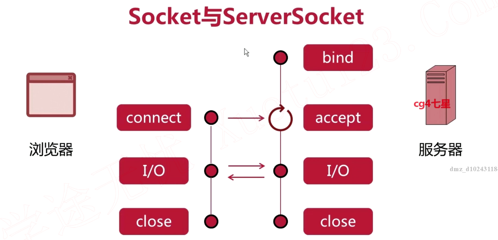
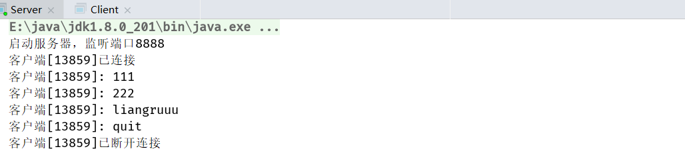
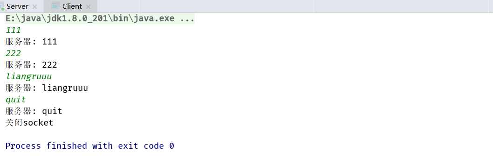

## 1. Socket和ServerSocket



1. `bind`：绑定服务器救赎客户端数据端口
2. `accept`：阻塞调用，服务器一直等待客户端来和它建立连接，若无则一直阻塞该线程；若有则返回一个服务端可以和客户端通信的Socket对象
3. `connect`：创建Socket对象实现和服务器线程的链接

```java
import java.io.*;
import java.net.ServerSocket;
import java.net.Socket;

public class Server {
  public static void main(String[] args) {

    final String QUIT = "quit";
    final int DEFAULT_PORT = 8888;
    ServerSocket serverSocket = null;

    try {
      // 绑定监听端口
      serverSocket = new ServerSocket(DEFAULT_PORT);
      System.out.println("启动服务器，监听端口" + DEFAULT_PORT);

      while (true) {
        // 等待客户端连接
        Socket socket = serverSocket.accept();
        System.out.println("客户端[" + socket.getPort() + "]已连接");
        BufferedReader reader = new BufferedReader(
            new InputStreamReader(socket.getInputStream())
        );
        BufferedWriter writer = new BufferedWriter(
            new OutputStreamWriter(socket.getOutputStream())
        );

        String msg = null;
        while ((msg = reader.readLine()) != null) {
          // 读取客户端发送的消息
          System.out.println("客户端[" + socket.getPort() + "]: " + msg);

          // 回复客户发送的消息
          writer.write("服务器: " + msg + "\n");
          writer.flush();

          // 查看客户端是否退出
          if (QUIT.equals(msg)) {
            System.out.println("客户端[" + socket.getPort() + "]已断开连接");
            break;
          }
        }
      }
    } catch (IOException e) {
      e.printStackTrace();
    } finally {
      if (serverSocket != null) {
        try {
          serverSocket.close();
          System.out.println("关闭serverSocket");
        } catch (IOException e) {
          e.printStackTrace();
        }
      }
    }

  }
}
```

```java
import java.io.*;
import java.net.Socket;

public class Client {
  public static void main(String[] args) {

    final String QUIT = "quit";
    final String DEFAULT_SERVER_HOST = "127.0.0.1";
    final int DEFAULT_SERVER_PORT = 8888;
    Socket socket = null;
    BufferedWriter writer = null;

    try {
      // 创建socket
      socket = new Socket(DEFAULT_SERVER_HOST, DEFAULT_SERVER_PORT);

      // 创建IO流
      BufferedReader reader = new BufferedReader(
          new InputStreamReader(socket.getInputStream())
      );
      writer = new BufferedWriter(
          new OutputStreamWriter(socket.getOutputStream())
      );

      // 等待用户输入信息
      BufferedReader consoleReader =
          new BufferedReader(new InputStreamReader(System.in));
      while (true) {
        String input = consoleReader.readLine();

        // 发送消息给服务器
        writer.write(input + "\n");
        writer.flush();

        // 读取服务器返回的消息
        String msg = reader.readLine();
        System.out.println(msg);

        // 查看用户是否退出
        if (QUIT.equals(input)) {
          break;
        }
      }
    } catch (IOException e) {
      e.printStackTrace();
    } finally {
      if (writer != null) {
        try {
          writer.close();
          System.out.println("关闭socket");
        } catch (IOException e) {
          e.printStackTrace();
        }
      }
    }

  }
}
```





