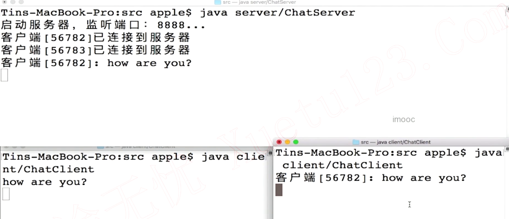

## 1. BIO模型（Blocked IO）

服务器开启线程负责接收客户端发起的连接请求，这个线程其实并不真的去处理输入输出数据流，单纯只是使用`accept`方法接收客户端请求；如果我们使用Acceptor线程来处理客户端请求那么我们就无法去接收其他客户端请求了，这样我们去开启若干个Handler线程去处理数据的交换通信


## 2. 多人聊天室


1. 服务器需要一个接收客户端请求的线程Acceptor和若干个处理用户请求的Handle线程
2. 客户端同样需要一个等待服务器数据的线程，用来显示其他客户端发送的数据(被阻塞)和接收输入数据的线程


```java
public class ChatServer {

  private int DEFAULT_PORT = 8888;
  private final String QUIT = "quit";

  private ServerSocket serverSocket;
  // 暂时用端口来区分客户端
  private Map<Integer, Writer> connectedClients;

  public ChatServer() {
    connectedClients = new HashMap<>();
  }

  public synchronized void addClient(Socket socket) throws IOException {
    if (socket != null) {
      int port = socket.getPort();
      BufferedWriter writer = new BufferedWriter(
          new OutputStreamWriter(socket.getOutputStream())
      );
      connectedClients.put(port, writer);
      System.out.println("客户端[" + port + "]已连接到服务器");
    }
  }

  public synchronized void removeClient(Socket socket) throws IOException {
    if (socket != null) {
      int port = socket.getPort();
      if (connectedClients.containsKey(port)) {
        connectedClients.get(port).close();
      }
      connectedClients.remove(port);
      System.out.println("客户端[" + port + "]已断开连接");
    }
  }

  public synchronized void forwardMessage(Socket socket, String fwdMsg) throws IOException {
    for (Integer id : connectedClients.keySet()) {
      if (!id.equals(socket.getPort())) {
        Writer writer = connectedClients.get(id);
        writer.write(fwdMsg);
        writer.flush();
      }
    }
  }

  public boolean readyToQuit(String msg) {
    return QUIT.equals(msg);
  }

  public synchronized void close() {
    if (serverSocket != null) {
      try {
        serverSocket.close();
        System.out.println("关闭serverSocket");
      } catch (IOException e) {
        e.printStackTrace();
      }
    }
  }

  public void start() {
    try {
      // 绑定监听端口
      serverSocket = new ServerSocket(DEFAULT_PORT);
      System.out.println("启动服务器，监听端口：" + DEFAULT_PORT + "...");

      while (true) {
        // 等待客户端连接，如果没有客户端链接就会一直阻塞，所以while也不会一直循环
        Socket socket = serverSocket.accept();
        // 创建ChatHandler线程
        new Thread(new ChatHandler(this, socket)).start();
      }
    } catch (IOException e) {
      e.printStackTrace();
    } finally {
      close();
    }
  }

  public static void main(String[] args) {
    ChatServer server = new ChatServer();
    server.start();
  }
}
```

```java
public class ChatHandler implements Runnable {

  private ChatServer server;
  private Socket socket;

  public ChatHandler(ChatServer server, Socket socket) {
    this.server = server;
    this.socket = socket;
  }

  @Override
  public void run() {
    try {
      // 存储新上线用户
      server.addClient(socket);

      // 读取用户发送的消息
      BufferedReader reader = new BufferedReader(
          new InputStreamReader(socket.getInputStream())
      );

      String msg = null;
      while ((msg = reader.readLine()) != null) {
        String fwdMsg = "客户端[" + socket.getPort() + "]: " + msg + "\n";
        System.out.print(fwdMsg);

        // 将消息转发给聊天室里在线的其他用户
        server.forwardMessage(socket, fwdMsg);

        // 检查用户是否准备退出
        if (server.readyToQuit(msg)) {
          break;
        }
      }
    } catch (IOException e) {
      e.printStackTrace();
    } finally {
      try {
        server.removeClient(socket);
      } catch (IOException e) {
        e.printStackTrace();
      }
    }
  }
}
```

```java
public class ChatClient {

  private final String DEFAULT_SERVER_HOST = "127.0.0.1";
  private final int DEFAULT_SERVER_PORT = 8888;
  private final String QUIT = "quit";

  private Socket socket;
  private BufferedReader reader;
  private BufferedWriter writer;

  // 发送消息给服务器
  public void send(String msg) throws IOException {
    if (!socket.isOutputShutdown()) {
      writer.write(msg + "\n");
      writer.flush();
    }
  }

  // 从服务器接收消息
  public String receive() throws IOException {
    String msg = null;
    if (!socket.isInputShutdown()) {
      msg = reader.readLine();
    }
    return msg;
  }

  // 检查用户是否准备退出
  public boolean readyToQuit(String msg) {
    return QUIT.equals(msg);
  }

  public void close() {
    if (writer != null) {
      try {
        System.out.println("关闭socket");
        writer.close();
      } catch (IOException e) {
        e.printStackTrace();
      }
    }
  }

  public void start() {

    try {
      // 创建socket
      socket = new Socket(DEFAULT_SERVER_HOST, DEFAULT_SERVER_PORT);

      // 创建IO流
      reader = new BufferedReader(
          new InputStreamReader(socket.getInputStream())
      );
      writer = new BufferedWriter(
          new OutputStreamWriter(socket.getOutputStream())
      );

      // 处理用户的输入
      new Thread(new UserInputHandler(this)).start();

      // 读取服务器转发的消息
      String msg = null;
      while ((msg = receive()) != null) {
        System.out.println(msg);
      }
    } catch (IOException e) {
      e.printStackTrace();
    } finally {
      close();
    }
  }

  public static void main(String[] args) {
    ChatClient chatClient = new ChatClient();
    chatClient.start();
  }
}
```

```java
public class UserInputHandler implements Runnable {

  private ChatClient chatClient;

  public UserInputHandler(ChatClient chatClient) {
    this.chatClient = chatClient;
  }

  @Override
  public void run() {
    try {
      // 等待用户输入消息
      BufferedReader consoleReader =
          new BufferedReader(new InputStreamReader(System.in));
      while (true) {
        String input = consoleReader.readLine();

        // 向服务器发送消息
        chatClient.send(input);

        // 检查用户是否准备退出
        if (chatClient.readyToQuit(input)) {
          break;
        }
      }
    } catch (IOException e) {
      e.printStackTrace();
    }
  }
}
```




## 3. 伪异步IO变成模型

创建成千上万个处理数据通信线程是不现实的(使用线程池改进)


```java
public class ChatServer {

    private int DEFAULT_PORT = 8888;
    private final String QUIT = "quit";

    private ExecutorService executorService;
    private ServerSocket serverSocket;
    private Map<Integer, Writer> connectedClients;

    public ChatServer() {
        executorService = Executors.newFixedThreadPool(10);
        connectedClients = new HashMap<>();
    }

    public void start() {
        try {
            // 绑定监听端口
            serverSocket = new ServerSocket(DEFAULT_PORT);
            System.out.println("启动服务器，监听端口：" + DEFAULT_PORT + "...");

            while (true) {
                // 等待客户端连接
                Socket socket = serverSocket.accept();
                // 创建ChatHandler线程
                executorService.execute(new ChatHandler(this, socket));
            }
        } catch (IOException e) {
            e.printStackTrace();
        } finally {
            close();
        }
    }
}
```

