## 1. NIO概述

### 1.1 BIO中的阻塞

1. `ServerSocket.accept()`：一直等待客户端的请求连接
2. `InputStream.read()，OutputStream.write()`：我们在调用read或者write函数时，客户端或者服务端没有输入任何的信息，则处理读写操作的Handle线程将会一直阻塞在read和write函数上
3. 无法在同一个线程里处理多个Stream I/O，因为会读写阻塞

### 1.2 非阻塞式NIO

1. 使用Channel代替Stream，是双向的，既可以写入也可以读取数据
2. 使用Selector监控多条Channel(轮询)
3. 可以在一个线程里处理多个Channel I/O

## 2. Channel和Buffer

Channel是基于Buffer实现的，Channel在读写数据过程中，数据都是要经过Buffer的

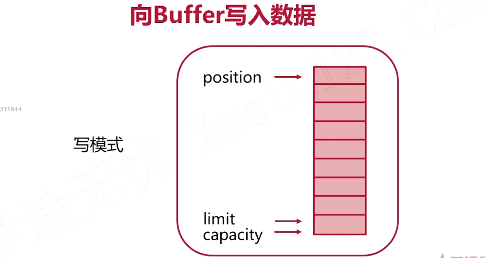

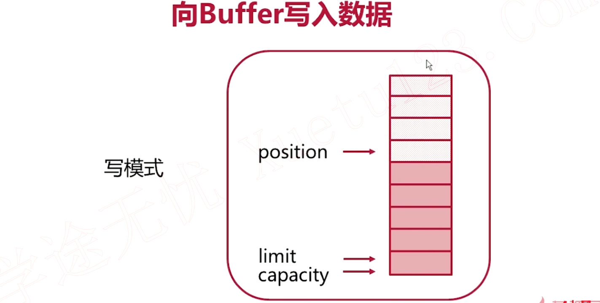

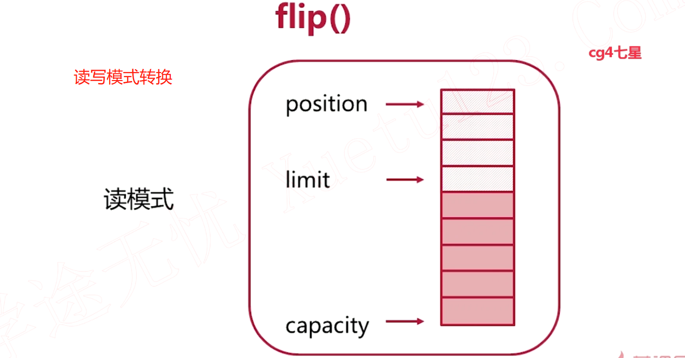


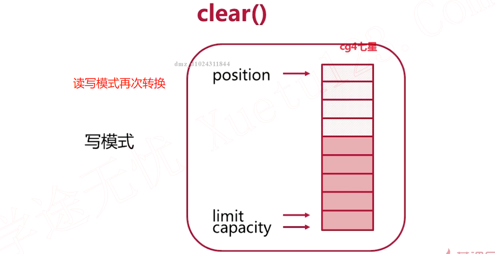

`读取部分数据`

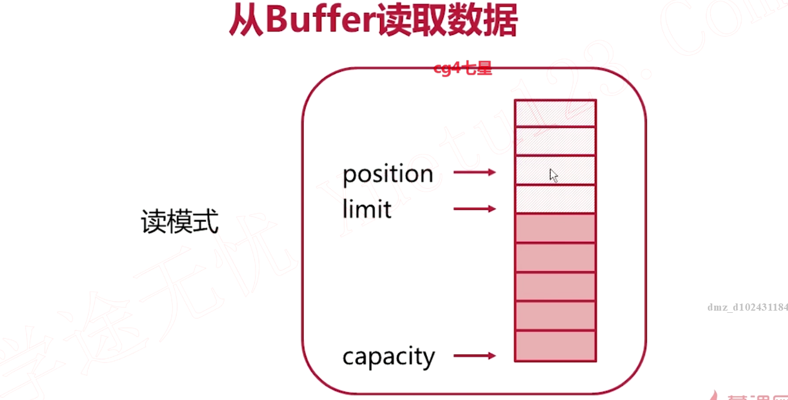


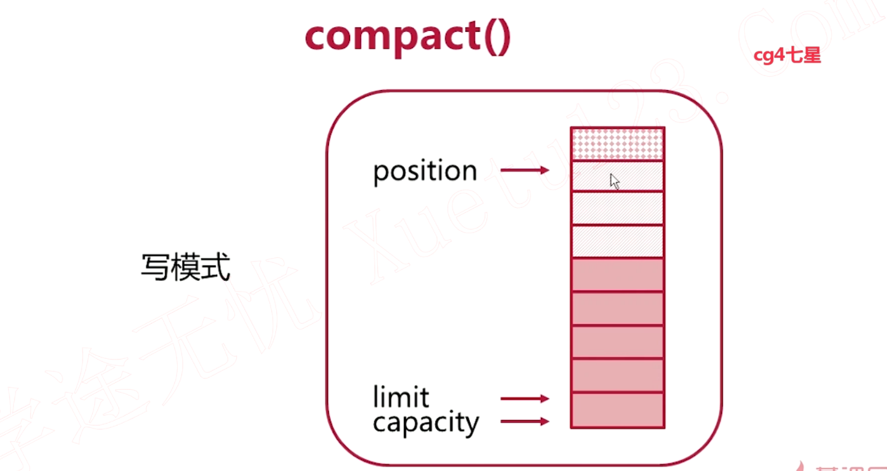

## 3. Channel基本操作

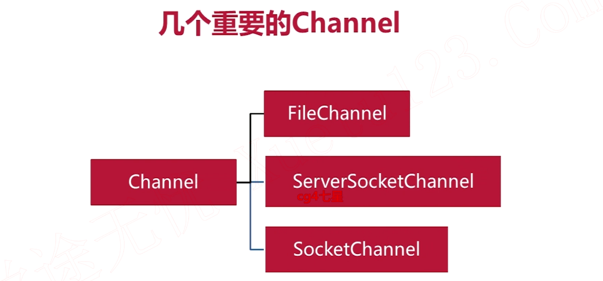

## 4. 多方法实现本地文件拷贝

```java
interface FileCopyRunner {
  void copyFile(File source, File target);
}
```

```java
private static void close(Closeable closeable) {
  if (closeable != null) {
    try {
      closeable.close();
    } catch (IOException e) {
      e.printStackTrace();
    }
  }
}
```

```java
private static final int ROUNDS = 5;

private static void benchmark(FileCopyRunner test, File source, File target) {
  long elapsed = 0L;
  for (int i = 0; i < ROUNDS; i++) {
    long startTime = System.currentTimeMillis();
    test.copyFile(source, target);
    elapsed += System.currentTimeMillis() - startTime;
    target.delete();
  }
  System.out.println(test + ": " + elapsed / ROUNDS);
}
```

```java
FileCopyRunner noBufferStreamCopy = new FileCopyRunner() {
  @Override
  public void copyFile(File source, File target) {
    InputStream fin = null;
    OutputStream fout = null;
    try {
      fin = new FileInputStream(source);
      fout = new FileOutputStream(target);

      int result;
      while ((result = fin.read()) != -1) {
        fout.write(result);
      }
    } catch (FileNotFoundException e) {
      e.printStackTrace();
    } catch (IOException e) {
      e.printStackTrace();
    } finally {
      close(fin);
      close(fout);
    }
  }

  @Override
  public String toString() {
    return "noBufferStreamCopy";
  }
};
```

```java
FileCopyRunner bufferedStreamCopy = new FileCopyRunner() {
  @Override
  public void copyFile(File source, File target) {
    InputStream fin = null;
    OutputStream fout = null;
    try {
      fin = new BufferedInputStream(new FileInputStream(source));
      fout = new BufferedOutputStream(new FileOutputStream(target));

      byte[] buffer = new byte[1024];

      int result;
      while ((result = fin.read(buffer)) != -1) {
        fout.write(buffer, 0, result);
      }
    } catch (FileNotFoundException e) {
      e.printStackTrace();
    } catch (IOException e) {
      e.printStackTrace();
    } finally {
      close(fin);
      close(fout);
    }
  }

  @Override
  public String toString() {
    return "bufferedStreamCopy";
  }
};
```

```java
FileCopyRunner nioBufferCopy = new FileCopyRunner() {
  @Override
  public void copyFile(File source, File target) {
    FileChannel fin = null;
    FileChannel fout = null;

    try {
      fin = new FileInputStream(source).getChannel();
      fout = new FileOutputStream(target).getChannel();

      ByteBuffer buffer = ByteBuffer.allocate(1024);
      // 把文件通道里的数据读入buffer
      while (fin.read(buffer) != -1) {
        buffer.flip();
        while (buffer.hasRemaining()) {
          // 把数据从buffer写到目标文件的Channel里
          fout.write(buffer);
        }
        buffer.clear();
      }
    } catch (FileNotFoundException e) {
      e.printStackTrace();
    } catch (IOException e) {
      e.printStackTrace();
    } finally {
      close(fin);
      close(fout);
    }
  }

  @Override
  public String toString() {
    return "nioBufferCopy";
  }
};
```

```java
FileCopyRunner nioTransferCopy = new FileCopyRunner() {
      @Override
      public void copyFile(File source, File target) {
        FileChannel fin = null;
        FileChannel fout = null;
        try {
          fin = new FileInputStream(source).getChannel();
          fout = new FileOutputStream(target).getChannel();
          long transferred = 0L;
          long size = fin.size();
          while (transferred != size) {
            // transferTo通道间传参数，第一个参数为数据起始位置
            // transferred记录总共传递多少参数
            transferred += fin.transferTo(0, size, fout);
          }
        } catch (FileNotFoundException e) {
          e.printStackTrace();
        } catch (IOException e) {
          e.printStackTrace();
        } finally {
          close(fin);
          close(fout);
        }
      }

      @Override
      public String toString() {
        return "nioTransferCopy";
      }
    };
```

```java
File smallFile = new File("/var/tmp/smallFile");
File smallFileCopy = new File("/var/tmp/smallFile-copy");

System.out.println("---Copying small file---");
benchmark(noBufferStreamCopy, smallFile, smallFileCopy);
benchmark(bufferedStreamCopy, smallFile, smallFileCopy);
benchmark(nioBufferCopy, smallFile, smallFileCopy);
benchmark(nioTransferCopy, smallFile, smallFileCopy);
```

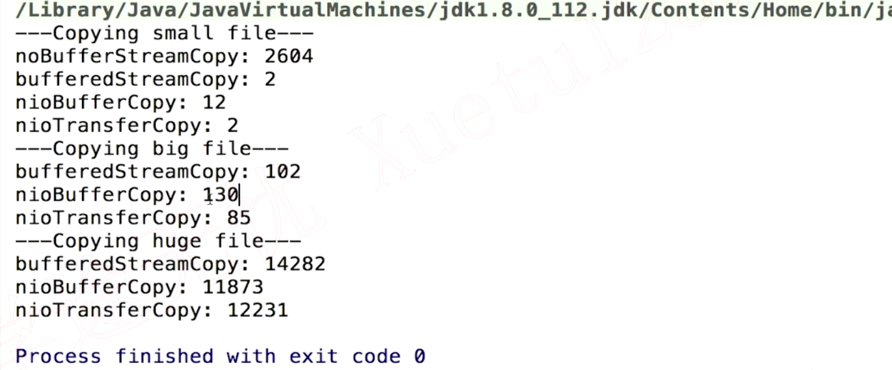

## 5. Selector和Channel

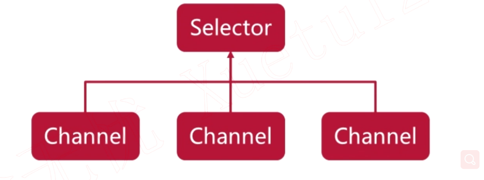


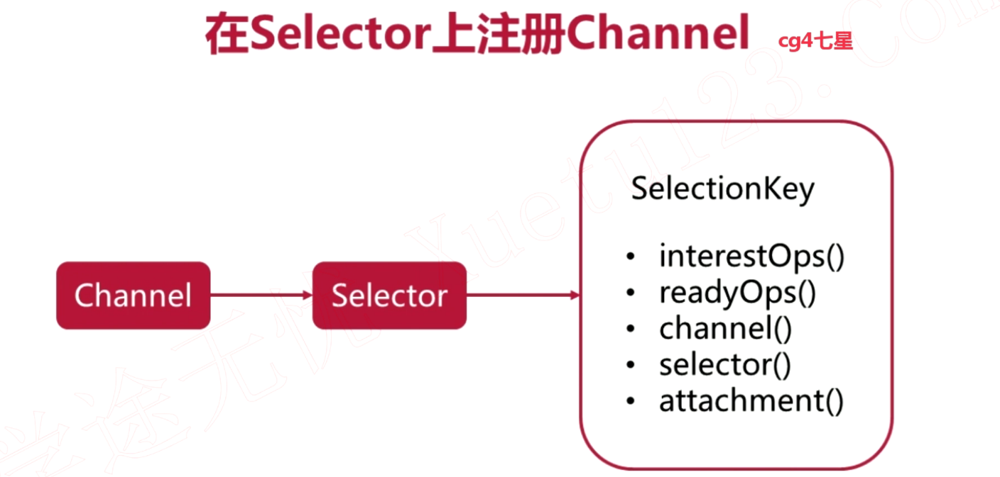

1. `SelectionKey`对应一个在`Selector`注册的`Channel`
2. `interestOps`：查看Channel的状态
3. `readyOps`：查看Channel可操作性的状态
4. `channel`：返回Channel对象
5. `slector`：返回Selector对象

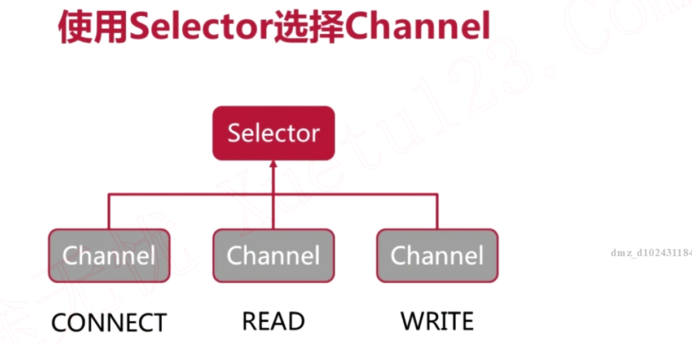

1. 注册状态为CONNECT的Channel，要求Selector监听Channel是否进入CONNECT状态
2. 注册状态为READ的Channel，要求Selector监听Channel是否进入READ状态
3. 注册状态为WRITE的Channel，要求Selector监听Channel是否进入WRITE状态

有一个被Selector监听的Channel处于可操作状态，随之拿到`SelectionKey`然后拿到Channel等对象；然后需要手动把这个Channel状态置为不可操作状态

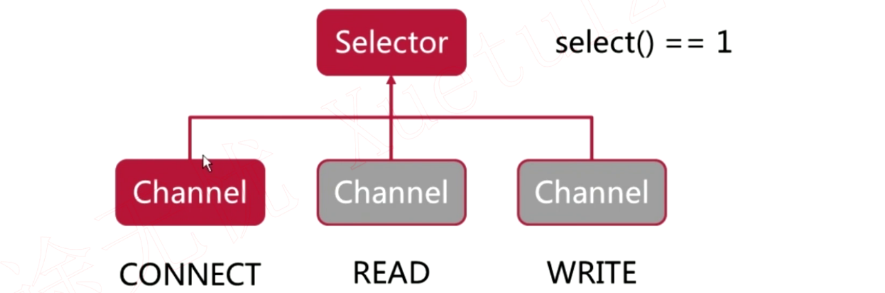

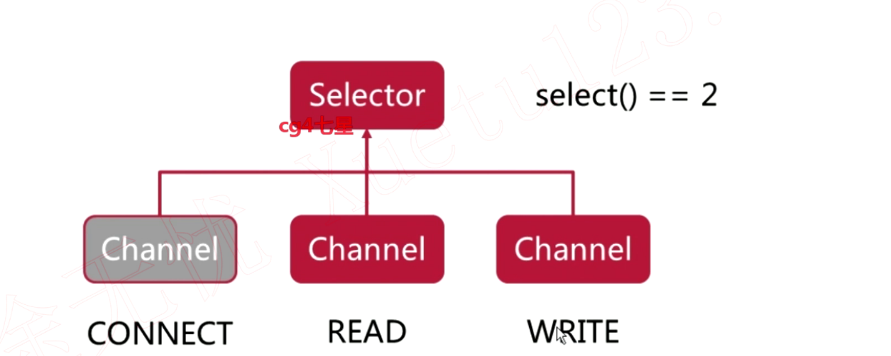

