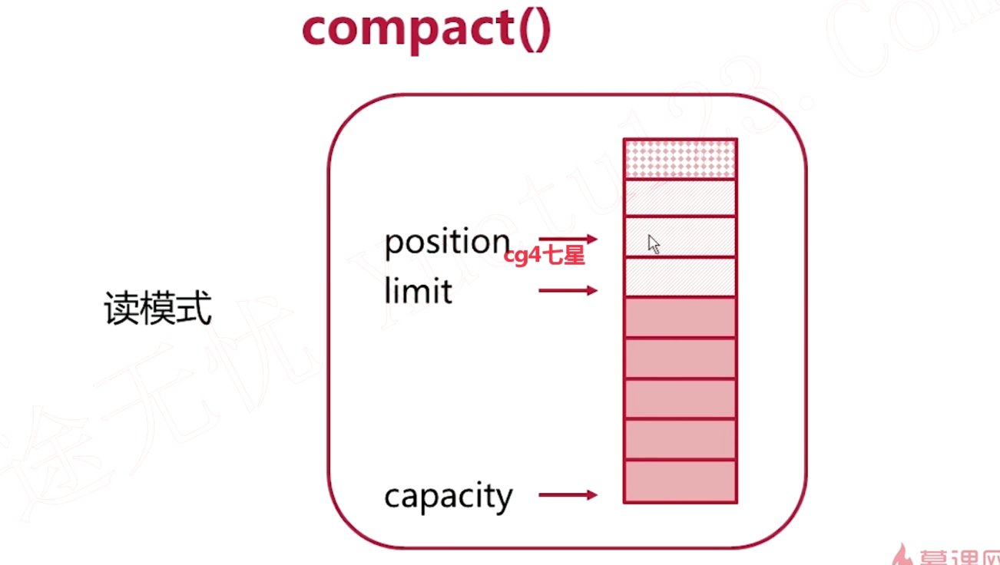

## 1. NIO概述

### 1.1 BIO中的阻塞

1. `ServerSocket.accept()`：一直等待客户端的请求连接
2. `InputStream.read()，OutputStream.write()`：我们在调用read或者write函数时，客户端或者服务端没有输入任何的信息，则处理读写操作的Handle线程将会一直阻塞在read和write函数上
3. 无法在同一个线程里处理多个Stream I/O，因为会读写阻塞

### 1.2 非阻塞式NIO

1. 使用Channel代替Stream（只有OutputStream和InputStream单向），是双向的，既可以写入也可以读取数据
2. 使用Selector监控多条Channel(轮询)
3. 可以在一个线程里处理多个Channel I/O

## 2. Channel和Buffer

Channel是基于Buffer实现的，Channel在读写数据过程中，数据都是要经过Buffer的


有三种指针式的结构：position，limit，capacity

1. capacity表示再往缓冲区写数据的时候最多能写到的数据
2. position指向目前读写操作所在位置


往缓冲区写了一定量数据之后打算读数据了。比如想把刚才写进去的数据读出来，但是此时必须进行Buffer读写模式的切换，需要调用flip（翻转）方法。1. 把position指针重新移动回初始位置；2. 把limit指针指向刚才position的位置。两个指针之前的区域就是刚才写操作的数据；3. position最远能读到的数据就是limint所在位置


****

读取部分数据：compact方法实现了把剩余还没读取的数据拷贝到buffer初始位置，然后把position指针指向未读数据接下来的位置，再把limit指针指向capacity所指位置





## 3. Channel基本操作


## 4. 多方法实现本地文件拷贝

参考代码 nio-file-copy

```java
// 四种不同的文件拷贝方式
public class FileCopyDemo {
    public static void main(String[] args) {
        // 1. 最原始的不使用缓冲区的拷贝方式，从源文件一个一个字节读取写到目标文件里去
        FileCopyRunner noBufferStreamCopy;
        // 2. 使用缓冲区方式，先读出一个Buffer大小的数据，再从缓冲区里读数据
        FileCopyRunner bufferedStreamCopy;
        // 3. Channel经过Buffer传输数据
        FileCopyRunner nioBufferCopy;
        // 4. 使用两个Channel，通过两个Channel之间传递数据
        FileCopyRunner nioTransferCopy;
    }
}
```

```java
File smallFile = new File("/var/tmp/smallFile");
File smallFileCopy = new File("/var/tmp/smallFile-copy");

System.out.println("---Copying small file---");
benchmark(noBufferStreamCopy, smallFile, smallFileCopy);
benchmark(bufferedStreamCopy, smallFile, smallFileCopy);
benchmark(nioBufferCopy, smallFile, smallFileCopy);
benchmark(nioTransferCopy, smallFile, smallFileCopy);
```


## 5. Selector和Channel

每个通道都可以选择进行非阻塞性的读写，这就意味着我们需要不停地去询问这个通道是否除以一个可操作的状态上（因为当调用读写函数的时候通道上可能没什么数据可以操作，也就是这个通道处于不可操作状态）
Selector就是帮我们进行监听多个通道的状态是否处于可操作的状态

1. 需要把Channel注册到Selector上，所以如果想要知道Channel状态，我们只需要询问Selector就可以了


1. `SelectionKey`对应一个在`Selector`注册的`Channel`
2. `interestOps`：查看Channel的状态
3. `readyOps`：查看Channel可操作性的状态
4. `channel`：返回Channel对象
5. `slector`：返回Selector对象


1. 注册状态为CONNECT的Channel，要求Selector监听Channel是否进入CONNECT状态
2. 注册状态为READ的Channel，要求Selector监听Channel是否进入READ状态
3. 注册状态为WRITE的Channel，要求Selector监听Channel是否进入WRITE状态

有一个被Selector监听的Channel处于可操作状态，随之拿到`SelectionKey`然后拿到Channel等对象；然后需要手动把这个Channel状态置为不可操作状态


