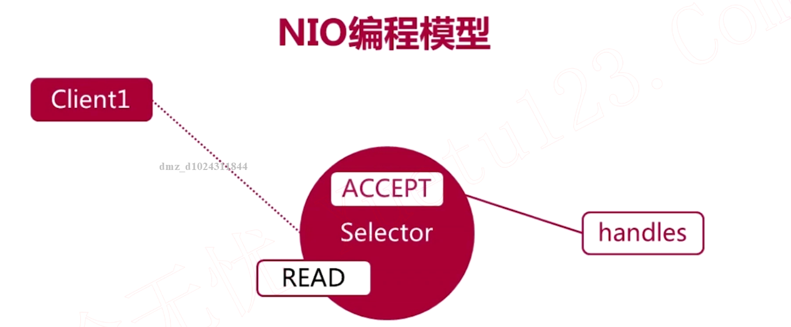

## 1. 使用NIO实现多人聊天室




1. 内置服务器的ServerSocket Channel，注册一个Accept事件；希望让Selector一直监听ServerSocket Channel的Accept事件的发生，类似于BIO中`server.accept()`
2. 当有客户端连接成功时，Selector就能监听到ServerSocket Channel触发了Accept事件，然后就要为这个ServerSocket Channel在Selector上注册一个新事件READ，READ结合之前Channel状态，意思为Selector监听这个ServerSocket Channel是否触发了读事件，即客户端向服务器端发送数据后，则Channel的状态为READ
3. 以上处理过程都是和Selector在同一个线程上(与BIO不同)

```java
public class ChatServer {
  private static final int DEFAULT_PORT = 8888;
  private static final String QUIT = "quit";
  private static final int BUFFER = 1024;

  private ServerSocketChannel server;
  private Selector selector;
  // 从通道读写数据都是需要经过Buffer的
  private ByteBuffer rBuffer = ByteBuffer.allocate(BUFFER);
  // 写入其他用户通道
  private ByteBuffer wBuffer = ByteBuffer.allocate(BUFFER);
  private Charset charset = Charset.forName("UTF-8");
  private int port;

  public ChatServer() {
    this(DEFAULT_PORT);
  }

  public ChatServer(int port) {
    this.port = port;
  }

  private void start() {
    try {
      server = ServerSocketChannel.open();
      // 设置为非阻塞式调用，必做
      server.configureBlocking(false);
      server.socket().bind(new InetSocketAddress(port));

      selector = Selector.open();
      // 告诉selector要监听哪一种状态变化
      server.register(selector, SelectionKey.OP_ACCEPT);
      System.out.println("启动服务器， 监听端口：" + port + "...");

      while (true) {
        /**
         * select()的调用是阻塞性的，可能这个selector注册了多个Channel，但如果在调用select()过程中都没有selector监听的事件发生
         * 那么这个select()是不会返回任何数的
         * public abstract int select() throws IOException;
         */
        selector.select();
        Set<SelectionKey> selectionKeys = selector.selectedKeys();
        for (SelectionKey key : selectionKeys) {
          /**
           * 处理被触发的事件
           * 客户端发送过来的数据和有关这个Channel的所有信息都被包装在SelectionKey中
           */
          handles(key);
        }
        selectionKeys.clear();
      }

    } catch (IOException e) {
      e.printStackTrace();
    } finally {
      close(selector);
    }

  }

  private void handles(SelectionKey key) throws IOException {
    // ACCEPT事件 - 和客户端建立了连接
    if (key.isAcceptable()) {
      ServerSocketChannel server = (ServerSocketChannel) key.channel();
      SocketChannel client = server.accept();
      client.configureBlocking(false);
      client.register(selector, SelectionKey.OP_READ);
      System.out.println(getClientName(client) + "已连接");
    }
    // READ事件 - 客户端发送了消息
    else if (key.isReadable()) {
      SocketChannel client = (SocketChannel) key.channel();
      String fwdMsg = receive(client);
      if (fwdMsg.isEmpty()) {
        // 客户端异常，希望selector不要再监听这个通道上read事件了
        key.cancel();
        // 更新了selector监听的事件状态，所以把当前阻塞住的selector马上返回，重新监听
        selector.wakeup();
      } else {
        System.out.println(getClientName(client) + ":" + fwdMsg);
        forwardMessage(client, fwdMsg);
        // 检查用户是否退出
        if (readyToQuit(fwdMsg)) {
          key.cancel();
          selector.wakeup();
          System.out.println(getClientName(client) + "已断开");
        }
      }
    }
  }

  private void forwardMessage(SocketChannel client, String fwdMsg) throws IOException {
    // SelectionKey上不仅仅只有SocketChannel，而且还有一开始注册的ServerSocketChannel
    for (SelectionKey key : selector.keys()) {
      Channel connectedClient = key.channel();
      if (connectedClient instanceof ServerSocketChannel) {
        continue;
      }
      // 其他客户端的SocketChannel未被关闭
      if (key.isValid() && !client.equals(connectedClient)) {
        wBuffer.clear();
        wBuffer.put(charset.encode(getClientName(client) + ":" + fwdMsg));
        wBuffer.flip();
        while (wBuffer.hasRemaining()) {
          ((SocketChannel) connectedClient).write(wBuffer);
        }
      }
    }
  }

  private String receive(SocketChannel client) throws IOException {
    rBuffer.clear();
    // 把从SocketChannel读出的数据写入rBuffer
    while (client.read(rBuffer) > 0) {;}
    rBuffer.flip();
    return String.valueOf(charset.decode(rBuffer));
  }

  private String getClientName(SocketChannel client) {
    return "客户端[" + client.socket().getPort() + "]";
  }

  private boolean readyToQuit(String msg) {
    return QUIT.equals(msg);
  }

  private void close(Closeable closable) {
    if (closable != null) {
      try {
        closable.close();
      } catch (IOException e) {
        e.printStackTrace();
      }
    }
  }

  public static void main(String[] args) {
    ChatServer chatServer = new ChatServer(7777);
    chatServer.start();
  }
}
```

```java
public class ChatClient {

  private static final String DEFAULT_SERVER_HOST = "127.0.0.1";
  private static final int DEFAULT_SERVER_PORT = 8888;
  private static final String QUIT = "quit";
  private static final int BUFFER = 1024;

  private String host;
  private int port;
  private SocketChannel client;
  private ByteBuffer rBuffer = ByteBuffer.allocate(BUFFER);
  private ByteBuffer wBuffer = ByteBuffer.allocate(BUFFER);
  private Selector selector;
  private Charset charset = Charset.forName("UTF-8");

  public ChatClient() {
    this(DEFAULT_SERVER_HOST, DEFAULT_SERVER_PORT);
  }

  public ChatClient(String host, int port) {
    this.host = host;
    this.port = port;
  }

  public boolean readyToQuit(String msg) {
    return QUIT.equals(msg);
  }

  private void close(Closeable closable) {
    if (closable != null) {
      try {
        closable.close();
      } catch (IOException e) {
        e.printStackTrace();
      }
    }
  }

  private void start() {
    try {
      client = SocketChannel.open();
      client.configureBlocking(false);

      selector = Selector.open();
      client.register(selector, SelectionKey.OP_CONNECT);
      client.connect(new InetSocketAddress(host, port));

      while (true) {
        selector.select();
        Set<SelectionKey> selectionKeys = selector.selectedKeys();
        for (SelectionKey key : selectionKeys) {
          handles(key);
        }
        selectionKeys.clear();
      }
    } catch (IOException e) {
      e.printStackTrace();
    } catch (ClosedSelectorException e) {
      // 用户正常退出
    } finally {
      close(selector);
    }

  }

  private void handles(SelectionKey key) throws IOException {
    // CONNECT事件 - 连接就绪事件
    if (key.isConnectable()) {
      SocketChannel client = (SocketChannel) key.channel();
      if (client.isConnectionPending()) {
        // 完成建立连接过程
        client.finishConnect();
        // 处理用户的输入
        new Thread(new UserInputHandler(this)).start();
      }
      // 一旦接收到信息则触发READ事件
      client.register(selector, SelectionKey.OP_READ);
    }
    // READ事件 -  服务器转发消息
    else if (key.isReadable()) {
      SocketChannel client = (SocketChannel) key.channel();
      String msg = receive(client);
      if (msg.isEmpty()) {
        // 服务器异常
        close(selector);
      } else {
        System.out.println(msg);
      }
    }
  }

  public void send(String msg) throws IOException {
    if (msg.isEmpty()) {
      return;
    }

    wBuffer.clear();
    wBuffer.put(charset.encode(msg));
    wBuffer.flip();
    while (wBuffer.hasRemaining()) {
      client.write(wBuffer);
    }

    // 检查用户是否准备退出
    if (readyToQuit(msg)) {
      close(selector);
    }
  }

  private String receive(SocketChannel client) throws IOException {
    rBuffer.clear();
    while (client.read(rBuffer) > 0) {
      ;
    }
    rBuffer.flip();
    return String.valueOf(charset.decode(rBuffer));
  }

  public static void main(String[] args) {
    ChatClient client = new ChatClient("127.0.0.1", 7777);
    client.start();
  }
}
```

```java
public class UserInputHandler implements Runnable {

  private ChatClient chatClient;

  public UserInputHandler(ChatClient chatClient) {
    this.chatClient = chatClient;
  }

  @Override
  public void run() {
    try {
      // 等待用户输入消息
      BufferedReader consoleReader =
          new BufferedReader(new InputStreamReader(System.in));
      while (true) {
        String input = consoleReader.readLine();

        // 向服务器发送消息
        chatClient.send(input);

        // 检查用户是否准备退出
        if (chatClient.readyToQuit(input)) {
          break;
        }
      }
    } catch (IOException e) {
      e.printStackTrace();
    }
  }
}
```

