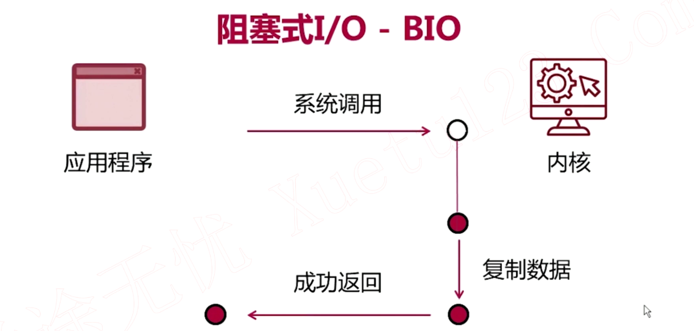
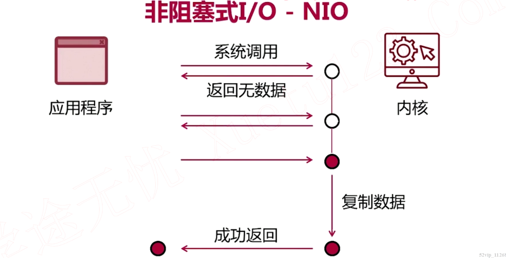
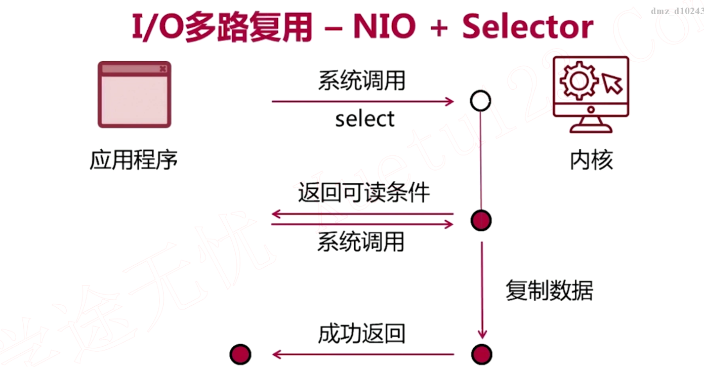
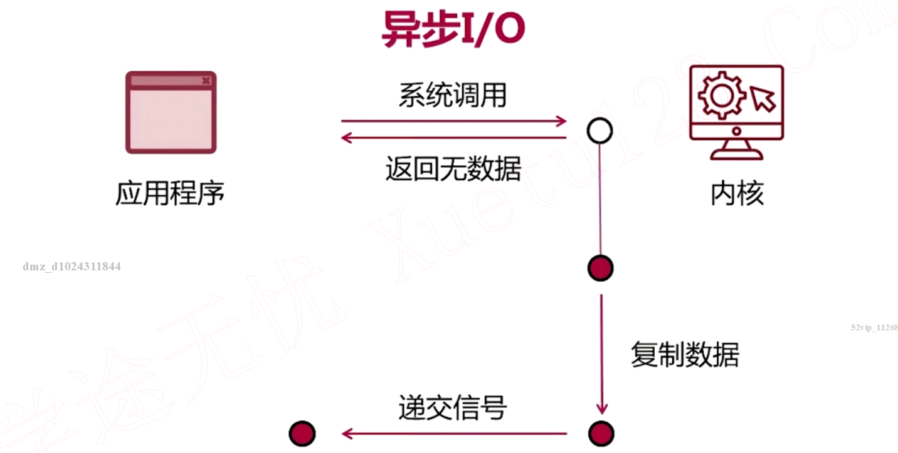
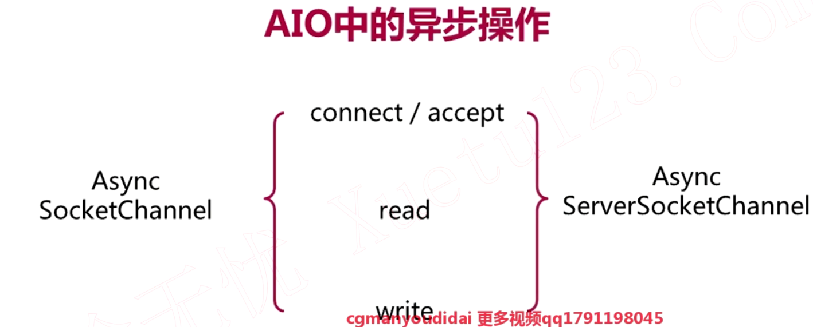
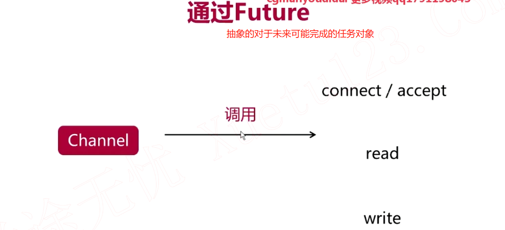
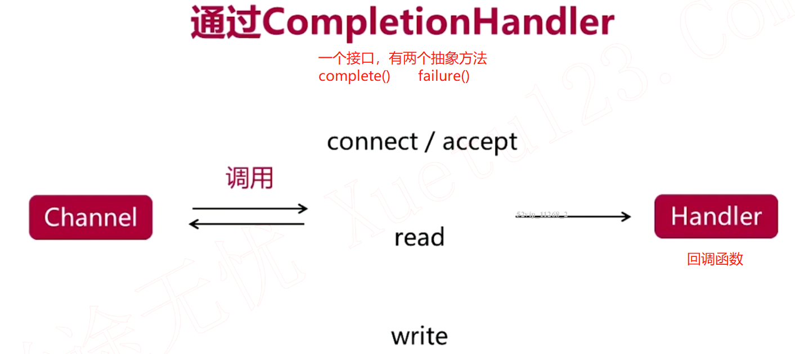
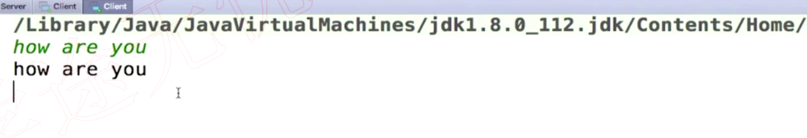

## 1. 阻塞式I/O



1. 应用程序层面一定要通过与操作系统内核的层面进行一定的互动才能实现信息在网络上的通信交互
2. 系统调用函数与操作系统内核进行沟通有无收到从其他客户端收到的数据，既然是阻塞是I/O，那么系统调用就会被阻塞在这边，它不会返回，会一直在等待知道真的从网卡这边收到数据，数据也被拷贝到内核的缓冲区
3. 数据会被复制到应用程序的缓冲区

## 2. 非阻塞式I/O



一个词`轮询`

## 3. I/O多路复用



1. 应用程序告诉内核帮忙监听(这个select本身是阻塞式的)数据通路，若有接收到数据则通知程序

## 4. 异步I/O

1. 之前三种都是同步I/O，因为如果客户端不再发送I/O请求服务端是不会主动发送数据的，若想获取数据必须再去询问内核一次，而异步I/O客户端只需要请求一次
2. 即使客户端不发送请求，但这不代表后台什么都没发生，操作系统在其他后台线程中会去做着I/O相关事情的



## 5. AIO中的异步操作





当I/O操作完成了的时候再对结果做额外的操作，系统会调用Handle



## 7. 回音式服务器

```java
import java.io.*;
import java.net.InetSocketAddress;
import java.nio.ByteBuffer;
import java.nio.channels.AsynchronousServerSocketChannel;
import java.nio.channels.AsynchronousSocketChannel;
import java.nio.channels.CompletionHandler;
import java.util.HashMap;
import java.util.Map;

public class Server {

  final String LOCALHOST = "localhost";
  final int DEFAULT_PORT = 8888;
  AsynchronousServerSocketChannel serverChannel;

  private void close(Closeable closable) {
    if (closable != null) {
      try {
        closable.close();
        System.out.println("关闭" + closable);
      } catch (IOException e) {
        e.printStackTrace();
      }
    }
  }

  public void start() {
    try {
      // 绑定监听端口
      // 使用默认的AsynchronousChannelGroup
      serverChannel = AsynchronousServerSocketChannel.open();
      serverChannel.bind(new InetSocketAddress(LOCALHOST, DEFAULT_PORT));
      System.out.println("启动服务器，监听端口:" + DEFAULT_PORT);

      // 服务端一直保持要从客户端获取请求的状态，若没有这个循环，则当AcceptHandler还没被运行时程序就结束了
      while (true) {
        /**
         * 第一个参数为想让AcceptHandler处理的参数attachment，可以为null
         * 等到serverChannel接收到客户端请求时就会去执行AcceptHandler
         * AcceptHandler是在别的线程上被运行
         */
        serverChannel.accept(null, new AcceptHandler());
        // 阻塞线程，等待客户端数据输入，避免循环过于频繁
        System.in.read();
      }
    } catch (IOException e) {
      e.printStackTrace();
    } finally {
      close(serverChannel);
    }
  }

  private class AcceptHandler implements
      CompletionHandler<AsynchronousSocketChannel, Object> {
    @Override
    public void completed(AsynchronousSocketChannel result, Object attachment) {
      // 继续让服务器端监听接收请求
      if (serverChannel.isOpen()) {
        serverChannel.accept(null, this);
      }

      /**
       * 在服务器端就是要接收客户端的SocketChannel发送的数据然后把数据原封不动地发送出去
       * 那么我们需要做的就是先read，再write，而两者都是异步的方法
       * 那么我们还需要一个CompletionHandler去处理读和写之后的回调处理
       */
      AsynchronousSocketChannel clientChannel = result;
      if (clientChannel != null && clientChannel.isOpen()) {
        // 处理客户端通道上读写操作的CompletionHandler
        ClientHandler handler = new ClientHandler(clientChannel);

        // 读客户通过客户端Channel发送过来的信息
        ByteBuffer buffer = ByteBuffer.allocate(1024);
        Map<String, Object> info = new HashMap<>();
        info.put("type", "read");
        info.put("buffer", buffer);
        /**
         * 从通道里读数据到buffer，读完之后进行handle处理并且传入attachment对象info
         * 这里的attachment可以告诉ClientHandler现在要处理的操作是写操作还是读操作
         * 也想知道从clientChannel里获取的数据是什么以便传入客户端的clientChannel
         *
         * 开启buffer写模式，数据从clientChannel写到buffer
         */
        clientChannel.read(buffer, info, handler);
      }
    }

    @Override
    public void failed(Throwable exc, Object attachment) {
      // 处理错误
    }
  }

  /**
   * 虽然名字为ClientHandler，但是是服务端的代码
   * 泛型设置为<Integer, Object>
   *   Integer是因为clientChannel.read返回的是Integer，表示读取了多少数据
   *   Object即使attachment
   */
  private class ClientHandler implements
      CompletionHandler<Integer, Object> {
    private AsynchronousSocketChannel clientChannel;

    public ClientHandler(AsynchronousSocketChannel channel) {
      this.clientChannel = channel;
    }

    @Override
    public void completed(Integer result, Object attachment) {
      Map<String, Object> info = (Map<String, Object>) attachment;
      String type = (String) info.get("type");

      /**
       * 从通道里read完数据后再向通道里write数据
       * 向通道里write完数据后再从通道里read数据
       */
      if ("read".equals(type)) {
        ByteBuffer buffer = (ByteBuffer) info.get("buffer");
        // 开启buffer读模式
        buffer.flip();
        info.put("type", "write");
        // 数据从buffer读到clientChannel
        clientChannel.write(buffer, info, this);
        buffer.clear();
      } else if ("write".equals(type)) {
        ByteBuffer buffer = ByteBuffer.allocate(1024);

        info.put("type", "read");
        info.put("buffer", buffer);

        clientChannel.read(buffer, info, this);
      }
    }

    @Override
    public void failed(Throwable exc, Object attachment) {
      // 处理错误
    }
  }

  public static void main(String[] args) {
    Server server = new Server();
    server.start();
  }
}
```

```java
import java.io.*;
import java.net.InetSocketAddress;
import java.nio.ByteBuffer;
import java.nio.channels.AsynchronousSocketChannel;
import java.util.concurrent.ExecutionException;
import java.util.concurrent.Future;

public class Client {

  final String LOCALHOST = "localhost";
  final int DEFAULT_PORT = 8888;
  AsynchronousSocketChannel clientChannel;

  private void close(Closeable closable) {
    if (closable != null) {
      try {
        closable.close();
        System.out.println("关闭" + closable);
      } catch (IOException e) {
        e.printStackTrace();
      }
    }
  }

  public void start() {
    try {
      // 创建channel
      clientChannel = AsynchronousSocketChannel.open();
      Future<Void> future = clientChannel.connect(new InetSocketAddress(LOCALHOST, DEFAULT_PORT));
      // 阻塞式调用直到服务端和客户端成功建立链接
      future.get();

      // 等待用户的输入
      BufferedReader consoleReader =
          new BufferedReader(new InputStreamReader(System.in));
      while (true) {
        String input = consoleReader.readLine();

        byte[] inputBytes = input.getBytes();
        ByteBuffer buffer = ByteBuffer.wrap(inputBytes);
        // 返回向clientChannel写了多少数据
        Future<Integer> writeResult = clientChannel.write(buffer);
        // 阻塞式调用，相当于等待clientChannel.write(buffer);成功完成
        writeResult.get();
        // 把buffer转换成读模式
        buffer.flip();
        Future<Integer> readResult = clientChannel.read(buffer);

        readResult.get();
        String echo = new String(buffer.array());
        buffer.clear();

        System.out.println(echo);
      }

    } catch (IOException e) {
      e.printStackTrace();
    } catch (InterruptedException e) {
      e.printStackTrace();
    } catch (ExecutionException e) {
      e.printStackTrace();
    } finally {
      close(clientChannel);
    }
  }

  public static void main(String[] args) {
    Client client = new Client();
    client.start();
  }

}
```

