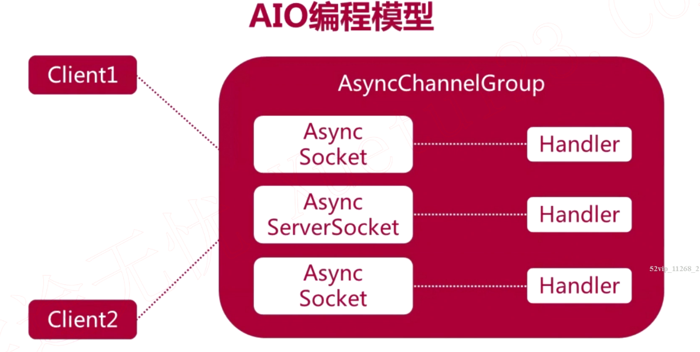

## 1. AIO模型



1. `AsyncChannelGroup`指的是可以被多个异步通道共享的资源群组，包含有线程池
2. 在AIO编程模型里，操作系统帮我们做了很多事；当操作系统处理准备好资源后会异步地通知我们，或者通过Handle方法做异步操作，操作系统需要分发(dispatch)Handle所需要做的工作，即他需要这样一个线程池来dispatch
3. 当我们不指定AsyncChannelGroup时，系统会默认设置一个共享的Group
4. 一个客户端发起建立连接的请求时，accept Handle被触发，他就会给新客户端对应的Socket Channel来注册一个Handle，这个Handle用来处理这个客户端和服务器的I/O交互；Socket Channel read或者write完之后就出触发这个Socket Channel对应的Handle

## 2. 使用AIO实现多人聊天室

```java
不全！！！！！

public class ChatServer {
  private static final String LOCALHOST = "localhost";
  private static final int DEFAULT_PORT = 8888;
  private static final String QUIT = "quit";
  private static final int BUFFER = 1024;
  private static final int THREADPOOL_SIZE = 8;

  private AsynchronousChannelGroup channelGroup;
  private AsynchronousServerSocketChannel serverChannel;
  private List<ClientHandler> connectedClients;
  private Charset charset = Charset.forName("UTF-8");
  private int port;

  public ChatServer() {
    this(DEFAULT_PORT);
  }

  public ChatServer(int port) {
    this.port = port;
    this.connectedClients = new ArrayList<>();
  }

  private String getClientName(SocketChannel client) {
    return "客户端[" + client.socket().getPort() + "]";
  }

  private boolean readyToQuit(String msg) {
    return QUIT.equals(msg);
  }

  private void close(Closeable closable) {
    if (closable != null) {
      try {
        closable.close();
      } catch (IOException e) {
        e.printStackTrace();
      }
    }
  }

  private void start() {
    ExecutorService executorService = Executors.newFixedThreadPool(THREADPOOL_SIZE);
    try {
      // 基于线程池创建AsynchronousChannelGroup
      channelGroup = AsynchronousChannelGroup.withThreadPool(executorService);
      serverChannel = AsynchronousServerSocketChannel.open(channelGroup);
      serverChannel.bind(new InetSocketAddress(LOCALHOST, port));
      System.out.println("启动服务器，监听端口" + port);

      while (true) {
        serverChannel.accept(null, new AcceptHandle());
        System.in.read();
      }

    } catch (IOException e) {
      e.printStackTrace();
    }
  }

  /**
   * CompletionHandler泛型的第一个参数为异步调用函数的返回数据类型serverChannel.accept()返回AsynchronousSocketChannel
   * 第二个参数为attachment对象类型
   */
  private class AcceptHandle implements CompletionHandler<AsynchronousSocketChannel, Object> {
    @Override
    public void completed(AsynchronousSocketChannel clientChannel, Object attachment) {
      if (serverChannel.isOpen()) {
        serverChannel.accept(null, this);
      }
      if (clientChannel != null && clientChannel.isOpen()) {
        /**
         * 准备从客户端读取数据，则调用read函数
         * read函数也是一个异步操作，既然是异步操作，所以使用CompletionHandler的回调函数处理异步调用返回的结果
         */
        ClientHandler handler = new ClientHandle(clientChannel);
        ByteBuffer buffer = ByteBuffer.allocate(BUFFER);
        // TODO 将新用户添加到在线用户列表
        addClient(handler);
        clientChannel.read(buffer, buffer, handler);
      }
    }

    @Override
    public void failed(Throwable exc, Object attachment) {
      System.out.println("连接失败:" + exc);
    }
  }


  private class ClientHandler implements CompletionHandler<Integer, Object> {
    private AsynchronousSocketChannel clientChannel;

    /**
     * 每次accept了一个新的客户就为此创建一个ClientHandle实例
     * 把这个ClientHandle和clientChannel对应起来
     * @param clientChannel
     */
    public ClientHandler(AsynchronousSocketChannel clientChannel) {
      this.clientChannel = clientChannel;
    }

    @Override
    // Integer result:从通道里读取了多少数据
    public void completed(Integer result, Object attachment) {
      ByteBuffer buffer = (ByteBuffer) attachment;
      if (buffer != null) {
        if (result <= 0) {
          /**
           * 客户端异常
           * TODO 将客户移除在线客户列表
           */
        } else {
          buffer.flip();
          String fwdMsg = receive(buffer);
          System.out.println(getClientName(clientChannel) + ":" + fwdMsg);
          forwardMessage(clientChannel, fwdMsg,);
          buffer.clear();

          
        }
      }
    }

    @Override
    public void failed(Throwable exc, Object attachment) {

    }
  }

  public static void main(String[] args) {
    ChatServer chatServer = new ChatServer(7777);
  }

}
```

