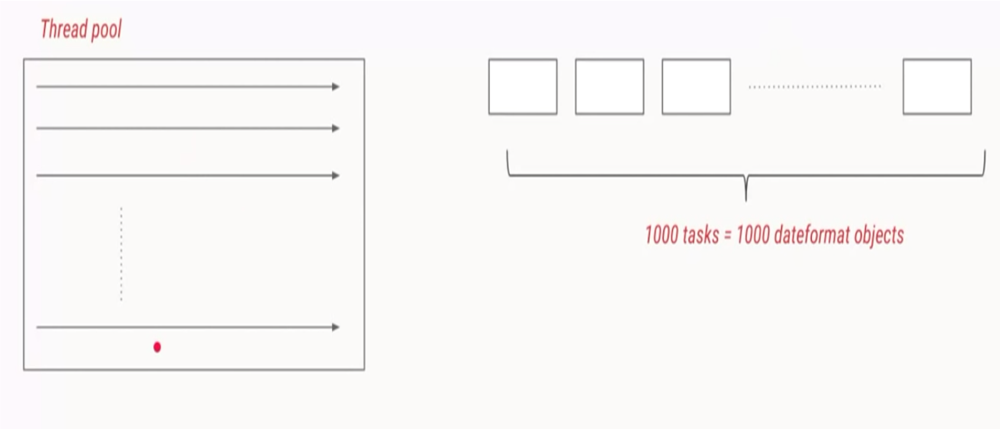
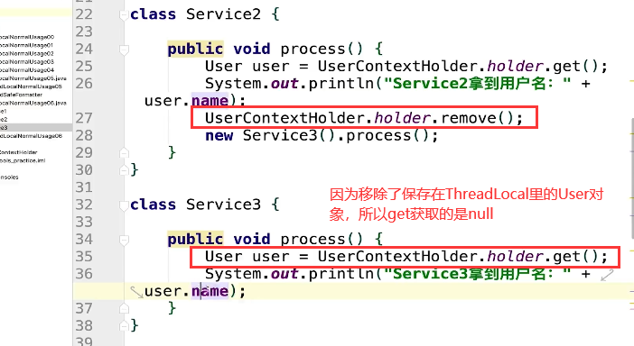
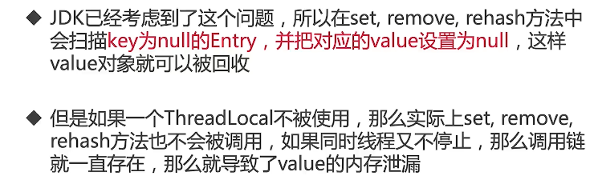

### 2. 并发工具类纵览

1. 为了并发安全：

   **从底层原理分析**：互斥同步、非互斥同步、结合互斥和非互斥同步、无同步方案

   互斥同步简而言之就是锁，比如synchronized，ReentrantLock（可重入锁），ReadWriteLock（读写锁）......； 以及使用同步的工具类，比如Collections.synchhronizedList(new ArrayList<E>())和Vector等，本质上是利用了synchronized对集合元素进行同步互斥操作

   非互斥同步：可以同时读写内容，但不要求进行读写操作之前就把资源独占，最典型的就是atomic包下的原子类；

   结合互斥和非互斥同步：线程安全的并发容器，比如说ConcurrentHashMap，CopyOnWriteArrayList，并发队列（阻塞和非阻塞队列，ArrayBlockingQueue...）

   无同步方案典型例子比如说ThreadLocal和final关键字

   **从使用者的角度**：避免共享变量、共享变量但是加以限制和处理、使用成熟工具类

   避免共享变量：ThreadLocal

   共享变量但是加以限制和处理：互斥同步（锁）、final关键字

   使用成熟工具类：线程安全的并发容器、atomic包下的原子类

2. 管理线程，提高效率

   线程池相关类：Executor，ExecutorService，常见线程池（CachedThreadPool，ScheduledThreadPool......）

   能获取子线程的运行结果：Callable，Future，FutureTask

3. 线程协作

   Semaphore，Condition......

### 3. 线程池

1. 线程池的自我介绍；2. 创建和停止线程池；3. 常见线程池的特点和用法；4. 任务太多，怎样拒绝；5. 钩子方法，给线程池加点料；6. 实现原理，源码分析；7. 使用线程池的注意点

#### 3.1 线程池的自我介绍 

* 线程池的重要性

* 什么是"池"

  * 软件中的"池"，也可以理解为计划经济。用若干个固定下来的线程去执行上千个任务（可以复用每个线程）。而且在有了固定数量的线程之后，就不需要再去创建更多的线程了，因为创建和销毁线程是需要很大开销的

* 如果不使用线程池，每个任务都需要新开一个线程处理

  参考代码 src/threadpool/EveryTaskOneThread.java；src/threadpool/ForLoop.java

  * 一个线程
  * 多个线程使用for循环创建线程
  * 当任务数量上升到1000

* 这样开销太大，我们希望有固定数量的线程，来执行者1000个线程，这样就避免了反复创建并销毁线程所带来的开销问题


* 线程池的好处：加快响应速度，合理利用CPU和内存，统一管理


#### 3.2 增减线程的时机

1. 线程池构造函数的参数

   

   ****

   比如设置corePoolSize=5，则当有5个任务提交的时候线程池就会相应地创建等量的线程；但是有的时候所需要的线程的量是不固定的。比如前一天任务少，则所需线程量就可以相对少一点，但是后一天任务大，则线程量就需要加大。像这种不均匀的任务需求量是工程的常态，这时候就引入了maxPoolSize

   

   ****

   任务提交就会创建线程直到达到了corePoolSize比如说5个，这是任务的核心处理线程。然后又有一些线程被提交，这时这些任务会被提交到存储队列中去等待，这个队列就是用来存放这些等待被线程执行的任务的，等待处于执行状态的任务被执行完毕之后，得到核心线程的处理（这其实就是线程池的作用：即用10个线程去处理100个任务，肯定有线程处于阻塞状态）。请注意，这时候线程池的大小仍是corePoolSize，但是如果连等待队列都满了的话，这时候线程池的扩展性就通过maxPoolSize体现了出来。而线程池所能包含的线程个数最多能扩展到maxPoolSize

   

   ****

   

   ****

   

   ****

   

   ****

   

   ****

   

   **线程只管创建不管回收也不行**

   keepAliveTime：如果线程池当前线程数多于corePoolSize，那么如果多于线程（非核心线程，即超过corePoolSize的那部分）的空闲时间超过keepAliveTime，他们就会被终止

   ThreadFactory用来创建线程

   

   workQueue：有三种常见的队列类型

   1. 直接交接：SynchronousQueue，如果说任务不是特别多的话，只是把任务通过队列做一下简单的中转交到线程去处理的话，那么就可以使用这个队列。这个队列本身内是没有容量的，即存不下任务的。如果使用了这个队列，则maxPoolSize就需要设置的大一些，因为没有队列作为缓冲了，每提交一个任务就意味着多创建一个线程
   2. 无界队列：LinkedBlockingQueue，这是一个不会被塞满的队列，在这种情况下maxPoolSize不论设置有多么大都没用，因为不会有新创建的线程。这种队列确实可以防止流量突增，因为流量加大处理不完的话就会被放在阻塞队列上而不是新创建线程增加系统负担；但是也有缺点，比如处理速度比不上任务提交的速度的话这个阻塞队列就会无限制增加导致内存浪费 
   3. 有界队列：ArrayBlockingQueue，可以设置合适的队列大小

2. 线程池应该手动创建还是自动创建

   

   * `newFixedThreadPool`：参考代码 src/threadpool/FixedThreadPoolTest.java

   **执行结果始终都是1-2-3-4**

   

   ```java
   public static ExecutorService newFixedThreadPool(int nThreads) {
       // para1：传进来的参数，即corePoolSize
       // para2：maxPoolSize，因为设置大小和corePoolSize一样，所以线程数固定
       // para3：keepAliveTime，因为不会有新创建线程，也就没有必要设置超时时间，因为超时时间是针对新创建线程的
       // para4：时间单位
       // para5：任务队列类型LinkedBlockingQueue
           return new ThreadPoolExecutor(nThreads, nThreads,
                                         0L, TimeUnit.MILLISECONDS,
                                         new LinkedBlockingQueue<Runnable>());
       }
   ```

   参考代码 src/threadpool/FixedThreadPoolOOM.java

   

   ****

   

   * `newSingleThreadExecutor`：参考代码 src/threadpool/SingleThreadExecutor.java

     以这种方式创建的线程池里只有一个线程，所以不需要传递参数

   

   ```java
       public static ExecutorService newSingleThreadExecutor() {
           // corePoolSize和maxPoolSize大小都为1
           return new FinalizableDelegatedExecutorService
               (new ThreadPoolExecutor(1, 1,
                                       0L, TimeUnit.MILLISECONDS,
                                       new LinkedBlockingQueue<Runnable>()));
       }
   ```

   

   * `CachedThreadPool`：可缓存线程池，是一个无界线程池，具有自动回收多余线程的功能

     参考代码 src/threadpool/CachedThreadPool.java

   

   1. SynchronousQueue是一个直接交换的队列，说明队列内部容量为0，不能把任务放在队列中。任务提交之后直接交付给线程去执行；并且该线程池所设定的最大线程数量为MAX_INTEGER，即无论提交多少个任务都会去创建线程帮助执行
   2. 过期时间设置为60s

   

   ****

   

   ```java
       public static ExecutorService newCachedThreadPool() {
           return new ThreadPoolExecutor(0, Integer.MAX_VALUE,
                                         60L, TimeUnit.SECONDS,
                                         new SynchronousQueue<Runnable>());
       }
   ```

   * `newScheduledThreadPool`：支持定时及周期性任务执行的线程池

   参考代码 src/threadpool/ScheduledThreadPoolTest.java

   ```java
   // para1：任务
   // para2：延迟时间
   // para3：时间单位
   public ScheduledFuture<?> schedule(Runnable command,
                                      long delay, TimeUnit unit);
   ```

   ```java
   // para2：初始延迟时间
   // para3：之后的延迟时间
   // 比如threadPool.scheduleAtFixedRate(new Task(), 1, 3, TimeUnit.SECONDS);
   // 意思是初始延迟1s执行任务之后每隔3s执行任务
   public ScheduledFuture<?> scheduleAtFixedRate(Runnable command,
                                                 long initialDelay,
                                                 long period,
                                                 TimeUnit unit);
   ```

   **所以正确的做法应该是手动创建线程**：根据不同的业务场景，自己设置线程池参数，比如我们的内存有多大，我们想给线程取什么名字等等

3. 线程池里的线程数量设定为多少比较合适

   1. 耗时IO型因为虽然有很多线程，但是大多都在等待IO数据/文件读写。即这些线程都处于阻塞态，并没有用到CPU的资源。所以需要把线程数设置的多一下（本质上是非IO型线程数量增加），让CPU利用率高一点
   2. 线程数的计算方式跟操作系统里的通过**"高响应比计算时间片分配算法"**类似，响应比为：1 + 平均等待时间/平均工作时间


4. 停止线程池的正确方法：参照3.7

#### 3.6 对比线程池的特点

`newFixedThreadPool`：10个固定数量的线程循环地被执行


`CachedThreadPool`：可缓存线程池，是一个无界线程池，具有自动回收多余线程的功能


`newScheduledThreadPool`：支持定时及周期性任务执行的线程池

`newSingleThreadExecutor`


****


****


#### 3.7 停止线程池的正确方法

1. `shutdown`：运行了这个方法线程池不一定会停止。事实上，这个方法仅仅是初始化整个关闭过程，因为线程池在执行到一半的时候，线程池内的任务处于这么几种状态：要么正在被线程调用运行，要么正在阻塞队列里等待被线程调用，所以线程池不是轻易就能停的。在执行了shutdown方法之后，线程池就获知希望被停止，为了优雅起见，线程池会把正在执行的，在等待的任务都执行完毕之后再关闭。并且从今往后被提交的任务都会被线程池所拒绝执行，抛出拒绝异常（存量任务会被执行完毕，新的任务却不会增加）

   参考代码 src/threadpool/ShutDown.java

   ```java
   class ShutDownTask implements Runnable {
   
       @Override
       public void run() {
           try {
               Thread.sleep(500);
               System.out.println(Thread.currentThread().getName());
           }
       }
   }
   ```

   ```java
   public class ShutDown {
   
       public static void main(String[] args) throws InterruptedException {
           ExecutorService executorService = Executors.newFixedThreadPool(10);
           for (int i = 0; i < 100; i++) {
               executorService.execute(new ShutDownTask());
           }
           Thread.sleep(1500);
   
           executorService.shutdown();
           // 在线程池执行shutdown之后提交任务会抛出异常
           executorService.execute(new ShutDownTask());
   
       }
   }
   ```

   

2. `isShutdown`：判断线程池是否进入了停止状态，即执行了shutdown就会返回true

3. `isTerminated`：判断线程池里的任务，包括正在执行和等待的任务是否都执行完毕

4. `awaitTermination`：判断n秒之后线程池是否处于`Terminated`状态

   ```java
   // 判断7s过后线程池是否处于完全关闭状态，这个方法是个异步方法
   boolean b = executorService.awaitTermination(7L, TimeUnit.SECONDS);
   ```

5. `shutdownNow`：立刻彻底关闭线程池，正在被执行的线程会收到interrupt信号；在等待的任务会以列表List<Runnable>的形式被直接返回，这个列表里的任务之后是要做进一步处理的

#### 3.8 任务太多，怎么拒绝 / 钩子函数：给线程池加点料


**"4种拒绝策略"**

1. AbortPolicy：直接抛出异常
2. DiscardPolicy：也会抛出异常，但是不给提示
3. DiscardOldestPolicy：因为等待队列中存在着很多任务，把最早提交的任务丢弃以便存放新提交的任务，有点像操作系统里的"最近最久未使用算法"（LRU）
4. CallerRunsPolicy：线程池会把提交的任务转交给提交任务的线程去执行。比如说主线程提交了一个任务给线程池，如果线程池已满，则这个策略会把这个任务交给主线程去执行（"你行你上"）

****


参考代码 src/threadpool/PauseableThreadPool.java

#### 3.9 Executor家族的辨析

##### 3.9.1 实现原理、源码分析


****


****


****


1. Executor是一个interface，只有一个方法

   ```java
   public interface Executor {
   
       /**
        * Executes the given command at some time in the future.  The command
        * may execute in a new thread, in a pooled thread, or in the calling
        * thread, at the discretion of the {@code Executor} implementation.
        *
        * @param command the runnable task
        * @throws RejectedExecutionException if this task cannot be
        * accepted for execution
        * @throws NullPointerException if command is null
        */
       void execute(Runnable command);
   }
   ```

2. ExecutorService继承自Executor并且实现了其他的方法，从而具有初步管理线程池的功能

   ```java
   public interface ExecutorService extends Executor {
   
       void shutdown();
   
       List<Runnable> shutdownNow();
   
       boolean isShutdown();
       ......
   ```

3. Executors是一个工具类，诸如newFixedThreadPool，newCachedThreadPool都是这个工具类里的方法，帮助快速创建线程池

##### 3.9.2 线程池实现任务复用的原理

相同线程执行不同任务

```java
public class ThreadPoolExecutor extends AbstractExecutorService{
    
    ......

    public void execute(Runnable command) {
        if (command == null)
            throw new NullPointerException();

        int c = ctl.get();
        // 当前线程个数是否小于corePoolSize
        if (workerCountOf(c) < corePoolSize) {
            // 添加工作线程Worker
            // para1：command就是即将被执行的任务
            // para2：bool值，若为true则表示线程数是否少于corePoolSize
            if (addWorker(command, true))
                return;
            c = ctl.get();
        }
        // 检查线程池是否处于运行状态，如果是就把任务放入工作队列中（因为线程数以及大于了corePoolSize）
        if (isRunning(c) && workQueue.offer(command)) {
            // 在此期间，有可能线程被终止，则再次做检查
            int recheck = ctl.get();
            // 如果检查过后发现线程没有在运行，则就删除任务
            if (! isRunning(recheck) && remove(command))
                reject(command);
            // 
            else if (workerCountOf(recheck) == 0)
               	// para2：bool值，若为false则表示线程数是否少于maxPoolSize
                addWorker(null, false);
        }
        // 等待队列已满并且线程也无法增加，则拒绝任务
        else if (!addWorker(command, false))
            reject(command);
    }
    
    ......
}
```


#### 3.10 线程池状态


****


****


### 4. ThreadLocal

#### 4.1 ThreadLocal的两种用法

典型场景1： 每个线程需要一个独享的对象（通常是工具类，典型需要使用的类有SimpleDateFormat和Random），由于工具类本身不是线程安全的，所以多个线程共享同一个静态工具类是有很大风险的，所以需要ThreadLocal来帮助给每个线程都只做一个独享的对象，从而使得线程之间使用的工具类是不同的实例，相互之间并不会影响

典型场景2：每个线程内需要保存全局变量（例如在拦截器中获取用户信息），可以让不同方法直接使用，避免参数传递的麻烦

#### 4.2 典型场景1：每个线程需要一个独享的对象

使用了ThreadLocal就相当于把一本教材复印了N本给每个同学使用，每个实例都只能由当前的线程去使用，其他线程是访问不到的


**SimpleDateFormat的进化之路**

##### 4.2.1 两个线程打印日期


参考代码 src/threadlocal/ThreadLocalNormalUsage00.java


##### 4.2.2 1000个打印日期的任务，用线程池来执行 

延伸出1000个，那就有1000个线程和1000个SimpleDateFormat，写法不优雅而且要面临创建销毁线程时候的高开销


参考代码

src/threadlocal/ThreadLocalNormalUsage01.java | src/threadlocal/ThreadLocalNormalUsage02.java

但是线程池方法有个缺点就是SimpleDateFormat对象被创建了1000次，但是其实没有必要



##### 4.2.3 代码优化1（错误）

通过把SimpleDateFormat对象设置为静态变量

```java
static SimpleDateFormat dateFormat = new SimpleDateFormat("yyyy-MM-dd HH:mm:ss");
```

参考代码 src/threadlocal/ThreadLocalNormalUsage03.java

出现了重复时间数据


错误原因在于当所有线程都公用一个共享变量的时候出现了线程安全问题（因为共享变量SimpleDateFormat不是线程安全的对象）


##### 4.2.4 代码优化2（加锁且正确）

参考代码 src/threadlocal/ThreadLocalNormalUsage04.java

```java
public String date(int seconds) {
    
    Date date = new Date(1000 * seconds);
    String s = null;
    synchronized (ThreadLocalNormalUsage04.class) {
        s = dateFormat.format(date);
    }
    return s;
}
```


但是这样子加锁仍存在问题，因为加锁后因为互斥所以保证了同一时间只能有一个线程运行这段代码，1000个线程运行起来需要一个个排队。

但是"输出日期字符串"这种任务并不需要满足前后顺序执行的硬性条件，在高并发的场景下这就导致了这种需求的任务执行效率低下

#### 4.5 ThreadLocal是救火队长

我们之前是给每个任务创建一个dateFormat对象，这次我们给每个线程池里的线程创建df对象，创建数量一下从1000锐减至10。而且从线程里创建的df对象是线程安全的。


****

参考代码 src/threadlocal/ThreadLocalNormalUsage05.java


#### 4.6 ThreadLocal的第二种用法

每个线程内需要保存全局变量，可以让不同的方法直接使用，避免参数传递的麻烦


****


****


****


****


参考代码 src/threadlocal/ThreadLocalNormalUsage06.java


****

两个线程创建的不是一个对象，所以不存在线程安全问题


#### 4.7 ThreadLocal两种方式总结

1. 让某个需要用到的对象在线程间隔离（每个线程都有自己的独立的对象）
2. 在任何方法中都可以轻松获取到该对象

**根据共享对象的生成时机不同，选择initialValue或set来保存对象**

1. initialValue：在ThreadLocal**第一次get**的时候把对象个初始化出来，对象的初始化时机可以由我们控制。比如SimpleDateFormat不受外界因素干扰，想什么时候新建就什么时候新建
2. set：如果需要保存到ThreadLocal里的对象的生成时机**不由我们随意控制**，例如拦截器生成的用户信息，用ThreadLocal.set直接放到我们的ThreadLocal中区，以便后续使用

#### 4.8 ThreadLocal带来的好处

1. 线程安全
2. 不需要加锁，提高执行效率
3. 高效利用内存，节省开销
4. 免去传参的繁琐

#### 4.9 ThreadLocal原理

同一个Thread可以包含多个ThreadLocal对象，所以需要用键值对的形式存储


#### 4.10 重要方法解析

1. initialValue()：初始化


参考代码  src/threadlocal/ThreadLocalNormalUsage05.java

我们在ThreadLocal变量的初始化时重写了initialValue()方法，但是从未调用过。只是在主函数中调用了get方法

```java
class ThreadSafeFormatter {

    public static ThreadLocal<SimpleDateFormat> dateFormatThreadLocal = new ThreadLocal<SimpleDateFormat>() {
        @Override
        protected SimpleDateFormat initialValue() {
            return new SimpleDateFormat("yyyy-MM-dd HH:mm:ss");
        }
    };
}
```

```java
    public String date(int seconds) {
        
        Date date = new Date(1000 * seconds);
        SimpleDateFormat dateFormat = ThreadSafeFormatter.dateFormatThreadLocal2.get();
        return dateFormat.format(date);
    }
}
```

我们深入get函数的源码，其实是在get方法里调用了initialValue方法

```java
    public T get() {
        Thread t = Thread.currentThread();
        ThreadLocalMap map = getMap(t);
        if (map != null) {
            ThreadLocalMap.Entry e = map.getEntry(this);
            if (e != null) {
                @SuppressWarnings("unchecked")
                T result = (T)e.value;
                return result;
            }
        }
        // 这行是关键
        return setInitialValue();
    }
```

```java
    private T setInitialValue() {
        // 在这里调用了initialValue方法
        T value = initialValue();
        Thread t = Thread.currentThread();
        ThreadLocalMap map = getMap(t);
        if (map != null)
            map.set(this, value);
        else
            createMap(t, value);
        return value;
    }
```


参考代码 src/threadlocal/ThreadLocalNormalUsage06.java


****


```java
public static ThreadLocal<SimpleDateFormat> dateFormatThreadLocal = new ThreadLocal<SimpleDateFormat>() {
    @Override
    protected SimpleDateFormat initialValue() {
        return new SimpleDateFormat("yyyy-MM-dd HH:mm:ss");
    }
};
```

2. set()：为这个线程设置一个新值
3. get()：得到这个线程对应的value，如果是首次调用get()，则会调用initialize来得到这个值
4. remove()：删除对应这个线程的值



****


#### 4.11 源码分析

1. get()


```java
public T get() {
    Thread t = Thread.currentThread();
    ThreadLocalMap map = getMap(t);
    // 没有对map进行初始化的话，每个线程拿到的都是null
    if (map != null) {
        // this指的是ThreadLocal本类，以为get方法是ThreadLocal类的成员方法
        // map.getEntry(this)：把当前的ThreadLocal对象作为键去找到对应的值
        ThreadLocalMap.Entry e = map.getEntry(this);
        if (e != null) {
            @SuppressWarnings("unchecked")
            T result = (T)e.value;
            return result;
        }
    }
    return setInitialValue();
}
```

```java
ThreadLocalMap getMap(Thread t) {
    return t.threadLocals;
}

// threadLocals就是每一个线程都拥有的ThreadLocalMap成员变量
ThreadLocal.ThreadLocalMap threadLocals = null;
```

2. set()


```java
public void set(T value) {
    Thread t = Thread.currentThread();
    ThreadLocalMap map = getMap(t);
    if (map != null)
        // 覆盖
        map.set(this, value);
    else
        // 创建
        createMap(t, value);
}
```

3. initialValue()


```java
public static ThreadLocal<SimpleDateFormat> dateFormatThreadLocal = new ThreadLocal<SimpleDateFormat>() {
    @Override
    protected SimpleDateFormat initialValue() {
        return new SimpleDateFormat("yyyy-MM-dd HH:mm:ss");
    }
};
```

4. remove()

```java
public void remove() {
    ThreadLocalMap m = getMap(Thread.currentThread());
    if (m != null)
        // 只会删掉对应的ThreadLocal，不会全删
        m.remove(this);
}
```

#### 4.12 ThreadLocalMap类


****


****


****


#### 4.13 ThreadLocal注意点

##### 4.13.1 内存泄漏

内存泄漏：某个对象不再有用，但是占用的内存不能被回收

因为ThreadLocal是一个键值对，所以可能出现内存泄漏的只有两种可能：1. Key；2. Value


Entry在进行构造函数赋值的时候和普通的Map构造不同，一般的Map构造比如key = k；value = v

而这里的Map构造调用super(k)

```java
static class ThreadLocalMap {
    static class Entry extends WeakReference<ThreadLocal<?>> {
        /** The value associated with this ThreadLocal. */
        Object value;
        
		// 构造函数传入了key和value
        Entry(ThreadLocal<?> k, Object v) {
            super(k);
            value = v;
        }
    }   
}
```

而诸如value = v就是一个强引用


****

采用线程池方式的时候，同一个线程可能会被反复使用，则线程是很难被终止的；key是弱引用可以被回收，而value是强引用无法被回收，就可能会出现OOM


****



****


就比如在 src/threadlocal/ThreadLocalNormalUsage06.java里

因为Service3是调用链的最后与一个元素，所以在Service3中需要调用remove方法清除Entry对象，防止内存泄露

##### 4.13.2 空指针异常

参考代码 src/threadlocal/ThreadLocalNPE.java


