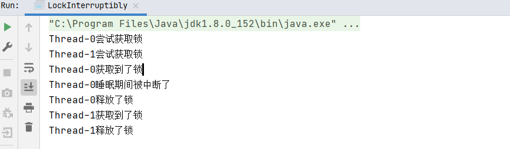

### 5. 不可不说的“锁”事

#### 5.1 内置锁的能力不足以满足需求 

****

****

**为什么需要Lock？**

* 为什么synchronized不够用？

​	比如一个线程获得了synchronized锁之后，对于其他线程只能在外面等待这个获取锁的线程释放锁。释放锁的情况个只有两种，一种是代码执行完毕；另一种是执行到一半异常了，则JVM会把锁释放。但是有的时候不一定时必须等待代码执行完毕才释放锁，执行到一半想让该线程释放锁。

​	还有一种需求是对于处于就绪队列的等待线程来说，不知道能不能拿到共享变量的访问锁，**它想试一试，如果尝试3s还不能获取锁对象则撤退**，synchronized没有这种功能

****

如果一个线程去申请synchronized锁但是没拿到就会进入就绪队列进行等待，但是它无法知道申请锁的时候能否拿到锁对象

1. lock()

   * lock()就是最普通的获取锁。如果所以被其他线程获取，则进行等待
   * Lock不会像synchronized一样在异常时自动释放锁，对于synchronized而言即便没有进行写操作，在发生异常的时候也能通过JVM释放锁；但是对于Lock而言，不管是加锁还是释放锁，这个逻辑必须线程代码自己写出来，即Lock.lock()和Lock.unlock()
   * 因此最佳实践是，在finally中释放锁，以保证发生异常时锁一定被释放

   参考代码 src/lock/lock/MustUnlock.java

   * lock()方法不能被中断，这会带来很大的隐患：一旦陷入死锁lock()就会陷入永久等待

2. tryLock()

   * tryLock()用来尝试获取锁，如果当前没有被其他线程占用，则获取成功，则返回true，否则返回false，代表获取锁失败
   * 相比于lock，这样的方法显然功能更加强大了，我们可以根据是否能获取到锁来决定后续程序的行为
   * 该方法会立即返回，即便在拿不到锁的时候也不会一直在那等待

3. tryLock(long time，TimeUnit unit)：超时就放弃

   参考代码 src/lock/lock/TryLockDeadlock.java

4. lockInterruptibly()：相当于tryLock把超时时间设置成无限。在等待锁的过程中，线程可以被中断

   参考代码 src/lock/lock/LockInterruptibly.java

   **thread0.interrupt()**

   

   **thread1.interrupt()**

   

   

   