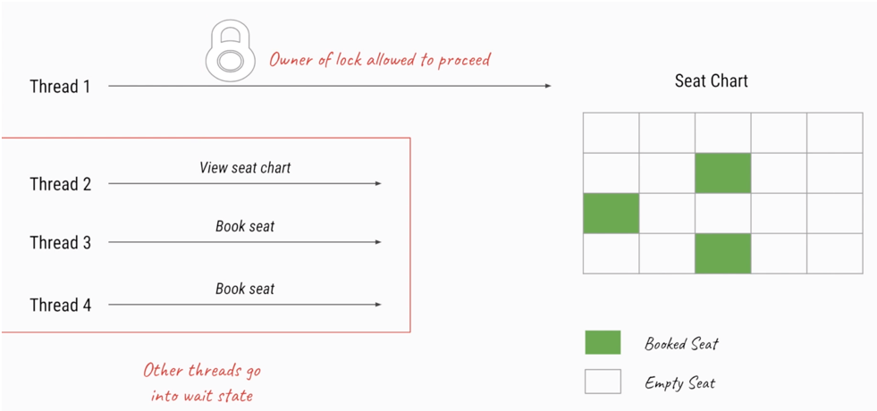
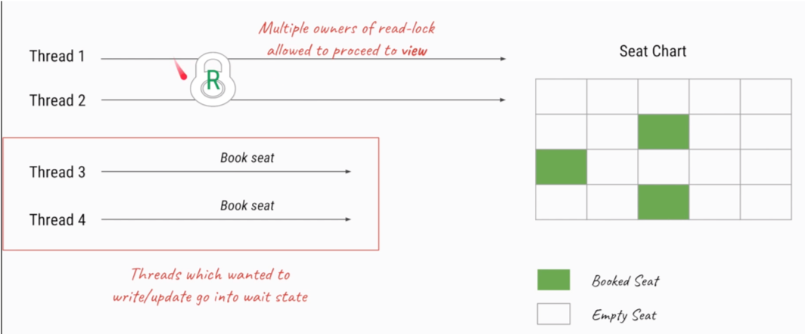

### 5. 不可不说的“锁”事

#### 5.1 内置锁的能力不足以满足需求 


****


****

**为什么需要Lock？**

* 为什么synchronized不够用？


​	比如一个线程获得了synchronized锁之后，对于其他线程只能在外面等待这个获取锁的线程释放锁。释放锁的情况个只有两种，一种是代码执行完毕；另一种是执行到一半异常了，则JVM会把锁释放。但是有的时候不一定时必须等待代码执行完毕才释放锁，执行到一半想让该线程释放锁。

​	还有一种需求是对于处于就绪队列的等待线程来说，不知道能不能拿到共享变量的访问锁，**它想试一试，如果尝试3s还不能获取锁对象则撤退**，synchronized没有这种功能


****


如果一个线程去申请synchronized锁但是没拿到就会进入就绪队列进行等待，但是它无法知道申请锁的时候能否拿到锁对象


1. lock()

   * lock()就是最普通的获取锁。如果所以被其他线程获取，则进行等待
   * Lock不会像synchronized一样在异常时自动释放锁，对于synchronized而言即便没有进行写操作，在发生异常的时候也能通过JVM释放锁；但是对于Lock而言，不管是加锁还是释放锁，这个逻辑必须线程代码自己写出来，即Lock.lock()和Lock.unlock()
   * 因此最佳实践是，在finally中释放锁，以保证发生异常时锁一定被释放

   参考代码 src/lock/lock/MustUnlock.java

   * lock()方法不能被中断，这会带来很大的隐患：一旦陷入死锁lock()就会陷入永久等待

2. tryLock()

   * tryLock()用来尝试获取锁，如果当前没有被其他线程占用，则获取成功，则返回true，否则返回false，代表获取锁失败
   * 相比于lock，这样的方法显然功能更加强大了，我们可以根据是否能获取到锁来决定后续程序的行为
   * 该方法会立即返回，即便在拿不到锁的时候也不会一直在那等待

3. tryLock(long time，TimeUnit unit)：超时就放弃

   参考代码 src/lock/lock/TryLockDeadlock.java

4. lockInterruptibly()：相当于tryLock把超时时间设置成无限。在等待锁的过程中，就绪线程可以被中断

   参考代码 src/lock/lock/LockInterruptibly.java

   **thread1.interrupt()**

   

   ****

   

   **有几个注意点**

   1. 代码中在主线程调用的Thread.sleep是为了让interrupt()能在线程睡眠的时候执行，不然没有阻塞2s的话，interrupt()会在线程线程睡眠之前就被执行，那么打断就没有意义了
   2. 代码中虽然thread0在thread1之前被执行start方法，但是两个线程的执行顺序还是可能不同的。start方法只是表示启动，不代表运行。所以虽然代码里是thread0仙贝调用start方法，但是通过上面两幅图看到最先获取锁对象的并不全是thread0

5. unlock()：解锁操作。我们一旦获取到锁，最先考虑的不是获取到锁之后的业务逻辑，而是应该先写一个try-catch代码块，然后把unlock放在finally代码块里，这是一个非常好的习惯。

#### 5.5 锁的可见性保证

线程与线程之间并不是实时可以看到对方最新的动态的，比如第一个线程修改了A = 1，第二个线程看到的A可能还是原先未修改的值也有可能是修改后的值。对于可见性问题而言，有一个happens-before原则：有一件事发生了，如果其他线程一定能看到之前所做修改的话就代表这些线程拥有happens-before。对与Lock而言，Lock的加解锁和synchronized有同样的内存语义（happens-before能力），也就是说，下一个线程加锁后可以看到所有前一个线程解锁前发生的所有操作

注：B获取锁时能实时获取Thread-A所做的所有操作


****

线程A修改了y=1，然后加锁，修改x=1，然后解锁；因为Lock具有happens-before能力，所以解锁之前的所有操作，即与y=1；x=1对与线程B加锁之后的操作而言是可见的，所以i=x=1


#### 5.6 锁的分类


****


##### 5.6.1 乐观锁和悲观锁

乐观锁——>互斥同步锁；悲观锁——>非互斥同步锁

1. 为什么会诞生非互斥同步锁——互斥同步锁的劣势
   * 因为悲观锁住资源之后就是独占的，其他线程如果还想获取相同的资源就必须等待。由此带来的阻塞和唤醒的性能劣势，包括用户态核心态以及上下文切换，检查是否有线程需要被唤醒......；乐观锁不需要把线程挂起
   * 永久阻塞：如果持有锁的线程被永久阻塞，比如遇到了无限循环，死锁等活跃性问题，那么等待该线程释放锁的那几个线程将永远也得不到执行
   * 优先级反转：如果被阻塞线程的优先级较持有锁的线程高，就会导致低优先级的线程迟迟不释放锁给高优先级的线程用。即虽然纸面上优先级高，但是实际分配时间片来说还是低优先级的线程先被执行
2. 什么是乐观锁和悲观锁


****


****


****


3. 典型例子


​	参考代码 src/lock/lock/PessimismOptimismLock.java


* Git不适合用悲观锁是因为在提交代码的过程中就会把远端仓库这个共享资源锁住，这段时间里只能由一个人提交，很可能会使得一整天都在写代码导致这个远端仓库只由一个人持有，从而导致团队工程无法协作开发

****


4. 开销对比


5. 两种锁各自的使用场景


##### 5.6.2 可重入锁的用法

以ReentrantLock为例

普通用法1：预订电影院座位，我们在APP上预定电影票的时候常见的比如"已为您锁定座位3分钟，请立刻付款"

****


****


参考代码 src/lock/reentrantlock/CinemaBookSeat.java

任意的两个线程都不能同时预订座位，都必须等其他线程完成预定座位之后才能开始预订


普通用法2：打印字符串

参考代码 src/lock/reentrantlock/LockDemo.java


不加锁的结果


##### 5.6.3 可重入性质和源码解析

可重入锁，指的是以线程为单位，当一个线程获取对象锁之后，这个线程可以再次获取本对象上的锁，而其他的线程是不可以的。

好处：避免死锁，提升封装性（避免一次次的解锁加锁操作） 

参考代码 src/lock/reentrantlock/GetHoldCount.java

```java
public class GetHoldCount {
    private  static ReentrantLock lock =  new ReentrantLock();

    public static void main(String[] args) {
        System.out.println(lock.getHoldCount());
        lock.lock();
        System.out.println(lock.getHoldCount());
        // 因为主线程已经获取了锁对象，所以根据可重入锁定义主线程能在不释放锁的前提下获得锁
        lock.lock();
        System.out.println(lock.getHoldCount());
        lock.unlock();
        System.out.println(lock.getHoldCount());
        lock.unlock();
        System.out.println(lock.getHoldCount());

    }
}
```

不可重入锁大致示意

```java
// Thread-1
{
    lock.lock();
    // 具体操作.....
    // 必须先释放锁，才能再次获取锁
    lock.unlock(); 

    lock.lock();
    // 具体操作.....
    lock.unlock(); 
}
```

具体实例：参考代码 src/lock/reentrantlock/RecursionDemo.java

每次递归操作都重复获取锁，但是并没有释放锁


****


****


​	ReentrantLock上锁原理的核心是AQS，AQS其实就是利用了getState变量（上锁的次数）。每次上锁，则getState变量也加1。c就是代表了上锁的次数，c==0表示没有任何线程持有这把锁，则线程尝试用CAS的办法去获取锁对象。但如果一开始已经有线程持有了，这说明要么是本线程要么是其它线程，于是就判断current==getExclusiveOwnerThread（是不是本线程自己拿到锁对象），如果是则把state变量值+acquires，而acquires常用1来表示，即其实就是state+1（红色框就是重入的逻辑）；同样，在释放锁的时候只有判断c==0，即没有线程持有锁的时候才把锁释放掉

​	非可重入锁的CAS是写死的0和1，0（expect）表示希望现在没有任何线程持有；而1（update）表示我想持有锁对象。那么线程再次进来的时候已经获取不到了，因为expect值已经置为了1，即本线程已经持有了，也就执行不下去了，所以就不能再次去获取这把锁；对于释放也是同样的逻辑，不是本线程则抛异常，若是则把state设置为0

##### 5.6.4 公平锁和非公平锁

1. 什么是公平和非公平


2. 为什么要有非公平锁


​	在唤醒就绪线程时会有一个空档期，如果遵循公平原则这段时期什么线程都拿不到锁，谁都没办法处理；如果遵循非公平原则：比如有三个线程A，B，C，A持有锁对象，而B处于就绪状态，当A执行完毕释放锁的时候，B就要被唤醒，假设与此同时C线程请求这把锁，因为由于线程C没有被阻塞一直处于唤醒状态，它是可以立刻执行的，不需要经历从就绪到运行这一段唤醒时间。它完全可以在B被完全唤醒之前经历执行获取锁到执行完毕释放锁之一整个过程，这就产生了一个双赢的局面：即C没有排队就被执行，B也没有输，因为本来这段唤醒时间就是耗时，它拿到锁的时机并没有推迟，不如让给其它线程去获取锁。

3. 公平的情况（以ReentrantLock为例）


****


****

在线程1执行unlock()释放锁之后，由于此线程2的等待时间最久，所以线程2先得到执行，然后是线程3和线程4


4. 不公平的情况（以ReentrantLock为例）


****


5. 代码案例

   参考代码 src/lock/reentrantlock/FairLock.java

**公平锁：private Lock queueLock = new ReentrantLock(true);**


0-1-2-3-4-5-6-7-8-9-0-1-2-3-4-5-6-7-8-9

线程由于业务需求需要获取两次锁，但是因为公平锁的缘故，Thread-0需要等待阻塞队列其余线程释放锁之后才能再次获取锁（就比如说排队，当我在柜台处理完事务走出队伍但是突然想到又有其他事务要办的时候，因为公平原则不能插队，只能再次回到队尾重新排队）

**非公平锁：private Lock queueLock = new ReentrantLock(false);**

当线Thread-0执行第二次queueLock.lock()的时候，其余线程在队列中处于等待状态，但是由于唤醒需要时间，所以根据非公平锁的特点CPU优先把锁交给Thread-0，因为Thread-0并没有处于阻塞状态。所以此时的结构就是Thread-0直接打印两次


6. 特例


7. 对比公平和非公平的优缺点


8. 源码分析


##### 5.6.5 共享锁和排它锁

1. 什么是共享锁和排它锁


2. 读写锁的作用


3. 读写锁的规则


4. ReentrantReadWriteLock具体用法

   电影院升级：有些人不想买票，只是想看一看电影票长啥样

   参考代码 src/lock/readwrite/CinemaReadWrite.java

   * 之前的情况，未使用读写锁

   

   * 现在用了读写锁，线程1和线程2可以同时用读锁，提高了效率

   

   * 当线程1和线程2都释放了锁之后，线程3和线程4就可以写入了，但是只能有一个线程持有写锁

   

   ****

   

5. 读锁和写锁的交互方式

   * 选择规则：在等待队列中选择哪个线程执行。比如现在有一个线程已经持有读锁，后面的队列中既有想读的也有想写的，如果是想写的话肯定要排队，但是假设是想读的线程，那么能否插队？毕竟两个读线程一起读并不影响共享资源，但是对于想进行写操作的线程而言其实是不公平的，因为如果极端点不停的有读线程进入等待队列，那么写线程就会一直得不到CPU的执行
   * 升降级：其实读锁和写锁是不平等的
     * 降级：比如一个线程持有写锁，能否在它不是放写锁的情况下获取读锁？
     * 升级：比如一个线程持有读锁，能否在它不是放写锁的情况下获取写锁？
   * ReentrantReadWriteLock不支持插队，但是支持降级不支持升级；ReentrantReadWriteLock实现选择了策略2，是很明智的

   

   ****

   

   ****

   

   

   ****

   

   1. 因为根据读写锁的策略，不能既读又写，所以只能又重新回到等待队列里去等待，由此可得其实写线程其实是很难插到队的；而读线程之所以特殊，是因为可以多个读线程可以同时持有读锁，所以插队很容易，必须限制一下。
   2. 既然等待队列头结点不是写线程，那肯定就是读线程了，而读线程无所谓了，反正都能一起读，插不插队又有什么关系呢？

   参考代码 src/lock/readwrite/NonfairBargeDemo.java

   ReentrantReadWriteLock源码：

   ```java
   // ReentrantReadWriteLock类里面有个FairSync方法，其实就是公平策略
   // 它们只调用了hasQueuedPredecessors方法，就只是判断了等待队列里是否存在等待线程，如果存在就塞入等待队列
   
   static final class FairSync extends Sync {
       private static final long serialVersionUID = -2274990926593161451L;
       final boolean writerShouldBlock() {
           return hasQueuedPredecessors();
       }
       final boolean readerShouldBlock() {
           return hasQueuedPredecessors();
       }
   }
   
   // 非公平情况
   // 写线程直接返回false，意思就是如果是写线程就能随意插队  barge：乱闯
   // 而如果是读线程需要判断FirstQueuedIsExclusive（等待队列头结点是否是写线程，如果是则不能插队）Exclusive是排他的意思，其实就是写线程
   static final class NonfairSync extends Sync {
       private static final long serialVersionUID = -8159625535654395037L;
       final boolean writerShouldBlock() {
           return false; // writers can always barge
       }
       final boolean readerShouldBlock() {
   
           return apparentlyFirstQueuedIsExclusive();
       }
   }
   ```

   为了演示等待队列效果，让第1个线程为写线程，第2,3线程为读线程，然后再是写线程和读线程；而且需要注意的一点是必须设置非公平锁才能有插队的效果

   

   ****

   

   ****

   

   比如说有一个任务，它上来可能是先进行写日志操作，写完之后又要参与一些别的操作。这个任务的特点就是一开始进行写操作，然后在进行读操作，这个时候肯定不希望整个任务在执行过程中被打断，所以在任务完全被执行完毕之前肯定不会主动释放锁，但是由于只有一开始是进行写操作，后面都是读，如果一直持有的是写锁那就会浪费资源。这个时候如果支持降级的话，那么直接从写锁拿到读锁，再把写锁释放掉，这个时候别的线程就可以一起进行读操作，这样就提高了整体读取效率。 

   参考代码 src/lock/readwrite/Upgrading.java

   

   为什么不支持锁的升级？因为升级容易造成死锁，因为读写锁的特点就是多个线程一起读，但是只能有一个线程写和同时读同时写。正因为不能有读又有写，所以如果想升级的话就得等所有的读线程都释放锁之后才能升级，如果所有的读锁都释放完毕了这个时候升级为死锁就没问题了。但是考虑一个场景，假设有两个读线程A和B同时想升级为写锁，那么它们都在等另外一个线程释放读锁，这就导致了死锁

6. 总结


##### 5.6.6 自旋锁和阻塞锁


****


****


实现一个自旋锁

参考代码 src/lock/spinlock/SpinLock.java

##### 5.6.7 可中断锁


##### 5.6.8 锁优化

1. 缩小同步代码块：只需要锁住需要锁的部分，把其他开销大的都排斥出锁的范围之内
2. 尽量不要锁住方法
3. 减少请求锁的次数：在日志框架中，比如说有10个线程都想同时打印日志，这个时候大家都想获取锁，那么效率不是特别高。这时可以把10个线程的需求汇聚在一起，然后统一让某一个线程去执行写操作
4. 避免人为制造共享变量
5. 锁中尽量不要再包含锁，容易导致死锁
6. 选择合适的锁类型或合适的工具类