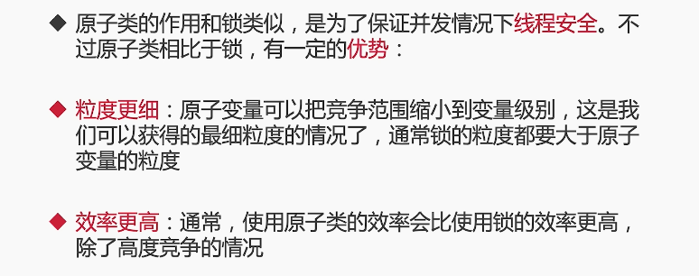
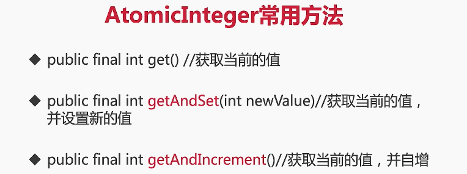
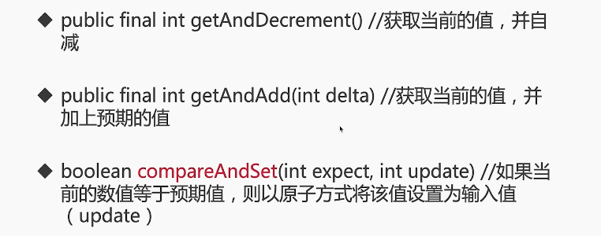
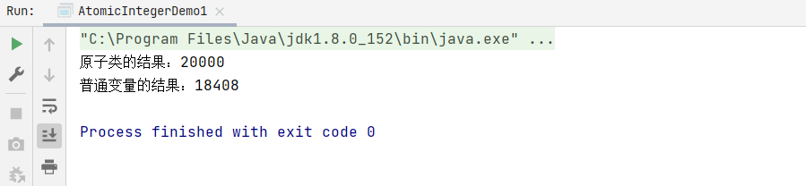
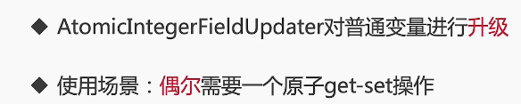
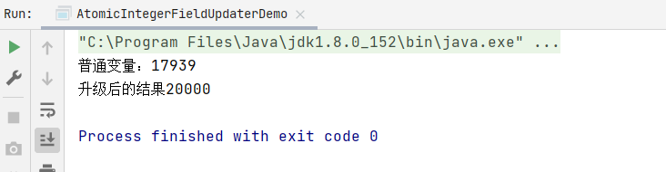
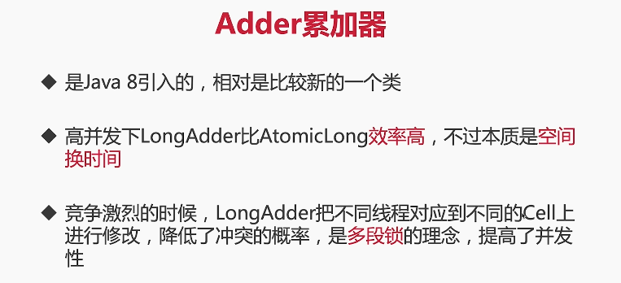

#### 6. atomic包

#### 6.1 原子类

1. 什么是原子类，有什么作用？
2. 6类原子类纵览
3. Atomic*基本类型原子类，以AtomicInteger为例
4. Atomic*数组类型原子类
5. Atomic*Reference引用类型原子类
6. 把普通变量升级为原子类：用AtomicIntegerFieldUpdater升级原有变量
7. Adder累加器

****

#### 6.2 6类原子类纵览

#### 6.3 AtomicInteger案例演示 

AtomicInteger是对Integer类型的封装，封装好之后就提供了原子的访问和更新操作，背后是基于CAS技术

参考代码 src/atomic/AtomicIntegerDemo1.java

#### 6.4 Atomic数组，每个都安全 

参考代码 src/atomic/AtomicArrayDemo.java

#### 6.5 Atomic引用在自旋锁的应用 

参考代码 src/lock/spinlock/SpinLock.java

#### 6.6 把普通变量升级为原子变量 

参考代码 src/atomic/AtomicIntegerFieldUpdaterDemo.java

#### 6.7 Adder累加器

****

参考代码 src/atomic/LongAdderDemo.java

