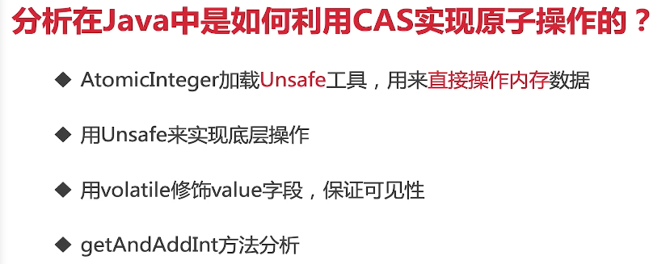
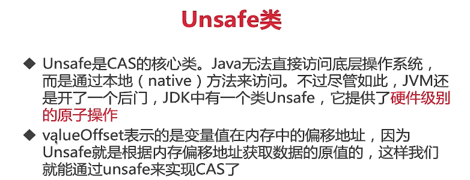
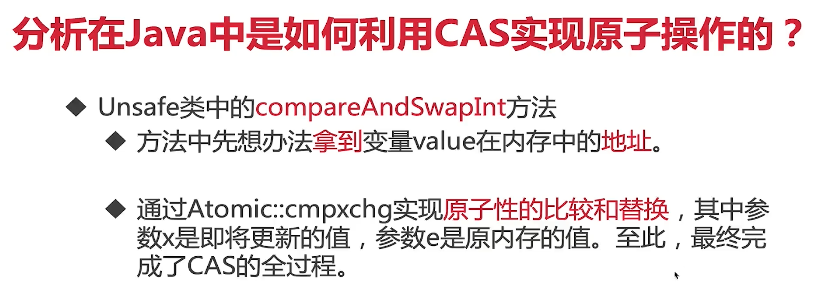

### 7. CAS

#### 7.1 什么是CAS?

CAS是英文单词**Compare And Swap**的缩写，翻译过来就是比较并替换，是一种实现线程安全的思想。CAS主要被用在并发编程领域，实现那种不能被打断的数据交换操作

****

CPU1执行修改数值操作的时候期望数值是56，并且想要改成57，然后CPU1去看值是否是56，如果是就能改动成功；当CPU1改动成功的时候，希望值是55并且想修改成56，但此时只已经变成了57，所以CPU2并不会把值改成56即CAS失败

CAS最终是要利用CPU的一些特殊指令的，因为这些指令是有CPU保证了操作的原子性，其次一个指令就能做好几件事情。比如先比较再更新，同时由于CPU保证了操作的原子性，则不会出现线程安全问题

#### 7.2 CAS的等价代码，使用案例

参考代码 src/cas/TwoThreadsCompetition.java

#### 7.3 CAS的应用场景，源码分析

* 乐观锁
* 并发容器（ConcurrentHashMap）
* 原子类

**分析在Java中是如何利用CAS实现原子操作的**

****

****

#### 7.4 CAS的缺点

