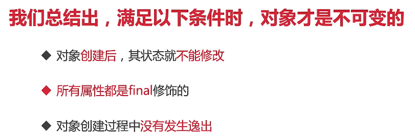

### 8. 以不变应万变

#### 8.1 final关键字和不变性

* 如果对象在被创建后，状态就不能给修改，那么它就是不可变得
* 例子：person对象，age和name都不能再变
* 具有不可变性的对象一定是线程安全的，我们不需要对其采取任何额外的安全措施，也能保证线程安全（并发读取是安全的的，但是写是不安全的）

参考代码 src/immutable/Person.java | src/immutable/TestFinal.java

#### 8.2 final的作用

* 类防止被继承，方法防止被重写，变量防止被修改
* 天生是线程安全的，而不需要额外的同步开销

**final的3种用法**

* final修饰变量 （参考代码 src/immutable/FinalVariableDemo.java）
  * 被final修饰的变量
    * 意味着值不能被修改。如果变量是对象，怎么对象的引用不能变，但是对象自身的内容依然可以变化
    * 属性被声明为final后，该变量则只能被赋值一次。且一旦被赋值，final的变量就不能再被改变，无论如何也不会被改变
    * 类中的final属性：等号右边直接赋值；在构造函数中赋值；在类的初始代码块中赋值（不常用），如果不采用第一种赋值方法，那么就必须在第2,3中挑一个来复制，而不能不赋值
  * 类中的static final属性
    * 两个赋值时机：除了在声明变量的等号右边直接赋值外，static final变量还可以用static初始代码块赋值，但是不能用普通的初始代码块赋值
  * 方法中的final变量
    * 和前面两者不同没有与这里的变量是在方法里的，所以有构造函数，也不存在初始代码块
    * final local variable不规定赋值时机，只要求在使用前必须赋值，这和方法中的非final变量的要求也是一样的


* final修饰方法（参考代码 src/immutable/FinalMethodDemo.java）
  * 构造方法不允许final修饰
  * 不可被重写，即便是子类有同样名字的方法，那也不能override，这个和static方法是同一个道理
  * static方法不能被重写
* final修饰类
  * 不可被继承，典型的String类就是用final修饰，我们没见过有什么类是继承String类的

**final的注意点**

* final修饰对象的时候，只是对象的引用不可变，而对象本身属性是可以变化的
* final使用原则：保证不变性，对于一些肯定不变的值习惯用final修饰

#### 8.4 不变形和final的关系

* 不变性并不意味简单地用final修饰就是不可变

  * 对于基本数据类型，却是是如果被final修饰后就具有不变性

  * 但是对于对象类型，需要该对象保证自身被创建后，状态永远不会变才可以。比如创建的Person对象用final修饰`final Person person = new Person()` ，但是Person对象本身的不是用final修饰的变量仍可以改变

    ```java
    public class Person {
    
        // final修饰不能变
        final int age = 18;
        // 非final修饰可以变
        String alice = new String("Alice");
    
    }
    ```

* 如何利用final实现对象不可变

  * 把所有的属性都声明为final？

    这种方式不可行，因为如果final修饰的还是一个对象，则这个用final修饰对象的非final修饰变量仍可以变，这就陷入了死循环

  * 一个属性是对象类型的不可变对象的正确例子（参考代码 src/immutable/ImmutableDemo.java）



****

如果对象溢出了，就会被其他线程拿到并且修改

**栈封闭**


参考代码 src/immutable/StackConfinement.java


#### 8.5 面试题：真假美猴王

参考代码 src/immutable/FinalStringDemo1.java | src/immutable/FinalStringDemo2.java


****


****

