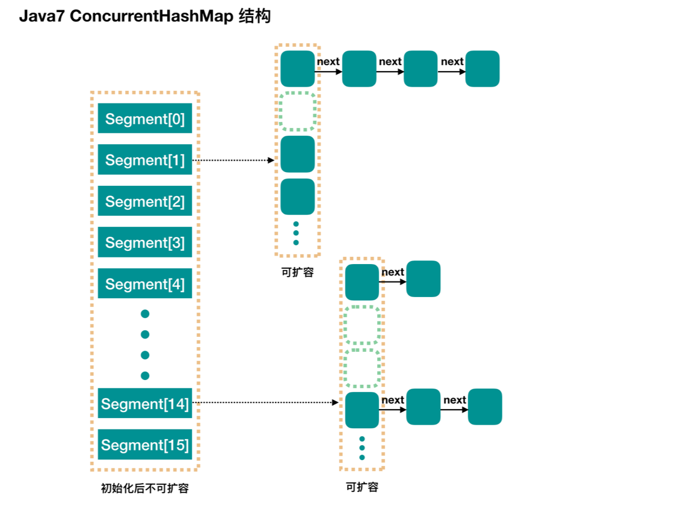
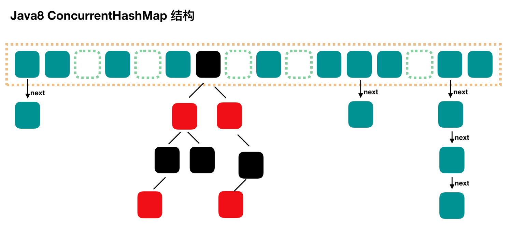

### 9. ConcurrentHashMap等并发集合

#### 9.1 并发容器概览 

* ConcurrentHashMap：线程安全的HashMap
* CopyOnWriteArrayList：线程安全的List
* BlockingQueue：这是一个接口，表示阻塞队列，非常适合用于作为数据共享的通道
* ConcurrentLinkedQueue：高效的非阻塞并发队列，使用链表实现。可以看做一个线程安全的LinkedList
* ConcurrentSkipListMap：是一个Map，使用跳表的数据结构进行快速查找

#### 9.2 集合类的历史，演进过程：Vector和Hashtable 

缺点：性能不好

参考代码 src/collections/predecessor/VectorDemo.java

Vector类里有很多成员方法都用synchronized修饰

```java
// Vector的get方法，正是因为有synchronized修饰，所以在较大并发量的时候性能会不太好
public synchronized E get(int index) {
    if (index >= elementCount)
        throw new ArrayIndexOutOfBoundsException(index);

    return elementData(index);
}
```

参考代码 src/collections/predecessor/HashtableDemo.java

Hashtable类里有很多成员方法都用synchronized修饰

```java
// Hashtable的get方法，正是因为有synchronized修饰，所以在较大并发量的时候性能会不太好
public synchronized V get(Object key) {
    Entry<?,?> tab[] = table;
    int hash = key.hashCode();
    int index = (hash & 0x7FFFFFFF) % tab.length;
    for (Entry<?,?> e = tab[index] ; e != null ; e = e.next) {
        if ((e.hash == hash) && e.key.equals(key)) {
            return (V)e.value;
        }
    }
    return null;
}
```

#### 9.3 前身：同步的HashMap和ArrayList 

参考代码 src/collections/predecessor/SynList.java


#### 9.4 ConcurrentHashMap概览 


#### 9.5 Map接口的典型实现类、常用方法演示 

参考代码 src/collections/predecessor/MapDemo.java


* HashMap：根据键的HashCode去存储，因为大多数时候能直接算出HashCode值，所以可以直接定位到所需要找的位置，所以HashMap访问的速度是很快的。HashMap是允许Key为null的，但是对于值是否为null不限制，且是一个线程不安全的实现。如果想实现线程安全访问，有两种办法
  *  Collections.synchronizedMap(new HashMap<>())
  * ConcurrentHashMap
* HashTable：是历史遗留类，很多功能和HashMap一致，但是它是线程安全的。并发性远不如ConcurrentHashMap，不建议使用
* LinkedHashMap：HashMap的子类，保存记录的插入顺序
* TreeMap：根据键去排序，默认升序

#### 9.6 为什么需要ConcurrentHashMap

* 为什么不用Collections.synchronizedMap()？

  * 它是通过锁来保证线程之间的并发访问的，但是由于synchronized对于并发量高的时候性能并不理想，所以不采用这种方法

* 为什么HashMap是线程不安全的？

  * 同时put碰撞导致数据丢失：如果计算出来的HashCode一致，那么两者的Key会放到同一个位置，但是两个线程都放在同一个位置就会导致其中一个线程中Key值的丢失
  * 同时put扩容导致数据丢失：扩容之后的数组也只有其中一个线程操作的会被保留下来 
  * 死循环造成的CPU100%（主要存在于Java1.7版本中）

  

  ****

  

  ****

  

  #### 9.10 HashMap 1.7和1.8的结构图和特点，红黑树的概念 

  

  ****

  

  ****

  

****


#### 9.11 ConcurrentHashMap 1.7和1.8结构图 


****



****


****



#### 9.12 ConcurrentHashMap源码分析 

#### 9.14 ConcurrentHashMap难道也会发生线程安全问题？：组合操作的玄机 

参考代码 src/collections/concurrenthashmap/OptionsNotSafe.java

虽然整个的ConcurrentHashMap是线程安全的，但是只能保证同时get或者同时put的时候不会出问题，但是不能保证get或者put操作结束后的组合操作是线程安全的

#### 9.16 CopyOnWriteArrayList的适用场景、读写规则 

