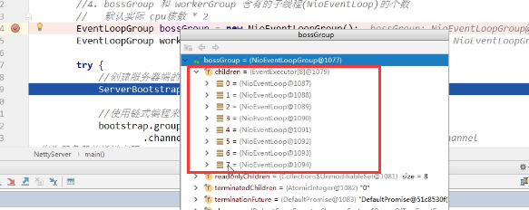

### 2.1 I/O模型

1）客户端和服务器端在进行通信的时候，通道是一种什么样的形式对程序性能是有很大影响的。比如是单通道还是双通道；是否用到缓冲；是同步还是异步；是阻塞还是非阻塞

4）Selector会轮询查看连接（通道）触发了什么事件，然后就把有事件发生的通道选择并处理（事件驱动，多路复用：一个线程维护多个通道）；客户端和服务器端不会总是一直在进行读或者写操作的，总会有一个间隙时间处于不活跃状态，那么这时Selector就会选择其他通道进行读写操作，以上就是NIO的并发思想

### 2.5 Java BIO 应用案例

参考代码 com/atguigu/bio/BIOServer.java

因为一直没有客户端连接，所以服务器端一直被阻塞

连接成功之后因为没有收到客户端的数据，所以也一直阻塞在读操作这步

### 3.1 Java NIO基本介绍

5）与BIO不同，使用BIO时当服务器端线程没有接收到客户端的数据流时（InputStream）就一直阻塞着；而NIO的一个Channel就如同BIO中的Socket，Selector通过事件驱动发现Channel状态的变化。比如Selector感知到一号通道发生了读/写事件，那么就会去处理此通道相关的读/写操作；但是如果一号通道什么操作都没发生（非激活状态），则这个Selector就会去处理别的通道而不会因此阻塞住；甚至如果该Selector监听的所有通道都处于非激活状态，则该"线程"就会去处理别的任务，不会阻塞。

8）NIO中的Buffer

参考代码 com/atguigu/nio/BasicBuffer.java

以下函数的具体分析可以参考**一站式学习Java网络编程 全面理解BIONIOAIO**笔记

1. 获取缓冲区容量：Buffer.capacity()
2. 判断缓冲区里是否还有未被读取的数据：Buffer.hasRemaining()

### 3.2 NIO和BIO的比较

2）NIO的非阻塞其实是源于Buffer的作用。我们知道BIO的阻塞其实是源于数据传输方向就只是客户端<——>服务器端，接收数据的任务只能有服务器"亲力亲为"，但是服务器端不知道客户端会什么时候发送数据，所以一直只能一直等着。而到了NIO时，由于有Buffer的存在，数据传输的方向变为了客户端<——>缓冲区<——>服务器端，服务器可以不用再一直干等着了，要拿数据可以直接从缓冲区里面拿。形象地解释就像搬运东西，一开始是客户端和服务器端"手递手"，服务器必须时刻在场；而非阻塞时，客户端先把东西搬到中转站储存，等搬一段时间之后再打个电话通知服务器端去拿，这样服务器可以不再时时刻刻在场。

### 3.6 通道

4）在NIO编程中，服务器会有一个ServerSocketChannel。当客户端有一个连接过来时，其实是先找主线程，主线程通过ServerSocketChannel给分一个连接的客户端创建一个对应的SocketChannel。其实Selector和Buffer之间的Channel就是SocketChannel，然后让此SocketChannel与服务器端进行通信

#### 3.6.2 应用实例 1-本地文件写数据

参考代码 com/atguigu/nio/NIOFileChannel01.java

#### 3.6.3 应用实例 2-本例文件读数据

参考代码 com/atguigu/nio/NIOFileChannel02.java

#### 3.6.4 应用案例 3-使用一个Buffer完成文件读写

参考代码 com/atguigu/nio/NIOFileChannel03.java

1. `fileChannel02.write(byteBuffer);`把缓冲区的内容写入Channel中，而Channel已经和`fileOutputStream`联系在了一起，同时`fileOutputStream`和"2.txt"联系在了一起。所以只要写下`fileChannel02.write(byteBuffer);`就意味着把缓冲区的内容写入文件中去
2. 只要涉及到读写转换，一定要写`Buffer.flip();`
3. `byteBuffer.clear();`是必须要写的，这行代码的作用就是"指针复位"。**若不写则每次读写时position指针永远指向第一次读写完毕之后capacity指针的位置**（前提是文件大小大于缓冲区大小，文件一次读不完），由此导致从第二次读取开始，每次读取文件大小恒为0

#### 3.6.5 应用案例 4-拷贝完件transferFrom方法 

参考代码 com/atguigu/nio/NIOFileChannel04.java

### 3.7 Selector（选择器） 

#### 3.7.1 Selector类相关方法

1. selector选择器是和线程关联的，一旦关联过后selector调用select方法，这个方法一旦返回就返回一个元素为SelectionKey的集合（Set）。然后就可以通过SelectionKey获知是哪个事件发生了（Read /Write/Accept），然后再根据获取不同的事件Key值取到对应的Channel再操作
2. selectedKeys()方法是获取所有注册在Selector上的Channel的SelectionKey，而select()方法是获取注册在Selector上且响应了事件的Channel的SelectionKey

### 3.9 NIO非阻塞网络编程入门

参考代码 com/atguigu/nio/NIOServer.java | com/atguigu/nio/NIOClient.java

### 3.13 NIO网络编程应用实例——群聊系统

参考代码 com/atguigu/nio/groupchat

### 5.8 Netty模型

#### 5.8.6 Netty快速入门实例-TCP服务

参考代码 com/atguigu/netty/simple

服务端效果截图

客户端效果截图

1. bossGroup 和 workerGroup 含有的子线程(NioEventLoop)的个数：默认实际 cpu核数 * 2

当new NioEventLoopGroup()没有传参数的时候就调用默认的构造函数，而默认构造函数传递的线程个数参数是电脑内核个数*2。也就是说bossGroup创建了8个子线程，及创建了8个NioEventLoop（电脑有8核）；同理workerGroup也创建了8个子线程，及创建了8个NioEventLoop

通过调试代码来观察NioEventLoopGroup对象，可以看到创建了8个children：NioEventLoop对象

2. 一般而言bossGroup只需要一个线程就可以了，而workerGroup需要的线程就需要多一点（老板一个，员工多个）；此时如果有多个Clinet进行服务器通讯的话，则workerGroup是如何分配这些NioEventLoop的？

此时需要注意，客户端连接线程序号次序为（n%m），即如果bossGroup创建了8个Eventloop线程，当第九个线程连接服务器端时，bossGroup分配第一个Eventloop线程给该客户端的处理（9%8=1）

3. ctx，channel和pipeline的关系：

#### 5.8.7 TaskQueue

在整个事件循环过程中，在Pipeline中会有一系列Handler会对业务以及数据进行处理。如果在某个Handler里会有一个长时间的操作，则势必会造成Pipeline一定的阻塞。所以对于某些任务我们可以把它们提交到对应的EventLoop中的TaskQueue异步执行

参考代码 com/atguigu/netty/simple/NettyServerHandler.java

1. 需要注意的是如果在TaskQueue有多个异步任务线程的话，如Thread1运行5秒，Thread2运行5秒，则Thread1执行5秒后出结果，而Thread2需要在原先的基础上再加5秒，即10秒后出结果。因为这是一个队列（Queue），虽然它们是线程（Thead），但是还是需要满足先进先出的规则

### 5.10 HTTP服务

参考代码 com/atguigu/netty/http

### 6.6 Channel和PipeChannel

参考代码 com/atguigu/netty/http/TestServerInitializer.java

添加了两个Handle

观察数据结构的Head和Tail可知一个Pipeline其实就是一个双向链表，每个链表的元素都是一个Handler，把所有的Handler链接在了一起

next——>handler（HttpServerCodec—>TestHttpServerHandler）

handler——>prev

### 6.7 ChannelHandlerContext

通过Pipeline获得的channel和通过ctx获得的channel是一样的

### 6.8 Unpooled类

参考代码 com/atguigu/netty/buf

1. 使用`buffer.getByte()`读取buffer的数据，则readindex不变化；如果使用`buffer.readByte()`读取buffer的数据，则readindex变化

****

2. 只要进行了一次readByte()，则readableBytes()数值就减少一位；但是进行了一次getByte()，readableBytes()数值不变

### 6.9 Netty应用实例—群聊系统

参考代码 com/atguigu/netty/groupchat

### 6.10Netty心跳检测机制 

参考代码 com/atguigu/netty/heartbeat

### 6.11 Netty通过WebSocket编程实现服务器和客户端的场链接

参考代码 com/atguigu/netty/websocket

### 7.4 Protobuf快速入门实例

参考代码 com/atguigu/netty/codec

在写.protobuf文件的时候数据类型不能按照语言的类型来写，比如我们在写整型的时候需要用int32定义，写字符串的时候需要用string来定义

### 7.5 Protobuf快速入门实例2 

针对前一个实例每个protobuf类都需要写一个handler与之对应的从而导致handler过于多的问题

参考代码 com/atguigu/netty/codec2

proto文件里出现的赋值语句都是编号值，比如string name=1；意思并不是给name赋值为1，而是name是编号为1的属性

****

DataType是编号为1的属性；因为有oneof关键字，所以dataBody里面任选一个作为第二个属性，Student或者Worker是编号为2或者3的属性

### 8.2 编码解码器

比如说之前在服务器端实现的ProtobufDecoder就是继承了ChannelInboundHandlerAdapter

入栈8个字节，每四个字节组合成一个int型数据，比如124和267放入list中

### 8.3 Netty的handler链的调用机制

参考代码 com/atguigu/netty/inboundhandlerandoutboundhandler

客户端——>服务端（编码）

服务端——>客户端（解码）

### 9.2 TCP粘包拆包现象实例

参考代码 com/atguigu/netty/tcp

每次接受数据个数不相同，10条数据总共接受了6次

第二次测试则接受了7次才接受完10条数据，所以依据这种现象可知代码是不安全的，每次显示的message可能都是不完整的

### 9.4 TCP粘包拆包解决方案

参考代码 com/atguigu/netty/protocoltcp

### 10.2 Netty启动过程源码剖析

参考代码 com/atguigu/netty/source/echo

本参考代码是源于netty源码的example包下的echo目录

****

****

`EventLoopGroup workerGroup = new NioEventLoopGroup();`最终会执行的代码

在创建每个子线程的同时放入了一个执行器executor，也就是说子线程是靠执行器去执行的

children的真实身份是EventExecutor

但是children数组的每个元素类型却是NioEventLoop，这是因为NioEventLoop实现了EventExecutor接口，所以能把实现类放在父类数组中

