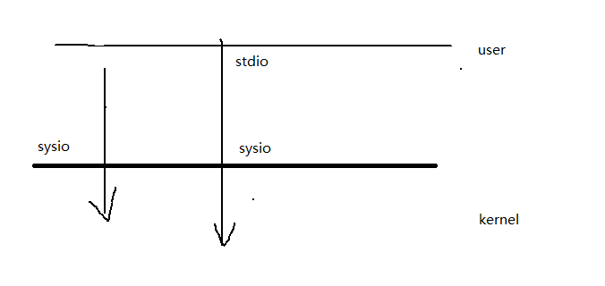

## 1. 标准IO

### 1.1 标准IO介绍

I/O的实现包括两种:1、stdio（标准IO）2、sysio（系统调用IO）

IO操作是一切实现的基础，实际上程序在有了IO操作之后才有其他的可能性。比如说之前写程序，在完成之后编译执行再显示在终端上，然后把terminal关掉或者是把当前内容清空这些内容就没有了。如果没有IO的话相当于什么数据都没有办法保留下来

比如说，在程序实现过程当中，用到了一些数据或产生了一些数据，而这些数据有保留价值，不管是永久的还是暂时的，我可以把它转存到文件当中去，等我某一个时刻用到的话，那这些数据我再从一个文件当中转这个这个读取出来，然后进行使用，进行计算，进行二次加工等等，所以说输入输出是我们一切实现的基础

·**标准IO和系统调用IO之间的区别和联系**

1. 首先当我们处于用户态的，需要访问内核态的时候，内核提供了一组函数以便于用户能够访问内核，这组函数被称为sysio。用户可以直接通过系统调用IO来直接对话内核
2. 但是如果kernel不一样，也就是说该内核提供给用户的系统调用IO就不一样，然后此时就给用户带来了困扰。比如linux和windows的内核显然是不一样的，结果linux提供了一套sysio、windows也提供了一套sysio。那么在进行任何实现的情况下，就需要顾及到用户是在哪个环境下进行编程
3. 此时，标准stdio跳出来"和稀泥"，此时既可以通过sysio来访问内核，也可以通过stdio来访问内核，但是stdio是通过间接访问sysio来达到访问内核的目的。相信大家都接触过printf这个函数，但是很多人在用这个函数的时候压根就没想过是在windows还是linux环境下使用的，printf是典型的stdio里面的函数。也就是说标准做了规定，要来发布一套函数，不管各个系统的底层如何去实现，只要实现了关闭，输出，输入...，不管调用了什么样的sysio，一定要用stdio来去实现
4. 所以为什么要优先使用stdio，就是因为stdio移植性好
5. `fopen()`在linux下依赖的函数是`open()`、而在windows环境下依赖的函数是`openfile()`。`open()`和`openfile()`就是kernel提供的sysio函数，`fopen()`就stdio函数

**标准IO：FILE类型贯穿始终，FILE其实是一个结构体**

`fopen()`

`fclose()`

`fgetc()`

`fputc()`

`fgets()`

`fputs()`

`fread()`

`fwrite()`

`printf()`

`scanf()`

`fseek()`

`ftell()`

`rewind()`

`fflush()`

