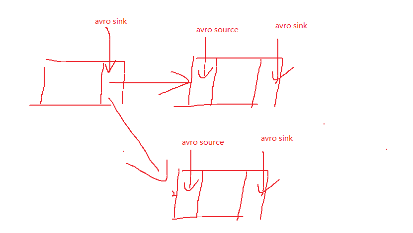
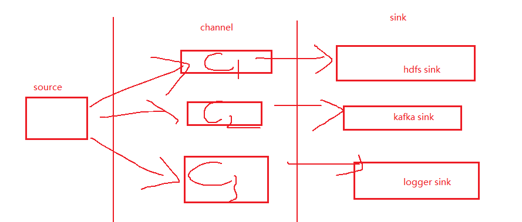
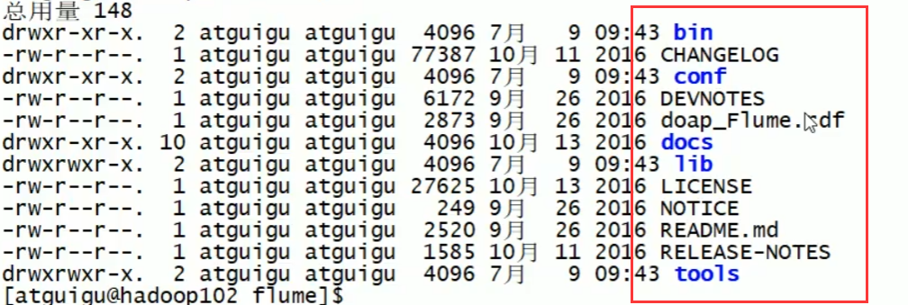
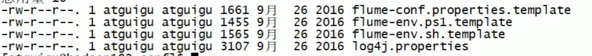
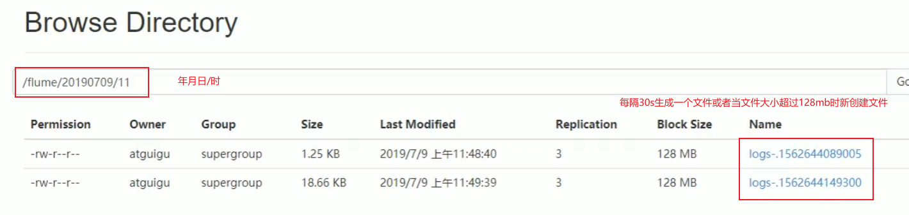
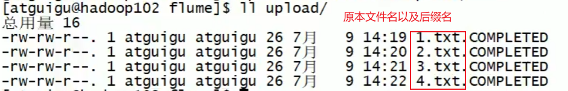

### 1.2.2 Source

* 轻量处理，比如作为拦截器，但又不像hive之类进行求和，count，map等操作

* 跟外界打交道用来读数据的组件

1. Avro source：多个Flume组件之间连接的数据源，因为一个Flume可能出现单点故障，所以使用多层Flume保险；多层之间的Flume连接使用Avro source



2. exec source：在启动时运行`tail -f`命令，把文件末尾的几行数据当成数据源
3. netcat source：把网络通信端口上的数据变化当成数据源

### 1.2.3 Sink

1. 将数据写出去的组件

### 1.2.4 Channel

* 当source和sink处理数据速度不对等的情况下，起到一个缓冲的作用

* Flume Channel Selectors：同一份数据可以通过复制经过多个channel把数据传递到不同的sink中，从而用来实现不同的功能

    

## 2.1 Flume 安装部署

**flume/目录结构**



**flume/conf目录结构**



* log4j.propertites配置：日志默认产生至flume/logs/flume.log文件，若想改位置则配置该文件即可
*  flume-env.sh：因为agent是一个jvm进程，既然运行在jvm上，所以需要知道jdk在哪里，所以需要配置java_home

### 2.2.1 监控端口数据官方案例

3）实现步骤：

**创建 Flume Agent 配置文件 flume-netcat-logger.conf **：在对配置文件进行起名的时候需要见名知意，例子的意思就是把从端口读到的数据传递到logger

**配置文件解析**


* r1.channels：一个source可要绑定多个channel，一对多
* k1.channel：一个channel绑定一个sink，一对一

**思考：nc hadoop102 44444，flume 能否接收到？**

### 2.2.2 实时监控单个追加文件

3）实现步骤：

**2.创建 flume-file-hdfs.conf 文件**：

```properties
a2.sinks.k2.hdfs.path = hdfs://hadoop102:9000/flume/%Y%m%d/%H
```

```properties
#多久生成一个新的文件，当校验超过了30s，则新生成一个文件
a2.sinks.k2.hdfs.rollInterval = 30
#设置每个文件的滚动大小，当校验超过了128mb，则新生成一个文件
a2.sinks.k2.hdfs.rollSize = 134217700
#文件的滚动与 Event 数量无关
a2.sinks.k2.hdfs.rollCount = 0
```

1. 如果三个配置的值都为0，则全部数据都写入一个文件中
2. rollSize一般配置为块大小，134217700=128mb

```properties
#是否按照时间滚动文件夹
a2.sinks.k2.hdfs.round = true
#多少时间单位创建一个新的文件夹
a2.sinks.k2.hdfs.roundValue = 1
#重新定义时间单位
a2.sinks.k2.hdfs.roundUnit = hour
```

上面滚动的是文件，下面滚动的是文件夹

**5.在 HDFS 上查看文件**



### 2.2.3 实时监控目录下多个新文件

实现步骤：

**a3.sources.r3.fileSuffix = .COMPLETED**：

1. 在扫描目录下新建的文件会自动添加.COMPLETED结尾
2. 如果文件后缀本就是以COMPLETED结尾的，则flume不会去扫描该文件，更不会去上传该文件；所以应该避免设置fileSuffix值为上传文件的后缀名
3. 不要把相同文件名的文件上传到扫描目录下，会报错



###  2.2.4 实时监控目录下的多个追加文件 

实现步骤：
**1．创建配置文件 flume-taildir-hdfs.conf **

```properties
# 扫描f1 f2两个group下的文件
a1.sources.r1.filegroups = f1 f2
# 一个文件
a1.sources.r1.filegroups.f1 = /var/log/test1/example.log
# 符合文件名格式的多个文件
a1.sources.r1.filegroups.f2 = /var/log/test2/.*log.*
```

**a3.sources.r3.positionFile = /opt/module/flume/tail_dir.json**：记录文件路径，文件读写断点等信息

**模拟断点续传功能**：

1. 终止flume服务，但是持续向扫描目录中的文件新增数据；如果使用的是exec等source，flume是无法读取服务终止之后所新增的数据的
2. 但因为使用的是taildir soruce，当重启flume服务时，因为记录了上次读写文件的断点，flume会重新获取终止flume服务之后所新增的数据，

## 3.2 Flume Agent 内部原理

**Replicating Channel Selector (default)**

```properties
a1.sources = r1
a1.channels = c1 c2 c3
# 可省略，因为默认Replicating形式
a1.sources.r1.selector.type = replicating
a1.sources.r1.channels = c1 c2 c3
a1.sources.r1.selector.optional = c3
```

**Multiplexing Channel Selector**

```properties
a1.sources = r1
a1.channels = c1 c2 c3 c4
a1.sources.r1.selector.type = multiplexing
a1.sources.r1.selector.header = state
a1.sources.r1.selector.mapping.CZ = c1
a1.sources.r1.selector.mapping.US = c2 c3
a1.sources.r1.selector.default = c4
```

* 在之前的很多的情况下，我们并没有用到header，但是header在多路复用的情况下需要添加数据，并且需要结合拦截器一起使用
* header是一种map形式的数据。state是key值，而CZ和US是value值

### 3.4.1 复制和多路复用

