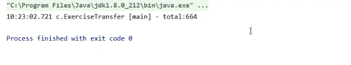
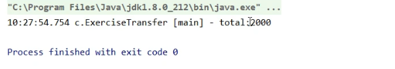
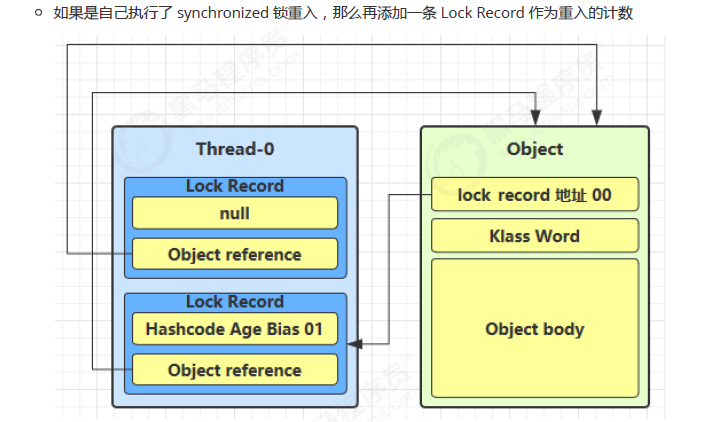

### 3.1 方法三，FutureTask 配合 Thread

1. FutureTask是一个任务对象，构造函数需要传递进去一个Callable对象；最后还是需要借助Thread对象执行
2. Runnable接口是没有返回值的（void）；而Callable接口是有返回值的（泛型数据<V>），便于在各个线程之间传递值；并且Callable接口覆写的是call()方法，同时需要抛出异常

### 3.2 观察多个线程同时运行

```java
import lombok.extern.slf4j.Slf4j;

@Slf4j(topic = "c.Test3")
public class Test3 {
    public static void main(String[] args) {
        new Thread(() -> {
            while(true) {
                log.debug("running...");
            }
        }, "t1").start();

        new Thread(() -> {
            while(true) {
                log.debug("running...");
            }
        }, "t2").start();
    }
}
```

**最后结果是交替运行**


### 3.4 栈与栈帧

#### 3.4.1 主线程栈内存

```java
package cn.itcast.n3;

public class TestFrames {
    public static void main(String[] args) {
        method1(10);
    }

    private static void method1(int x) {
        int y = x + 1;
        Object m = method2();
        System.out.println(m);
    }

    private static Object method2() {
        Object n = new Object();
        return n;
    }
}
```


`step1`


`step2`


`step3`


`step4`


`step5`


`step6`


#### 3.4.2 多线程栈内存

**主线程和t1线程有各自的栈帧**


### 3.5 常见方法

1. join()：等待某个线程运行结束，主要用于多个线程通信时使用，比如一个线程运行了一段时间会有一个运行结果，主线程想要拿到这个结果，则主线程可以调用这个join方法等待这个线程运出处结果就可以去获取结果

### 3.6 start 与 run

`调用run并没有启动新线程`


`调用start才启动的新线程`


### 3.7 sleep 与 yield

#### 3.7.1. 调用 sleep 会让当前线程从 Running 进入 Timed Waiting 状态（阻塞）

```java
@Slf4j(topic = "c.Test6")
public class Test6 {

    public static void main(String[] args) {
        Thread t1 = new Thread("t1") {
            @Override
            public void run() {
                try {
                    Thread.sleep(2000);
                } catch (InterruptedException e) {
                    e.printStackTrace();
                }
            }
        };

        t1.start();
        log.debug("t1 state: {}", t1.getState());

        try {
            Thread.sleep(500);
        } catch (InterruptedException e) {
            e.printStackTrace();
        }
        log.debug("t1 state: {}", t1.getState());
    }
}
```

```java
// RUNNABLE是因为log.debug("t1 state: {}", t1.getState());先于Thread.sleep(2000);执行
17:51:17.619 c.Test6 [main] - t1 state: RUNNABLE
// TIMED_WAITING是因为log.debug("t1 state: {}", t1.getState());在Thread.sleep(2000);期间执行
17:51:18.127 c.Test6 [main] - t1 state: TIMED_WAITING
```

#### 3.7.2 sleep 方法会抛出 InterruptedException

```java
@Slf4j(topic = "c.Test7")
public class Test7 {

    public static void main(String[] args) throws InterruptedException {
        Thread t1 = new Thread("t1") {
            @Override
            public void run() {
                log.debug("enter sleep...");
                try {
                    // 本次调用是在t1线程调用的
                    Thread.sleep(2000);
                } catch (InterruptedException e) {
                    log.debug("wake up...");
                    e.printStackTrace();
                }
            }
        };
        t1.start();

        // 在哪个线程调用就是针对哪个线程执行睡眠操作，本次调用是在main线程调用的
        Thread.sleep(1000);
        log.debug("interrupt...");
        t1.interrupt();
    }
}
```


#### 3.7.3 睡眠结束后的线程未必会立刻得到执行

只有获得cpu的时间片才能得到执行

#### 3.7.4 建议用 TimeUnit 的 sleep 代替 Thread 的 sleep 来获得更好的可读性

**可读性在于TimeUnit 可以指定时间单位，比如秒，分，时**

```java
import java.util.concurrent.TimeUnit;
public class Test8 {

    public static void main(String[] args) throws InterruptedException {
        log.debug("enter");
        TimeUnit.SECONDS.sleep(1);
        log.debug("end");
//        Thread.sleep(1000);
    }
}
```

#### 3.7.5 具体的实现依赖于操作系统的任务调度器

操作系统基本知识：

CPU还是会把时间片分给处于`Runnable 就绪状态`的线程，但是不会把时间片分给`Timed Waiting 状态（阻塞）`的线程

#### 3.7.6 线程优先级

观察以下程序，因为两个线程被分配到时间片的概率时相同的，所以最后输出的值也应该差不太多

```java
@Slf4j(topic = "c.Test9")
public class Test9 {

    public static void main(String[] args) {
        Runnable task1 = () -> {
            int count = 0;
            for (; ; ) {
                System.out.println("---->1 " + count++);
            }
        };
        Runnable task2 = () -> {
            int count = 0;
            for (; ; ) {
                System.out.println("              ---->2 " + count++);
            }
        };
        Thread t1 = new Thread(task1, "t1");
        Thread t2 = new Thread(task2, "t2");
        t1.start();
        t2.start();
    }
}
```

事实上最后结果确实是差不太多


****

但如果使用`yield`使其中一个线程让出cpu使用权的话再看看结果

```java
@Slf4j(topic = "c.Test9")
public class Test9 {

    public static void main(String[] args) {
        Runnable task1 = () -> {
            int count = 0;
            for (; ; ) {
                Thread.yield();
                System.out.println("---->1 " + count++);
            }
        };
        Runnable task2 = () -> {
            int count = 0;
            for (; ; ) {
                System.out.println("              ---->2 " + count++);
            }
        };
        Thread t1 = new Thread(task1, "t1");
        Thread t2 = new Thread(task2, "t2");
        t1.start();
        t2.start();
    }
}
```


两者相差比较多，如果通过设置线程优先级来改变被cpu分配时间片的概率，则结果

```java
public class Test9 {

    public static void main(String[] args) {
        Runnable task1 = () -> {
            int count = 0;
            for (; ; ) {
                System.out.println("---->1 " + count++);
            }
        };
        Runnable task2 = () -> {
            int count = 0;
            for (; ; ) {
                System.out.println("              ---->2 " + count++);
            }
        };
        Thread t1 = new Thread(task1, "t1");
        Thread t2 = new Thread(task2, "t2");
        t1.setPriority(Thread.MIN_PRIORITY);
        t2.setPriority(Thread.MAX_PRIORITY);
        t1.start();
        t2.start();
    }
}
```


结果也是相差较大

#### 3.7.7 案例

**详见《并发编程应用篇——限制》**

案例——防止CPU占用率100%

```java
while(true) {
    try {
        Thread.sleep(50);
    } catch (InterruptedException e) {
        e.printStackTrace();
    }
}
```

1. 用到while—true循环的场景比如说服务器开发的时候需要让服务端的线程不停的运行来响应客户端传过来的请求
2. sleep的时间可以不长，但是必须要加；因为在没有利用 cpu 来计算时，不要让 while(true) 空转浪费 cpu，在单核处理器下CPU光去处理java的循环程序了，其他程序基本得不到cpu的调度。这时可以使用 yield 或 sleep 来让出 cpu 的使用权给其他程序

**添加sleep之前**


**添加sleep之后**


### 3.8 join 方法详解

1. `sleep(1000)`表示线程进入阻塞状态，当一个线程进入阻塞或者就绪状态时CPU会把时间片分给其他线程，本题中是main线程，1s过后阻塞状态转变为就绪状态且无其他线程竞争CPU资源，所以t1线程就会进入调度从而执行r = 10；
2. 用 sleep 行不行？为什么？答：可以，但是不好。因为你无法判断t1线程被阻塞多久从而设置主线程sleep时间
3. 哪个线程对象来调用join函数，就会等待该线程运行结束（**就是一个同步过程**）

```java
@Slf4j(topic = "c.Test10")
public class Test10 {
    static int r = 0;
    public static void main(String[] args) throws InterruptedException {
        test1();
    }
    private static void test1() throws InterruptedException {
        log.debug("开始");
        Thread t1 = new Thread(() -> {
            log.debug("开始");
            sleep(1);
            log.debug("结束");
            r = 10;
        },"t1");
        t1.start();
        t1.join();
        log.debug("结果为:{}", r);
        log.debug("结束");
    }
}
```


#### 3.8.1 应用之同步（案例1）

参考代码cn/itcast/n3/TestJoin.java

```java
public class TestJoin {
    static int r = 0;
    static int r1 = 0;
    static int r2 = 0;

    public static void main(String[] args) throws InterruptedException {
        test2();
    }

    private static void test2() throws InterruptedException {
        Thread t1 = new Thread(() -> {
            sleep(1);
            r1 = 10;
        });
        Thread t2 = new Thread(() -> {
            sleep(2);
            r2 = 20;
        });
        t1.start();
        t2.start();
        long start = System.currentTimeMillis();
        log.debug("join begin");
        t2.join();
        log.debug("t2 join end");
        t1.join();
        log.debug("t1 join end");
        long end = System.currentTimeMillis();
        log.debug("r1: {} r2: {} cost: {}", r1, r2, end - start);
    }
}
```


****


### 3.9 interrupt 方法详解

#### 3.9.1 打断 sleep，wait，join 的线程

之前说过只要进入阻塞状态CPU就不会考虑把时间片分给阻塞状态进程，只有当线程进入就绪状态才会被考虑分配时间片（**操作系统基础中的基础知识，不知道的话可以去面壁了**）

参考代码cn/itcast/test/Test11.java

```java
@Slf4j(topic = "c.Test11")
public class Test11 {

    public static void main(String[] args) throws InterruptedException {

        Thread t1 = new Thread(() -> {
            log.debug("sleep...");
            try {
                Thread.sleep(5000); // wait, join
            } catch (InterruptedException e) {
                e.printStackTrace();
            }
        }, "t1");
	
        t1.start();
       	// 该行必须写，不然的话"interrupt"就会被提前打印出，只有处在sleep状态下才能查看打断标记
        Thread.sleep(1000);
        log.debug("interrupt");
        t1.interrupt();
        log.debug("打断标记:{}", t1.isInterrupted());
    }
}
```

**只需要记住一点，打断非阻塞状态的线程，打断标记都为`true`；打断阻塞状态的线程，打断标记都为`false`**


#### 3.9.2 打断正常运行的线程

线程具有自主性，即线程可以被打断（interrupt），但是响应不响应是线程自己的选择（你可以叫我做事但是我听不听是我自己的事）

```java
public class Test12 {

    public static void main(String[] args) throws InterruptedException {
        Thread t1 = new Thread(() -> {
            while(true) {
         		// 你可以叫我做事，听不听由我决定
                boolean interrupted = Thread.currentThread().isInterrupted();
                if(interrupted) {
                    log.debug("被打断了, 退出循环");
                    break;
                }
            }
        }, "t1");
        t1.start();

        Thread.sleep(1000);
        log.debug("interrupt");
        t1.interrupt();
    }
}
```

### 3.10 模式之两阶段终止

详情查看《并发编程——模式》终止模式之两阶段终止模式

参考代码cn/itcast/test/Test13.java

#### 3.10.1 利用 isInterrupted


****


如果没有遇到sleep则不会抛出异常，打断标记因为不是打断处于阻塞状态则仍为true，即进入下一个循环if判断为true

### 3.11 主线程与守护线程 

默认情况下，Java 进程需要等待所有线程都运行结束，才会结束。比如说即使是主线程main结束了，如果还有其他线程在执行，这个java进程就不会结束

参考代码cn/itcast/test/Test15.java

```java
@Slf4j(topic = "c.Test15")
public class Test15 {
    public static void main(String[] args) throws InterruptedException {
        Thread t1 = new Thread(() -> {
            while (true) {
                if (Thread.currentThread().isInterrupted()) {
                    break;
                }
            }
            log.debug("结束");
        }, "t1");
        // 设置守护线程
        t1.setDaemon(true);
        t1.start();

        Thread.sleep(1000);
        log.debug("结束");
    }
}
```

即使t1线程一直处于while循环，但是主线程结束了，则守护线程t1也要结束


### 3.12 六种状态

#### 3.12.1 代码展示 

参考代码：cn/itcast/n3/TestState2.java

```java
import cn.itcast.Constants;
import cn.itcast.n2.util.FileReader;

public class TestState2 {
    public static void main(String[] args) throws InterruptedException {
        new Thread(() -> {
            FileReader.read(Constants.MP4_FULL_PATH);
            FileReader.read(Constants.MP4_FULL_PATH);
            FileReader.read(Constants.MP4_FULL_PATH);
        }, "t1").start();

        Thread.sleep(1000);
        System.out.println("ok");
    }
}
```

`FileReader.read(Constants.MP4_FULL_PATH);`文件读取其实就是一个阻塞API，再操作系统层面这确实是一个阻塞状态，但是在Java层面却是一个Runnable状态


1. `WAITING`其实就是join()
2. `TIMED_WAITING`其实就是sleep()

#### 3.12.2 六种状态详情 

```java
package cn.itcast.n3;

import lombok.extern.slf4j.Slf4j;

import java.io.IOException;

@Slf4j(topic = "c.TestState")
public class TestState {
    public static void main(String[] args) throws IOException {
        Thread t1 = new Thread("t1") {
            @Override
            public void run() {
                log.debug("running...");
            }
        };

        Thread t2 = new Thread("t2") {
            @Override
            public void run() {
                while(true) { // runnable

                }
            }
        };
        t2.start();

        Thread t3 = new Thread("t3") {
            @Override
            public void run() {
                log.debug("running...");
            }
        };
        t3.start();

        Thread t4 = new Thread("t4") {
            @Override
            public void run() {
                synchronized (TestState.class) {
                    try {
                        Thread.sleep(1000000); // timed_waiting
                    } catch (InterruptedException e) {
                        e.printStackTrace();
                    }
                }
            }
        };
        t4.start();

        Thread t5 = new Thread("t5") {
            @Override
            public void run() {
                try {
                    t2.join(); // waiting
                } catch (InterruptedException e) {
                    e.printStackTrace();
                }
            }
        };
        t5.start();

        Thread t6 = new Thread("t6") {
            @Override
            public void run() {
                synchronized (TestState.class) { // blocked
                    try {
                        Thread.sleep(1000000);
                    } catch (InterruptedException e) {
                        e.printStackTrace();
                    }
                }
            }
        };
        t6.start();

        try {
            Thread.sleep(500);
        } catch (InterruptedException e) {
            e.printStackTrace();
        }
        log.debug("t1 state {}", t1.getState());
        log.debug("t2 state {}", t2.getState());
        log.debug("t3 state {}", t3.getState());
        log.debug("t4 state {}", t4.getState());
        log.debug("t5 state {}", t5.getState());
        log.debug("t6 state {}", t6.getState());
        System.in.read();
    }
}
```

t1就绪状态，t2运行状态，t3终止状态，t4阻塞状态（sleep），t5阻塞状态（同步），t6阻塞状态（t4线程对资源上锁，导致t6线程访问资源互斥）


#### 3.12.3 习题

参考代码：《并发编程——应用》统筹 cn/itcast/test/Test16.java

1. 在图一里，洗水壶和烧开水是同步的关系，前者没完成后者就不能进行下去，这交给一个线程做；洗茶壶一个线程，洗茶杯一个线程，拿茶叶一个线程，总共需要四个线程，比较浪费。
2. 在图二里，只需要两个线程，线程一进行两个操作同样是同步的关系；但是线程二三个操作并不是同步关系，但由于只有一个线程来做，所以还是需要4分钟时间
3. 最后一步泡茶操作需要等所有操作都做完之后才能进行，也是一个同步操作，但是在代码实现上因为线程二所需时间较线程一短，所以需要用join()方法等待线程一执行完毕

```java
@Slf4j(topic = "c.Test16")
public class Test16 {

    public static void main(String[] args) {
        Thread t1 = new Thread(() -> {
            log.debug("洗水壶");
            sleep(1);
            log.debug("烧开水");
            sleep(5);
        }, "老王");

        Thread t2 = new Thread(() -> {
            log.debug("洗茶壶");
            sleep(1);
            log.debug("洗茶杯");
            sleep(2);
            log.debug("拿茶叶");
            sleep(1);
            try {
                t1.join();
            } catch (InterruptedException e) {
                e.printStackTrace();
            }
            log.debug("泡茶");
        }, "小王");

        t1.start();
        t2.start();
    }
}
```


### 4.2 synchronized

#### 4.2.1 面向对象改进

参考代码 cn/itcast/test/Test17.java

```java
// 封装同步代码块
package cn.itcast.test;

import lombok.extern.slf4j.Slf4j;

@Slf4j(topic = "c.Test17")
public class Test17 {
    public static void main(String[] args) throws InterruptedException {
        Room room = new Room();
        Thread t1 = new Thread(() -> {
            for (int i = 0; i < 5000; i++) {
                room.increment();
            }
        }, "t1");

        Thread t2 = new Thread(() -> {
            for (int i = 0; i < 5000; i++) {
                room.decrement();
            }
        }, "t2");

        t1.start();
        t2.start();
        t1.join();
        t2.join();
        log.debug("{}", room.getCounter());
    }
}

class Room {
    private int counter = 0;

    public synchronized void increment() {
        counter++;
    }

    public synchronized void decrement() {
        counter--;
    }

    public synchronized int getCounter() {
        return counter;
    }
}
```


#### 4.2.3 方法上的 synchronized 

前者是非static方法也称对象方法，锁住的是一个对象；后者是static方法也称类方法，锁住的是一个类

### 4.3 所谓的“线程八锁”

情况1：synchronized锁住的是this对象，当一个线程执行a或者b方法的时候其余线程既不能执行a也不能执行b方法，直到第一个线程释放锁之后第二个线程才能执行。也就是说结果只会输出21或者12

情况2：分两种情况，如果线程一最先执行，因为synchronized锁住的是this对象，导致线程二无法执行，得先让线程一sleep 1s之后，线程二才能执行，所以是"1s后输出12"；二如果是线程二最先执行并且没有阻塞操作，所以是瞬间就执行了，同时线程一无法执行，所以会出现"先输出2，1s后再输出1"

情况3：因为方法c没有添加synchronized关键字，所以他不会因为互斥被阻塞。因为方法一添加了sleep方法导致会滞后执行，所以最后结果会出现三种情况，3 1s 12 或 23 1s 1 或 32 1s 1

情况4：两者没有互斥关系，所以方法二总是被先打印出来，1s之后打印1

情况5：方法一锁住的是Number类的类对象，方法二锁住的是this对象。不同对象之间没有互斥关系，所以方法二总是被先打印出来，1s之后打印1

情况6：方法一和二锁住的都是类对象，是同一个对象，所以按照之前的说法分两种情况

情况7：创建了n1，n2对象，锁住的仍然不是同一个对象，没有互斥。所以方法二总是被先打印出来，1s之后打印1

情况8：虽然创建了n1，n2对象，但是两者调用的都是静态方法，等价于锁住的是同一个类对象，有互斥，所以按照之前的说法分两种情况

### 4.4 局部变量线程安全分析

test1方法里的局部变量i并不是共享的，各做各的，并不干扰，不存在线程安全问题

#### 4.4.1 方法访问修饰符带来的思考

如果把修饰符private改为public就意味着其他线程也可以调用到方法2和3，但是此时还是不会遇到线程安全问题，关键就出自在list形参还是不是同一个？

情况1：答案是否的，因为不管有多少个线程，他们总是会先创建list对象，而这些list对象都是不同的，即线程二里的list对象和线程一里的list对象是不同的

情况2：父类里的对象会暴露给子类对象，如果在子类里创建新线程则可能会导致线程不安全

**这里是想说明一点，方法的修饰符private/public/protected...其实是有意义的，它帮助保证了线程安全。比如子类不能继承父类的private方法，如果在子类和父类里各定义了一个用private定义的method3方法，则这两个方法不是同一个方法**

`开闭原则指的是如果不想让子类影响到父类，则可以让private或final修饰从而增强线程安全性`

#### 4.4.2 多个方法的组合不是原子的

Hashtable的get方法本身是原子的（用synchronized修饰），set方法本身也是原子的（用synchronized修饰），但是get和set方法两者之间却不是原子的。

```java
Hashtable table = new Hashtable();
// 线程1，线程2
if( table.get("key") == null) {
    table.put("key", value);
}
```


如果想使赋键值操作变成原子性，就需要在最外层套上synchronized

```java
Hashtable table = new Hashtable();
// 线程1，线程2
synchronized(this){
    if( table.get("key") == null) {
        table.put("key", value);
    }   
}
```

#### 4.4.3 不可变类线程安全性

不可变类指的是只可读不可写，类似于String类中的substring或者replace方法主要是因为它根本没有改变原字符串，而是复制了一个然后在复制体上去改，所以是线程安全的

#### 4.4.4 实例分析

1. HashTable是线程安全的，HashMap不是
2. String都是线程安全的
3. `final Date D2 = new Date();`Date不是线程安全的，添加了final修饰符的Date同样也不是线程安全的。因为final只是说D2的引用不能变，它始终指向这个new出来的Date对象，但是这个Date对象里的值是能改变的（我始终提着一个菜篮子，但是菜篮子里的菜是可以变得）。我们刚才说过能改变值的就是线程不安全的。区别于String，Date的值是可以改变的，String类里的值是不能改的，所以不管加没加final都是线程不安全的
4. 第二个例子一看就不是线程安全的，多个线程都能同时进入临界区（临界区就是共享代码块，操作系统基本知识），共同对共享变量count进行操作
5. 例4展示的是三层结构中的典型调用Servlet层调用Service层方法然后调用Dao层方法。Dao层自身没有成员变量，意味着以后如果有多个线程访问也没有线程能去修改成员变量的属性。所以像这种没有成员变量的类一般都是线程安全的；并且Dao类里面的Connection是属于一个方法里的局部变量，将来即使有多个线程同时访问，那么线程一创建的是conn1，二线程二创建的是conn2，都在各自的线程栈内存中，两者相互独立，互不干扰；然后是Service层，虽然创建了一个成员变量，但是这个成员变量并没有改变值的方法，所以也是线程安全的；同理Servlet层里的创建Service对象也是线程安全的
6. 例5大部分都是一样的，除了Dao层把Connection从局部变量改成了成员变量，而多个对象的成员变量是可以共享的，线程一刚连接上数据库呢，线程二速度快直接给close掉了。所以一定要把Connection对象弄成局部变量而非成员变量
7. 例6大部分都是一样的，这次把Service层的userDao改成了方法里的局部变量，根据之前的分析只要对象是局部变量就是线程安全的（绝大多数都是，除了类似例7这样子的涉及到子类父类关系），所以本例是线程安全的，但是不推荐这么写。

### 4.5 习题

#### 4.5.1 卖票练习

1. 只要证明余票数和卖出的票数相加等于总票数，则没有线程安全问题
2. 主要代码分析

```java
// 模拟多人买票
TicketWindow window = new TicketWindow(1000);
// 所有线程的集合
List<Thread> threadList = new ArrayList<>();
// 卖出的票数统计
List<Integer> amountList = new Vector<>();
for (int i = 0; i < 2000; i++) {
    Thread thread = new Thread(() -> {
        // 买票
        int amount = window.sell(random(5));
        // 统计买票数
        amountList.add(amount);
    });
    threadList.add(thread);
    thread.start();
}

// 必须要等到获得所有线程的值后才能统计，获得线程返回值就需要用到join方法了
for (Thread thread : threadList) {
    thread.join();
}
```


遇到线程安全问题需要先找到临界区和共享资源，然后通过加锁来解决（就像我们在操作系统进程题中找到互斥量然后对其进行PV操作一样p(mutex)，v(mutex)）

1. 我们需要先找到临界区和临界资源（多个线程可以共享的资源并且进行读写操作）

```java
// ①
// 买票
int amount = window.sell(random(5));
// 售票
// sell部分代码就属于临界区，需要线程安全保护
public int sell(int amount) {
    if (this.count >= amount) {
        this.count -= amount;
        return amount;
    } else {
        return 0;
    }
}

// ②
// 统计买票数
// 因为涉及到对数组元素的添加，肯定有写操作；
// 但是List数组在java实现的时候就已经考虑到了线程安全问题，所以就不需要我们再去考虑了
amountList.add(amount);
```

2. 那么我们需不需要考虑①和②组合的线程安全问题呢，答案是不需要的。因为window和amountList是两个不同的共享变量，两者既不互斥也不同步
3. 那`threadList.add(thread);`需不需要进行线程安全操作呢？答案是不用，因为threadList实在主线程上定义的，而主线程不参与对共享变量的同步互斥，所以不需要

鉴于以上分析可以得出只需要对sell方法加锁就可以线程安全

```java
public synchronized int sell(int amount) {
    if (this.count >= amount) {
        this.count -= amount;
        return amount;
    } else {
        return 0;
    }
}
```

#### 4.5.2 转账练习

1. 判断是否线程安全只需要判断两个账户最后的金额之和是否等于原先两者金额之和，相等则安全，反之则不
2. 按照例子的原先金额数为2000，但是执行一次过后金额明显变少



3. 同样还是要分辨共享变量和临界区，但是此题和上题的区别在于账户a和账户b的余额amount都需要保护

```java
// 这样改正行不行，为什么？
public synchronized void transfer(Account target, int amount) {
    if (this.money > amount) {
        this.setMoney(this.getMoney() - amount);
        target.setMoney(target.getMoney() + amount);
    }
}
```

答案是不行，因为上面的代码等价于如下代码。而我们之前分析过，这种加锁方式是给新创建的对象加锁，所以两个对象有两把不同的所，两者之间互不影响

```java
public void transfer(Account target, int amount) {
    synchronized(this){
        if (this.money > amount) {
            this.setMoney(this.getMoney() - amount);
            target.setMoney(target.getMoney() + amount);
        }
    }
}
```

那能不能同时给amount和target加锁呢？答案是可以的，但是容易死锁。最简单的方式是结合两者的共同共享变量，就是Account类对象。但是这种方式仍然是不好的方法，它的性能不太高

```java
public void transfer(Account target, int amount) {
    synchronized(Account.class){
        if (this.money > amount) {
            this.setMoney(this.getMoney() - amount);
            target.setMoney(target.getMoney() + amount);
        }
    }
}
```



### 4.6 Monitor 概念&&synchronized 原理进阶

详见《并发编程——原理》 Monitor && synchronized原理进阶以及《并发编程》的Java 对象头部分

```java
static final Object obj = new Object();
public static void method1() {
    synchronized( obj ) {
        // 同步块 A
        method2();
    }
}
public static void method2() {
    synchronized( obj ) {
        // 同步块 B
    }
}
```

上面这份代码就是对同一个obj进行了锁重入




